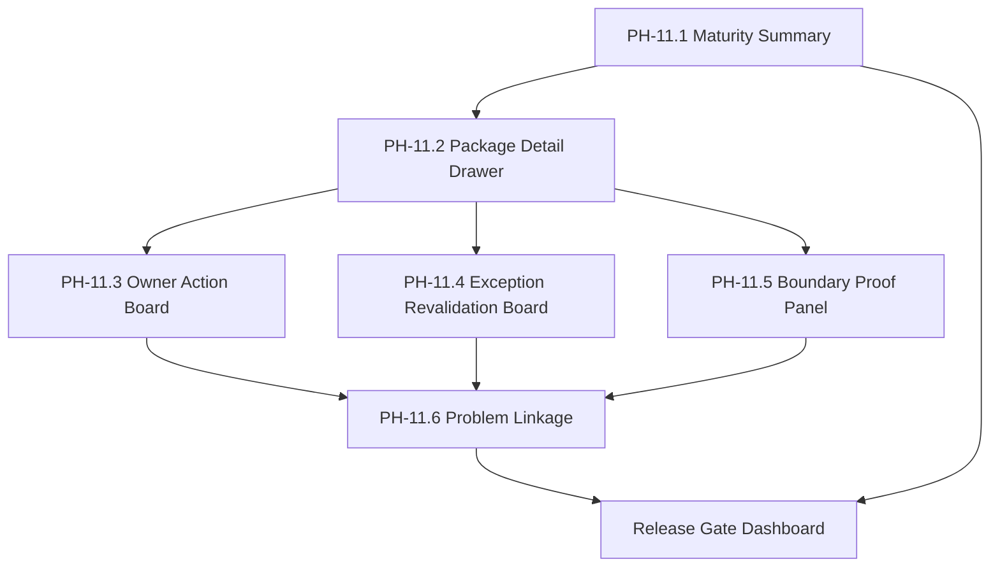
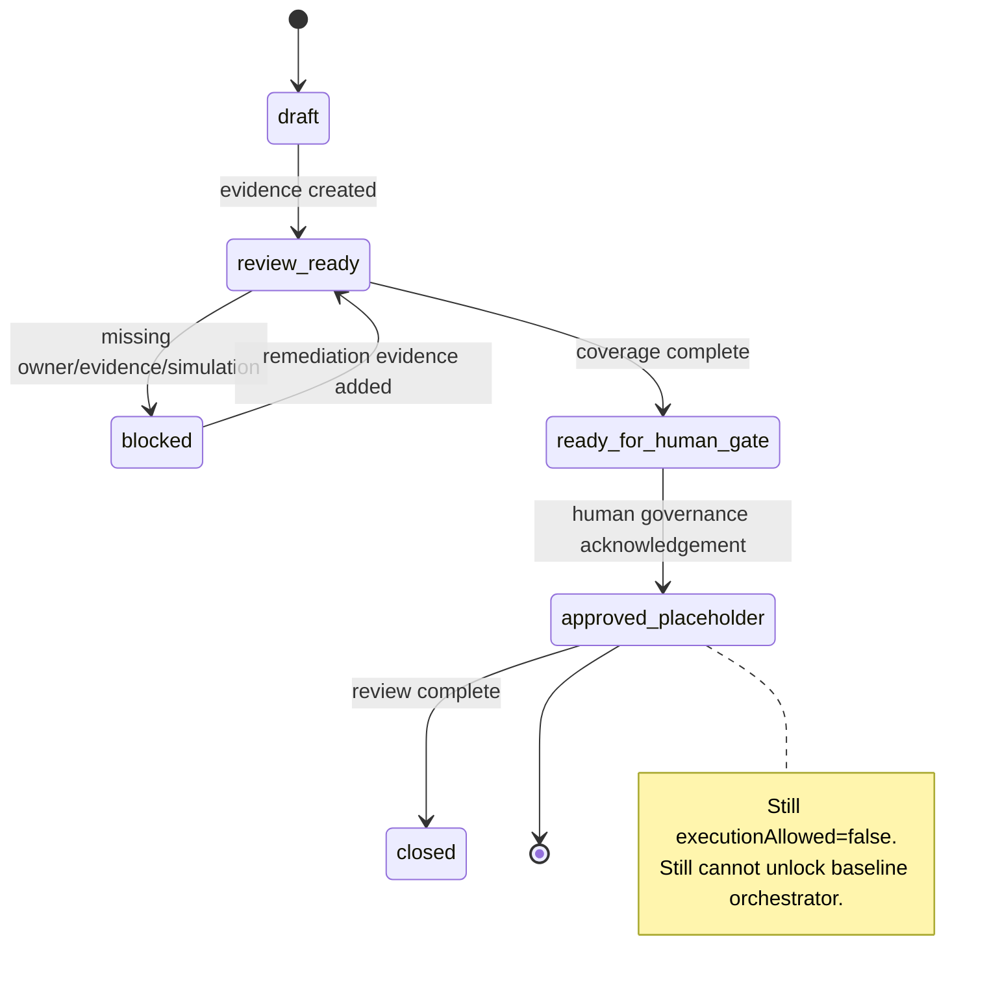

# SYLION Admin Panel V2 - Step 3.11 PHANTOM Module Plan

Status: planned
Date: 2026-05-21

## Purpose

Develop PHANTOM v3.0 in this sprint as a full admin governance module, not as an operational runtime.

The PHANTOM module must help administrators understand maturity, evidence, risk and human gates while keeping all execution paths blocked.

## PHANTOM Submodules

### PH-11.1 Maturity Summary

Shows:

- package count,
- coverage status,
- owner acknowledgement status,
- exception expiry state,
- simulation count,
- open risks,
- audit correlation.

### PH-11.2 Package Detail Drawer

Shows one package with:

- template,
- evidence bundles,
- approval packs,
- review board,
- owner acknowledgements,
- policy simulations,
- exceptions,
- coverage,
- blockers.

### PH-11.3 Owner Action Board

Shows owner-specific pending work:

- Legal,
- CISO,
- Architect,
- Compliance.

Actions remain acknowledgements only. They do not approve execution.

### PH-11.4 Exception Revalidation Board

Shows:

- expiring exceptions,
- expired exceptions,
- required revalidation owners,
- blocker impact on coverage.

### PH-11.5 Boundary Proof Panel

Shows negative proofs:

- PHANTOM approval cannot unlock orchestrator,
- PHANTOM exception cannot request execution,
- PHANTOM policy simulation rejects prohibited operational language,
- PHANTOM coverage has `certificationClaim=false`,
- every PHANTOM record has execution disabled.

### PH-11.6 PHANTOM Problem Linkage

Links PHANTOM blockers to Problem Registry:

- missing owner acknowledgement,
- expired exception,
- missing evidence,
- missing simulation,
- risky wording,
- prohibited operational detail rejected.

## Mermaid PHANTOM Workbench Graph

## PHANTOM State Graph

## PHANTOM Tests

Required API tests:

- missing owner ack blocks `approved_placeholder`,
- expired exception blocks coverage,
- prohibited term is rejected,
- `executionRequested=true` is rejected,
- PHANTOM approval ID fails against baseline orchestrator approval gate,
- coverage returns `certificationClaim=false`,
- public PHANTOM records return execution disabled.

Required Playwright tests:

- PHANTOM Workbench opens,
- Package Review Matrix visible,
- Maturity Summary visible,
- Boundary Proof Panel visible,
- owner ack status visible,
- exception revalidation status visible,
- mobile layout does not hide critical PHANTOM execution=false indicators.

## Risk Controls

- Avoid customer-facing claims that PHANTOM is certified.
- Avoid operational evasion, bypass or stealth instructions.
- Keep PHANTOM wording at governance, review, evidence and risk level.
- Make all human gate labels explicit.
- Keep baseline and PHANTOM release gates separate.

## Definition of Done

- PHANTOM workbench can explain current maturity without reading raw API responses.
- PHANTOM blockers roll up to Release Gate Dashboard.
- PHANTOM problems can be recorded and linked to evidence.
- PHANTOM remains non-executable in API, UI and tests.
