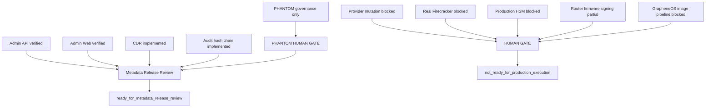
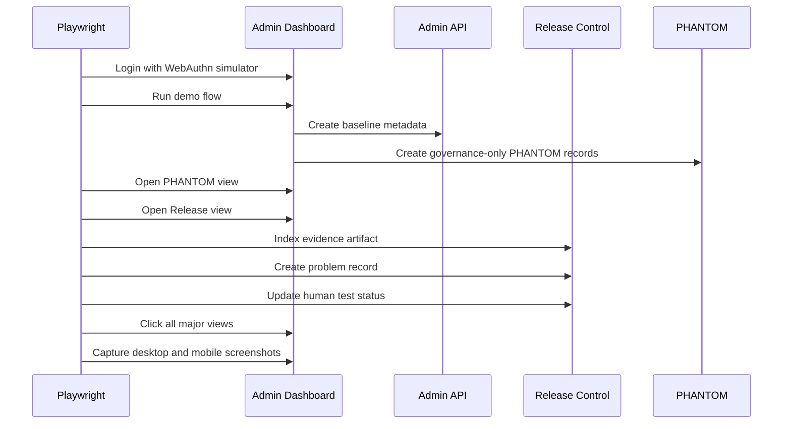

# SYLION Admin Panel V2 - Step 3.11 Implementation Freeze and Production Readiness

Date: 2026-05-21
Status: implemented and tested

## Executive Status

The admin panel has been advanced to a production-grade control-plane review layer:

- release gate dashboard,
- human test center,
- problem registry,
- evidence artifact index,
- Księga 3.4 matrix,
- PHANTOM boundary proof,
- Playwright dashboard regression with desktop and mobile evidence.

The system is not approved for production infrastructure execution. This is intentional and required by the current architecture gates.

Current release decision:

```text
not_ready_for_production_execution
ready_for_metadata_release_review after human review
productionExecutionAllowed=false
```

## What Was Implemented

### Release Control API

Added release-control records:

- release gates,
- human test scenarios,
- release problems,
- evidence artifacts,
- release summary.

Release records are metadata only and reject prohibited operational language.

### Admin Dashboard

Added a new `Release` view with:

- Release Gate Control,
- Release Gates,
- Human Test Center,
- Problem Registry,
- Evidence Artifact Index,
- Księga 3.4 Matrix,
- PHANTOM Boundary Proof.

### Playwright Regression

Expanded `npm run test:dashboard`:

- logs in,
- runs demo flow,
- opens PHANTOM,
- opens Release,
- indexes evidence artifact,
- creates a problem record,
- updates human test status,
- clicks all major views,
- verifies PHANTOM and release readiness text,
- captures desktop and mobile screenshots,
- writes a JSON summary.

## Problems Identified During This Sprint

1. Test locator ambiguity:
   - `Evidence artifact indexed` appeared in both `#login-toast` and `#toast`.
   - Fixed by scoping Playwright assertions to `#toast`.

2. Dashboard test idempotency:
   - The old assertion expected empty lifecycle data before demo flow.
   - Fixed by checking that the Approvals view loads rather than assuming empty runtime state.

3. Release card readability:
   - `Production exec` wrapped poorly in release cards.
   - Fixed by shortening the UI label to `Prod exec`.

Current identified unresolved problems:

```text
None found by automated Step 3.11 dashboard regression.
```

Residual product gaps remain listed below as blocked gates, not defects.

## Księga 3.4 Build Status

Implemented or metadata-ready:

- mandatory orchestrator approval ID,
- persisted operator readiness evidence,
- Puli AX access router gate in device flow,
- CDR mandatory controls,
- provider adapter dry-run boundary,
- audit hash chain,
- FIDO2/WebAuthn simulator and step-up model,
- 3 VPS baseline metadata,
- tenant/operator boundaries,
- dashboard release gate visibility.

Blocked by HUMAN GATE or missing production integrations:

- real Firecracker execution,
- real cloud/provider mutation,
- production HSM integration,
- production router firmware signing/provisioning,
- real GrapheneOS image build pipeline.

## PHANTOM v3.0 Build Status

Implemented:

- PHANTOM separate governance track,
- capability, approval, risk, package, evidence, approval pack, readiness, simulation, assignment, review board, exception and coverage records,
- Package Review Matrix,
- owner acknowledgement visibility,
- exception revalidation visibility,
- PHANTOM release boundary proof,
- negative tests proving PHANTOM cannot unlock orchestrator.

Required invariant:

```text
PHANTOM executionAllowed=false
PHANTOM executionEnabled=false
PHANTOM certificationClaim=false
PHANTOM production activation=blocked
```

Still blocked:

- live PHANTOM behavior,
- autonomous activation,
- baseline execution unlock,
- customer-facing certification claims.

## Verification

```text
npm test
63/63 passing

npm run test:dashboard
passing

git diff --check
clean
```

Playwright artifacts:

- `docs/admin-panel-v2/test-artifacts/step3-11-dashboard-regression/release-desktop.png`
- `docs/admin-panel-v2/test-artifacts/step3-11-dashboard-regression/release-mobile.png`
- `docs/admin-panel-v2/test-artifacts/step3-11-dashboard-regression/phantom-desktop.png`
- `docs/admin-panel-v2/test-artifacts/step3-11-dashboard-regression/phantom-mobile.png`
- `docs/admin-panel-v2/test-artifacts/step3-11-dashboard-regression/summary.json`

## Release Gate Graph



## Human Test Graph



## Production Readiness Verdict

Verdict:

```text
Control plane: production-grade for local metadata review and gated admin workflows.
Production execution: blocked.
PHANTOM live behavior: blocked.
Release status: ready for human review, not production execution.
```

Human gate owners:

- Platform: Firecracker and orchestrator production behavior.
- SRE: provider mutation and deployment operations.
- Security: HSM/PKI production boundary.
- Hardware: Puli AX firmware qualification and signing.
- Legal/CISO/Architect/Compliance: PHANTOM v3.0 beyond governance-only.
