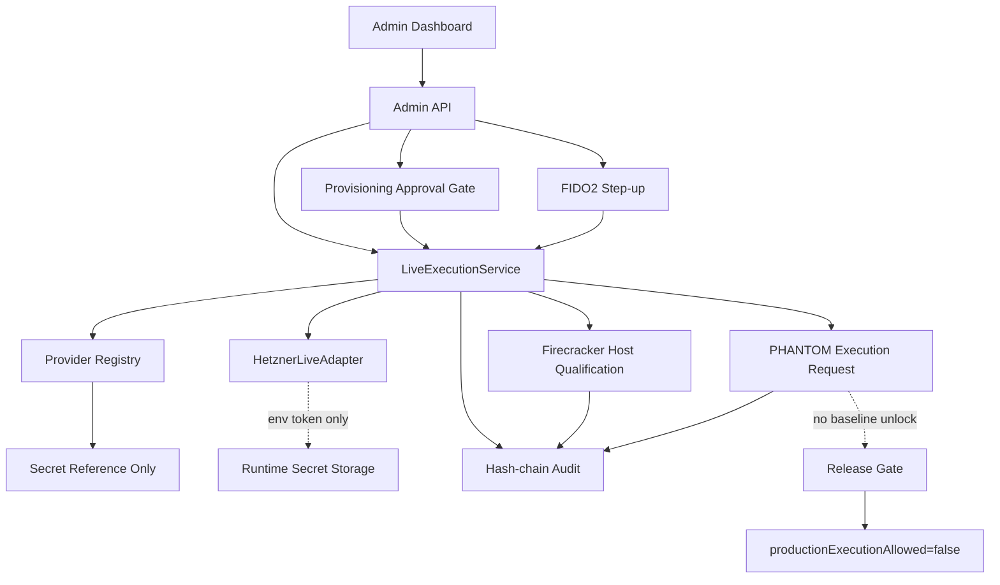
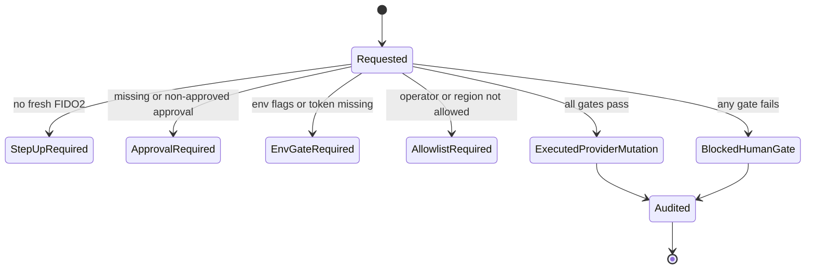
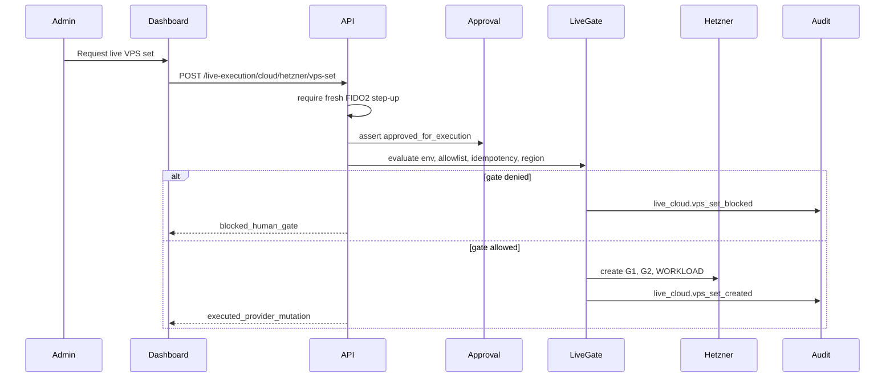

# SYLION Secure - Step 3.12 Freeze

Status: implemented in admin control plane, not production-unlocked.

## Scope

Step 3.12 adds controlled live-execution gates for:

- Hetzner live cloud VPS-set request for the baseline `G1`, `G2`, `WORKLOAD` layout.
- Firecracker host qualification before any microVM launch is considered.
- PHANTOM execution request workflow as a separate lab-governance path.

The sprint does not turn the SYLION baseline into an automatically mutating production system. Every live path is default-deny, audited, and bound to human approval plus runtime environment gates.

## Frozen Decisions

- Provider dry-run remains available and side-effect free.
- Live cloud mutation is isolated in `LiveExecutionService`.
- Hetzner is the first live adapter boundary.
- Provider secrets are still references only in the admin API; live token material must come from runtime secret storage such as environment or future vault integration.
- A live VPS-set request always preserves `3 VPS per operator`.
- Live requests require FIDO2 step-up, `approved_for_execution` provisioning approval, idempotency key, explicit live confirmation, operator allowlist, region allowlist, token presence, and server cap.
- Firecracker dashboard action qualifies a host only. It does not launch a microVM.
- PHANTOM execution requests can become `approved_for_lab_review` only when legal, CISO, architect, compliance, evidence, expiry, lab confirmation, and lab env flag are present.
- PHANTOM never unlocks baseline production execution.
- `productionExecutionAllowed` remains `false` in the release surface.

## Runtime Gates

Live cloud env gates:

```powershell
$env:HETZNER_API_TOKEN="set outside chat"
$env:SYLION_PROVIDER_MODE="live"
$env:SYLION_LIVE_ALLOWED="true"
$env:SYLION_LIVE_ALLOWLIST_OPERATORS="op_xxx"
$env:SYLION_LIVE_ALLOWED_REGIONS="fsn1"
$env:SYLION_LIVE_MAX_SERVERS="3"
```

Firecracker qualification env gate:

```powershell
$env:SYLION_FIRECRACKER_HOST_MODE="local_qualification"
```

PHANTOM lab request env gate:

```powershell
$env:SYLION_PHANTOM_LAB_ALLOWED="true"
```

Secrets must not be pasted into chat, committed to repo, written into docs, or logged by tests.

## API Modules

- `GET /live-execution/summary`
- `GET /live-execution/cloud/requests`
- `POST /live-execution/cloud/hetzner/vps-set`
- `GET /live-execution/firecracker/host-qualifications`
- `POST /live-execution/firecracker/host-qualification`
- `GET /live-execution/phantom/requests`
- `POST /live-execution/phantom/request`

## Admin Dashboard

Provider view now includes:

- Live Cloud Gate form.
- Firecracker Host qualification form.
- Live Execution Status cards.
- Live Cloud Requests cards.
- Firecracker Qualifications cards.

PHANTOM view now includes:

- Execution Request form.
- Execution Requests cards.

Release view now includes:

- Live Execution Proof cards covering live cloud, Firecracker and PHANTOM request state.

## Mermaid - Module Dependencies



## Mermaid - Live Cloud State Machine



## Mermaid - Deployment Path



## Tests

Automated:

- `npm.cmd test` passes 66/66.
- `npm.cmd run test:dashboard` passes Playwright human-style click flow.

Dashboard artifacts:

- `docs/admin-panel-v2/test-artifacts/step3-12-live-execution-regression/summary.json`
- `docs/admin-panel-v2/test-artifacts/step3-12-live-execution-regression/live-execution-desktop.png`
- Full desktop screenshots for all primary views.
- Mobile screenshots for PHANTOM and Release.

## Residual Risks

- Real Hetzner mutation has not been run in this environment.
- Firecracker launch is not implemented; only host qualification exists.
- Hetzner Cloud may not expose nested KVM for Firecracker; production Firecracker should use qualified bare metal or a verified KVM-capable host.
- HSM-backed production PKI is still a human-gated blocker.
- PHANTOM remains outside certifiable baseline and needs legal/CISO approval for any lab execution.

