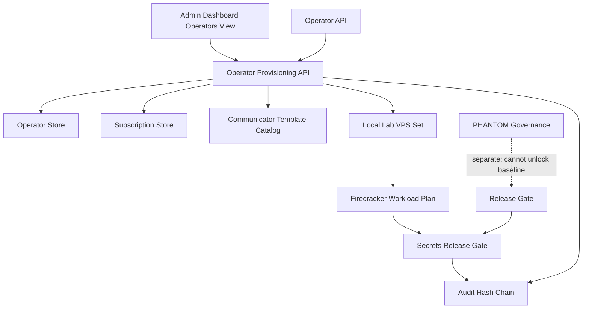
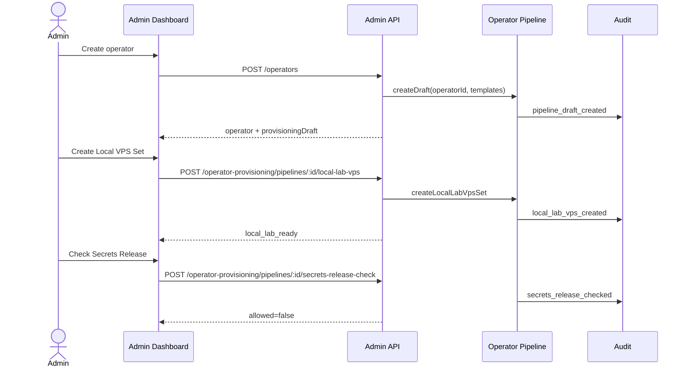
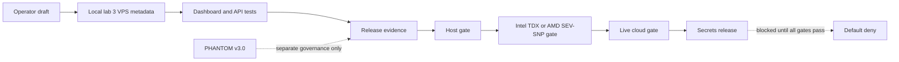

# Step 3.13 Freeze - Operator Provisioning Pipeline And Local Lab VPS

Status: implemented as a local-lab, audit-first control plane slice.

## Frozen Decision

Creating a new operator now also creates an operator provisioning draft. The draft is the first testable representation of the real target flow:

- every operator keeps the 3 VPS baseline: `G1`, `G2`, `WORKLOAD`;
- communicator workloads are planned as separate Firecracker microVM workloads;
- default communicator set is `whatsapp`, `signal`, `telegram`;
- subscription tier controls the maximum number of communicator workloads;
- CDR remains mandatory for communicator workloads;
- local lab VPS creation is metadata-only and never calls cloud providers;
- local lab Firecracker execution is a plan, not a VM launch;
- secrets release stays default-deny in local lab;
- PHANTOM remains outside baseline provisioning and cannot unlock the path.

## Implemented Modules

| Module | Responsibility | Current Scope |
| --- | --- | --- |
| Operator Provisioning Pipeline | Builds draft from operator and subscription context | Auto-created on operator creation; manually creatable from dashboard |
| Communicator Template Catalog | Defines authorized workload templates | WhatsApp, Signal, Telegram, Threema, Zangi, Matrix client, Matrix server |
| Local Lab VPS Set | Creates testable 3-layer VPS metadata | `local-lab://` resource identifiers for G1/G2/WORKLOAD |
| Firecracker Workload Plan | Maps communicators to microVM execution plan | Planned only; execution locked |
| Secrets Release Gate | Evaluates whether secrets may be released | Always denied for local lab; records blockers |
| Admin Dashboard Controls | Lets an admin exercise the flow like a human | Pipeline draft, local VPS set, secrets check, cards and helptips |
| Playwright Dashboard Regression | Clicks through the UI flow end-to-end | Login, demo flow, operator pipeline, local VPS, secrets deny, PHANTOM, release |

## Admin Dashboard Additions

Operators view now contains:

- `Provisioning Pipeline`: creates an operator draft and accepts communicator template keys.
- `Local Virtual VPS`: creates the local lab `G1/G2/WORKLOAD` resource set.
- `Secrets Gate`: verifies that local lab cannot release workload secrets.
- `Communicator Templates`: shows the authorized communicator templates and CDR requirement.
- `Operator Provisioning Pipelines`: shows status, workload count, lab VPS count, Firecracker plan count, and secrets state.

## Test Coverage

API tests cover:

- automatic pipeline draft creation during operator creation;
- local lab 3 VPS creation;
- Firecracker workload planning per communicator;
- blocked secrets release in local lab;
- subscription workload limit rejection;
- audit event emission for local lab resource creation.

Dashboard smoke test covers:

- login and demo flow;
- opening Operators;
- creating a pipeline draft from the dashboard;
- creating a local virtual VPS set from the dashboard;
- checking secrets release from the dashboard;
- PHANTOM execution gate still blocked;
- release gate still blocked by production-readiness controls.

## Known Boundaries

This step does not launch real Firecracker microVMs and does not create Hetzner or OVH resources. It creates a local control-plane test harness so the operator creation lifecycle can be tested repeatedly before live cloud unlock.

Production unlock still requires:

- provider API secret reference stored outside chat;
- explicit human production approval;
- fresh step-up;
- host qualification;
- CPU confidential-computing gate: Intel TDX or AMD SEV-SNP with attestation evidence;
- release evidence pack;
- PHANTOM separation confirmation.

## Mermaid - Module Dependencies

## Mermaid - Runtime Flow

## Mermaid - Deployment Gate

