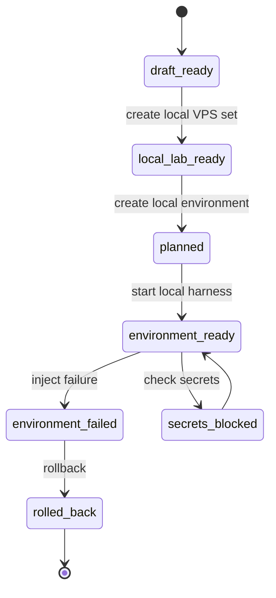
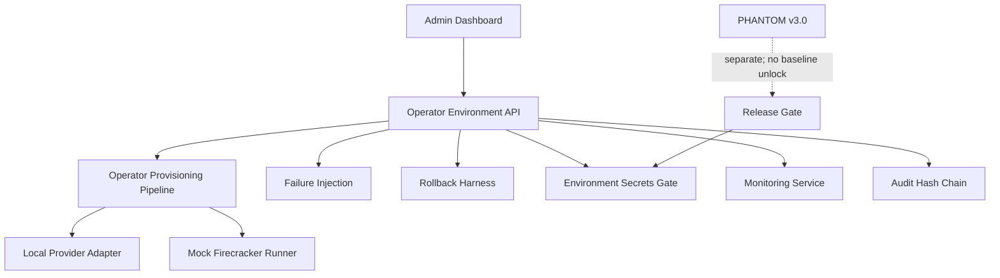
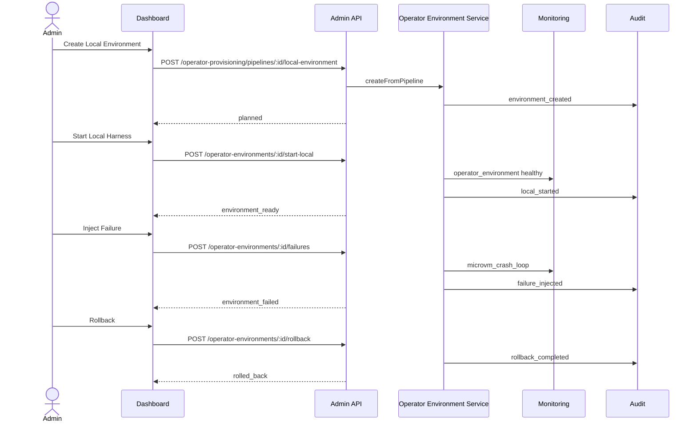

# Step 3.14 Freeze - Operator Environment Local Execution Harness

Status: implemented as local lab lifecycle harness.

## Frozen Decision

Step 3.14 turns the Step 3.13 operator provisioning pipeline into a local execution lifecycle that can be tested through API and dashboard without cloud side effects.

The system now supports:

- creating a local operator environment from a `local_lab_ready` pipeline;
- reserving the three baseline layers: `G1`, `G2`, `WORKLOAD`;
- planning mock Firecracker runtimes for communicator workloads;
- starting the local harness;
- injecting controlled failures;
- rolling back local lab resources;
- checking that environment secrets remain blocked;
- recording audit and monitoring evidence for each sensitive lifecycle action.

This remains local lab only. It does not create Hetzner or OVH resources, does not launch real Firecracker kernels, and does not release workload secrets.

## Implemented Modules

| Module | Responsibility | Production Boundary |
| --- | --- | --- |
| Operator Environment Service | Owns local lifecycle state machine | `productionExecutionAllowed=false` |
| Local Provider Adapter | Represents G1/G2/WORKLOAD as local lab resources | no provider API calls |
| Mock Firecracker Runner | Represents communicator runtimes | no real microVM launch |
| Failure Injection | Forces provider/runtime/secrets failure states | test-only |
| Rollback Harness | Stops mock runtimes and releases local records | local cleanup only |
| Environment Secrets Gate | Confirms default-deny secrets | no secret material |
| Environment Monitoring | Emits health and anomaly signals | no communication content |
| Dashboard Environment Controls | Human-clickable lifecycle controls | local lab labels and helptips |
| Playwright Regression | Clicks complete local lifecycle | screenshots plus summary JSON |

## Dashboard Controls

Operators view now includes:

- `Environment Harness`: creates a local environment from a local-lab pipeline.
- `Start Harness`: starts mock provider resources and mock Firecracker runtimes.
- `Failure Injection`: forces controlled failure types.
- `Rollback Harness`: releases local resources and stops mock runtimes.
- `Environment Secrets`: confirms default-deny secrets after local execution.
- `Operator Environments`: shows current environment state, runtimes, failure and secrets status.

## API Surface

| Endpoint | Purpose |
| --- | --- |
| `GET /operator-environments` | List local environments |
| `GET /operator-environments/:id` | Get local environment |
| `GET /operator-environments/:id/events` | List environment events |
| `POST /operator-provisioning/pipelines/:id/local-environment` | Create environment from pipeline |
| `POST /operator-environments/:id/start-local` | Start local harness |
| `POST /operator-environments/:id/failures` | Inject controlled failure |
| `POST /operator-environments/:id/rollback` | Roll back local harness |
| `POST /operator-environments/:id/secrets-release-check` | Check secrets default-deny |

## Test Coverage

Automated API tests verify:

- local environment creation from a ready pipeline;
- exactly three local provider resources;
- mock runtime creation per communicator workload;
- start transition to `environment_ready`;
- secrets release remains denied;
- failure injection transitions to `environment_failed`;
- rollback transitions to `rolled_back`;
- event history exists;
- audit actions exist;
- monitoring health and anomaly events exist;
- readonly users can list but cannot mutate environments.

Playwright dashboard test verifies:

- login and demo flow;
- operator pipeline creation;
- local VPS creation;
- local environment creation;
- local harness start;
- failure injection;
- rollback;
- environment secrets check;
- PHANTOM remains blocked;
- release remains not production-ready.

## Mermaid - State Machine

## Mermaid - Module Dependencies

## Mermaid - Runtime Flow

## Residual Risks

- Real Firecracker launch behavior is not tested yet.
- Provider cleanup behavior is not tested against live APIs.
- CPU confidential-computing attestation remains a gate, not an executor.
- Secrets release remains intentionally blocked.

Human gate is required before any live provider mutation, real Firecracker launch, or production secret release.
