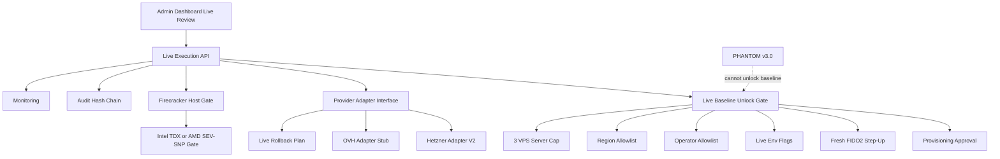
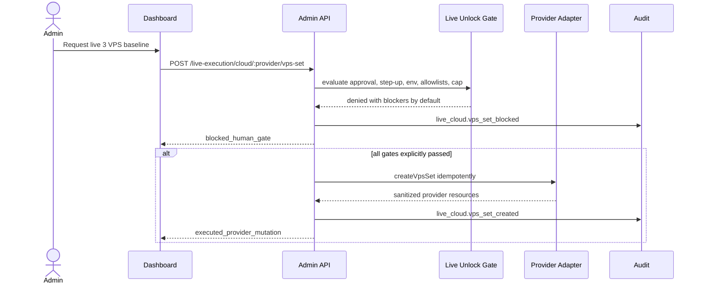
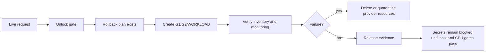

# Step 3.15 Masterplan - Gated Live Provider Adapter And Baseline Unlock

Status: planned, not implemented.

## Goal

Step 3.15 prepares the transition from local lab lifecycle to gated provider execution. The goal is not to make live cloud easy. The goal is to make live cloud deliberate, observable, reversible and blocked by default.

The sprint creates a production-grade plan for:

- Hetzner and OVH adapter boundary;
- provider secret references only, never plaintext in chat or dashboard;
- live environment gate;
- operator allowlist;
- region allowlist;
- max server cap;
- idempotent 3 VPS baseline creation;
- cleanup and rollback plan;
- CPU confidential-computing evidence gate;
- Firecracker host qualification gate;
- release evidence gate;
- Playwright dashboard test of the blocked and approved-for-review paths.

## Non-Negotiable Boundaries

- No API keys in chat.
- No provider mutation unless `SYLION_PROVIDER_MODE=live`, `SYLION_LIVE_ALLOWED=true`, operator and region are allowlisted, max servers is at least 3, approval is valid, and fresh step-up is present.
- PHANTOM cannot unlock baseline execution.
- Secrets release remains blocked until host, CPU, release and human gates pass.
- Live rollback must be designed before live creation can be considered acceptable.
- Provider responses must be sanitized before storage.

## Modules

| Module | Responsibility | Acceptance Criteria |
| --- | --- | --- |
| Provider Adapter Interface | Shared contract for Hetzner/OVH | create/list/delete 3 VPS set, idempotency, sanitized outputs |
| Hetzner Adapter V2 | Harden existing Hetzner live boundary | no plaintext token output, idempotency, labels, rollback metadata |
| OVH Adapter Stub | Adds blocked adapter shape | returns `not_implemented_live_gate` until implemented |
| Live Baseline Unlock Gate | Evaluates env flags, approval, allowlist, region, cap | default deny with explicit blockers |
| Provider Secret Resolver | Reads secret reference from env/secret manager only | never accepts chat-pasted key |
| Live Rollback Plan | Plans delete/rebuild for G1/G2/WORKLOAD | rollback must exist before creation |
| Host Attestation Gate | Connects Firecracker and CPU confidential evidence | TDX or SEV-SNP evidence required for secrets release |
| Dashboard Live Review | UI for blocked/ready/live-request states | clear warnings and helptips |
| Playwright Live Gate Test | Clicks blocked path without provider mutation | proves live remains blocked locally |

## Mermaid - Module Dependencies

## Mermaid - Live Gate Sequence

## Mermaid - Rollback Requirement

## Implementation Prompts

### Prompt A - Provider Interface

Implement a provider adapter interface for SYLION live baseline creation. The interface must support idempotent creation of exactly three resources: G1, G2 and WORKLOAD. It must return sanitized resources only and must not expose provider tokens, raw API payloads or operational secrets.

### Prompt B - Hetzner Adapter V2

Harden the Hetzner live adapter. Add rollback metadata, resource labels, dry-run parity, idempotency behavior and provider response sanitization. Preserve the existing default-deny gate.

### Prompt C - OVH Stub

Add an OVH adapter stub that follows the same interface but returns a blocked not-implemented state. It must be visible in docs and tests so future implementation has a contract.

### Prompt D - Live Gate Tests

Write API tests proving that live provider mutation is blocked by default and only reaches the adapter when all gates are explicitly set. Tests must verify no plaintext token leaks, 3 VPS baseline, idempotency, region allowlist, operator allowlist and max server cap.

### Prompt E - Dashboard Live Review

Extend the dashboard live review card to show blockers, allowlists, selected provider, rollback readiness and CPU confidential gate. Add helptips for each dangerous control.

### Prompt F - Playwright Human Test

Extend dashboard smoke to click the blocked live request path and verify that UI shows blockers, no production execution, PHANTOM separation, rollback required and secrets locked.

## Acceptance Criteria

- API tests prove default-deny live behavior.
- Hetzner adapter is only invoked under explicit env and approval gates.
- OVH adapter contract exists but cannot mutate resources yet.
- Dashboard shows live blockers and rollback readiness.
- Playwright verifies blocked live path.
- No plaintext provider secret appears in responses, audit, monitoring or screenshots.
- Step 3.15 freeze doc and diagrams are committed.

## Human Gate

Human gate is required before using a real provider key or running any live mutation. The key must be provided through environment variables or a secret manager, never in chat.
