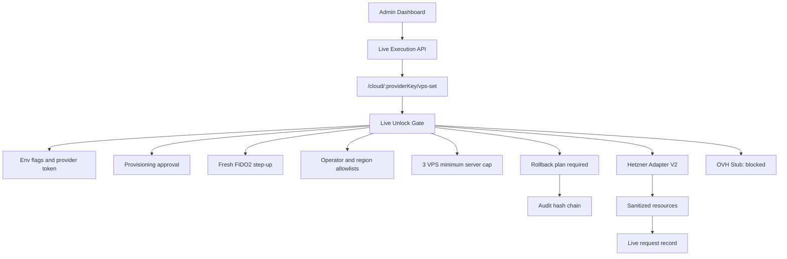
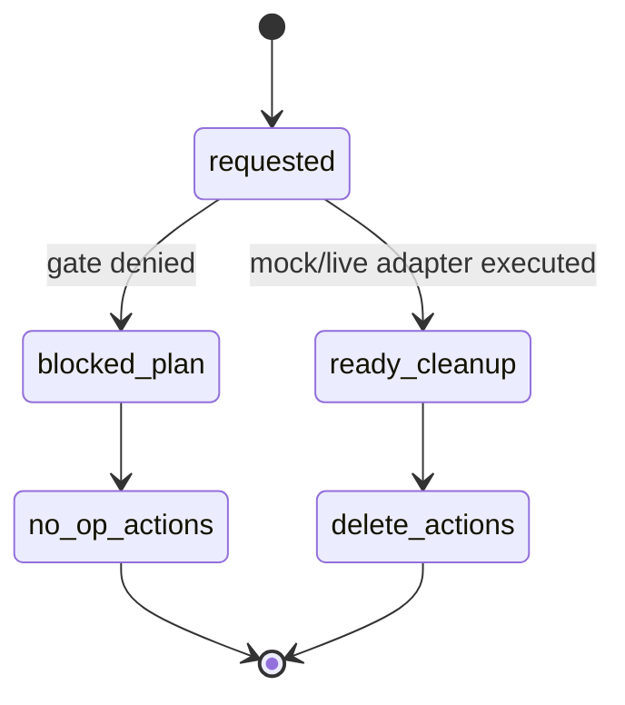

# Step 3.15 Freeze - Gated Live Provider Unlock Layer

Status: implemented as gated provider-contract and rollback-plan layer.

## Frozen Decision

Step 3.15 hardens the live provider path without making live execution automatic. The Admin API now exposes a provider-generic live VPS request route, creates rollback metadata for every request, sanitizes provider resources, and keeps OVH visible but blocked until the adapter is implemented.

No real provider mutation is possible unless all existing human gates and runtime gates pass.

## Implemented Scope

| Module | Status | Notes |
| --- | --- | --- |
| Provider-generic live route | implemented | `/live-execution/cloud/:providerKey/vps-set` |
| Hetzner Adapter V2 boundary | implemented | sanitized resources plus rollback metadata |
| OVH live adapter stub | implemented | visible, blocked by `ovh_live_adapter_not_implemented` |
| Live rollback plans | implemented | created for blocked and executed requests |
| Live summary adapter status | implemented | dashboard shows provider adapter states |
| Dashboard rollback visibility | implemented | live rollback cards and request rollback status |
| Tests | implemented | default-deny, Hetzner mock execution, OVH blocked |

## Security Invariants

- Provider secrets are never returned in responses.
- Raw provider responses are never stored in public request records.
- Every live request has rollback metadata.
- Blocked requests produce no-op rollback actions.
- Executed mock-provider requests produce sanitized delete actions.
- OVH cannot mutate resources yet.
- PHANTOM cannot unlock baseline live execution.
- `productionExecutionAllowed` remains false.

## API Surface

| Endpoint | Purpose |
| --- | --- |
| `POST /live-execution/cloud/:providerKey/vps-set` | Provider-generic gated baseline request |
| `GET /live-execution/cloud/rollback-plans` | List live rollback plans |
| `POST /live-execution/cloud/hetzner/vps-set` | Backward-compatible Hetzner route |

## Test Coverage

API tests cover:

- blocked live request creates rollback plan;
- provider secret does not leak;
- Hetzner mock adapter receives one call only after gates pass;
- Hetzner resources preserve `G1/G2/WORKLOAD`;
- provider resources are sanitized;
- idempotency prevents duplicate adapter calls;
- OVH remains blocked with `ovh_live_adapter_not_implemented`;
- audit records rollback plan creation.

Dashboard smoke verifies:

- blocked live request path;
- rollback plan visibility;
- live request blocker visibility;
- Firecracker host qualification still non-executable;
- CPU confidential gate still separated from production execution.

## Mermaid - Provider Gate

## Mermaid - Rollback Plan States

## Human Gate

Human gate remains required before using any real provider key or permitting live mutation. Provider keys must enter through environment variables or a secret manager, never chat.
