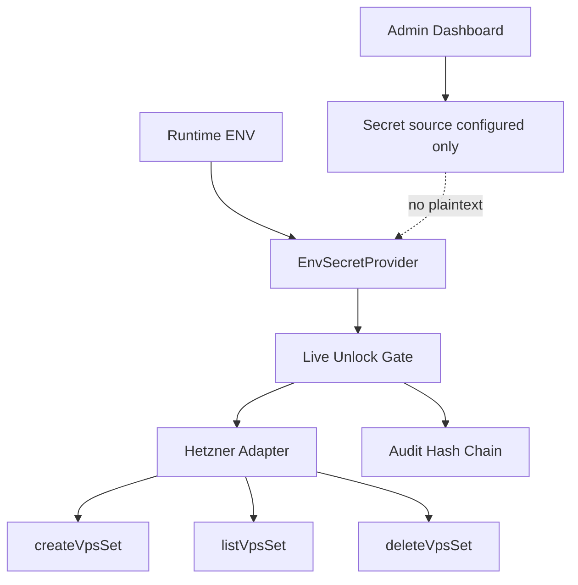
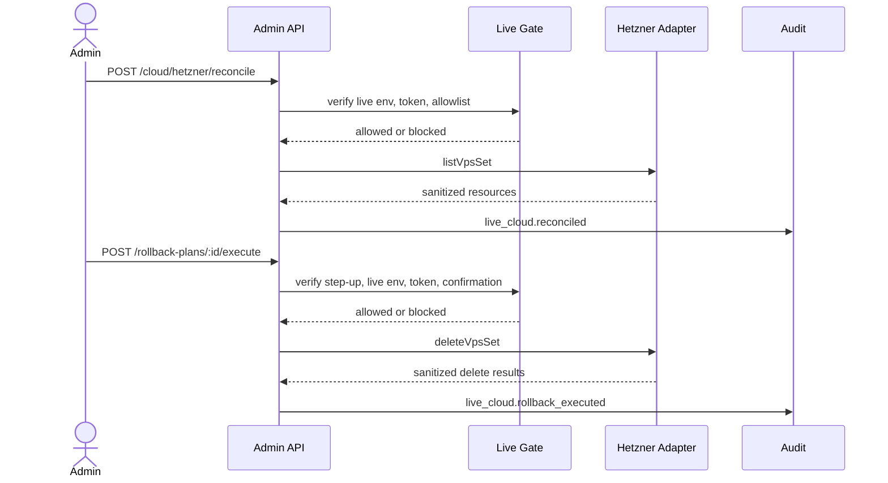

# Step 3.16 Freeze - Runtime Secrets And Hetzner Sandbox Operations

Status: implemented as gated runtime-secret and sandbox provider-operation layer.

## Frozen Decision

Step 3.16 starts replacing lab-only provider behavior with real execution boundaries, while preserving default-deny production posture.

The system now has:

- `EnvSecretProvider` for runtime provider token resolution;
- no provider token accepted through chat or dashboard execution paths;
- live summary visibility for secret source and configured provider status;
- Hetzner adapter support for create, list/reconcile, and delete/rollback actions;
- gated reconciliation endpoint;
- gated rollback execution endpoint with fresh step-up;
- tests proving no plaintext token exposure in summaries, responses, rollback results, or audit-facing objects.

## Implemented Modules

| Module | Responsibility | Production Boundary |
| --- | --- | --- |
| EnvSecretProvider | Resolves provider tokens from process env | no plaintext in public status |
| Hetzner listVpsSet | Reads current provider resources by SYLION labels | blocked unless live gate passes |
| Hetzner deleteVpsSet | Deletes resources from rollback actions | requires live gate and step-up |
| Live reconciliation | Compares provider state to G1/G2/WORKLOAD baseline | emits drift, no mutation |
| Rollback execution | Executes sanitized delete actions from rollback plan | gated destructive path |
| Dashboard live status | Shows secret source and rollback readiness | no token display |

## API Additions

| Endpoint | Purpose |
| --- | --- |
| `POST /live-execution/cloud/:providerKey/reconcile` | Reconcile provider state with operator baseline |
| `POST /live-execution/cloud/rollback-plans/:id/execute` | Execute gated rollback cleanup |

## Security Invariants

- Provider secrets are runtime-only.
- Provider secrets are not returned in API responses.
- Provider secrets are not written to audit events.
- Rollback execution requires fresh step-up and live confirmation.
- Reconciliation is blocked when the runtime provider token is absent.
- `productionExecutionAllowed` remains false.
- PHANTOM remains unable to unlock baseline execution.

## Test Coverage

Automated tests verify:

- `EnvSecretProvider` reports configured state without revealing token value;
- Hetzner sandbox adapter can create, reconcile, and rollback through gated flow;
- rollback execution records audit evidence;
- reconciliation is blocked when token is absent;
- responses do not contain the runtime token.

## Mermaid - Runtime Secret Flow

## Mermaid - Reconcile And Rollback

## Remaining Work

- Replace ENV provider with Vault/KMS/HSM-backed provider for production.
- Add real OVH list/create/delete implementation.
- Add provider-side retry/backoff and rate-limit handling.
- Add persistent reconciliation history.
- Add production runbook and two-person approval for destructive rollback.
