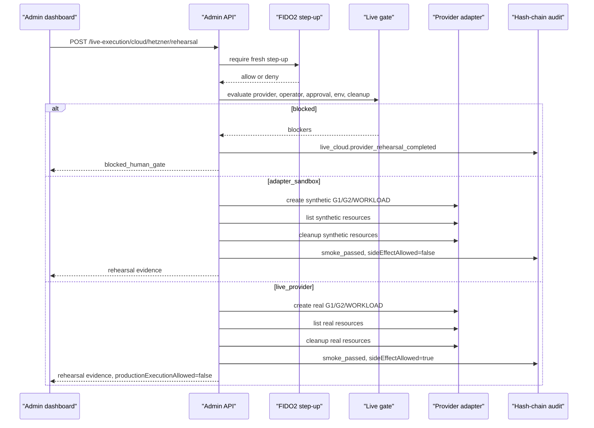

# Step 3.18 Freeze - Live Provider Rehearsal

Date: 2026-05-21

## Scope

Step 3.18 adds a controlled provider rehearsal layer for the SYLION live cloud path. It validates the 3-VPS baseline, approval binding, environment gates, adapter behavior, reconciliation and cleanup without requiring provider API keys in chat.

## Implemented

- `LIVE_PROVIDER_REHEARSAL` resource type.
- `GET /live-execution/cloud/rehearsals`
- `POST /live-execution/cloud/{provider}/rehearsal`
- Admin SDK helpers for listing/running rehearsals.
- Admin dashboard Provider Rehearsal form and evidence cards.
- Playwright dashboard smoke now clicks the rehearsal path.
- Tests for:
  - Hetzner adapter sandbox without runtime token.
  - live provider rehearsal blocked unless `SYLION_LIVE_SMOKE_ALLOWED=true`.
  - live provider create/list/delete sequence behind env gate and cleanup confirmation.

## Modes

| Mode | Provider side effects | Purpose |
| --- | --- | --- |
| `gate_only` | No | Evaluate gates only. |
| `adapter_sandbox` | No | Exercise provider-shaped create/list/delete contract with synthetic resources. |
| `live_provider` | Yes, gated | Real provider smoke only when live env gates, approval, step-up and cleanup confirmation are present. |

## Security Invariants

- No provider token is accepted through chat or stored in repo.
- Runtime provider token status is shown without plaintext.
- Rehearsal does not enable production execution.
- PHANTOM remains separate and cannot unlock baseline.
- Every adapter path requires G1/G2/WORKLOAD shape.
- Cleanup/rollback is mandatory for adapter and live smoke modes.
- Audit records every rehearsal outcome.

## Mermaid

## Remaining For 3.19-3.21

- 3.19: replace env-only secret backend with Vault/KMS/HSM adapter contract.
- 3.20: real/local Firecracker host qualification and launch rehearsal.
- 3.21: full human Playwright suite across admin + operator portals with issue inventory.
