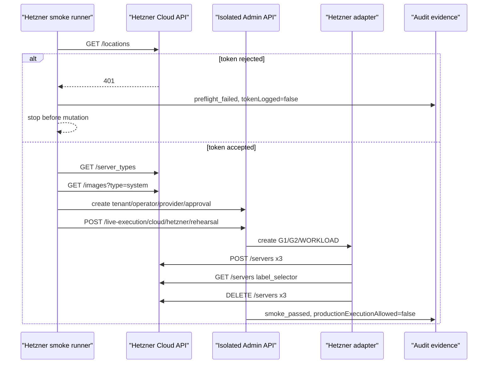

# Step 3.18a Freeze - Hetzner Live Smoke Preflight

Date: 2026-05-21

## Purpose

Step 3.18a hardens the transition from adapter sandbox to real Hetzner smoke. It adds a one-command smoke runner that validates the provider token and catalog before any paid resource mutation, then runs the existing 3-VPS rehearsal only when all gates are satisfied.

## Command

```powershell
$env:HETZNER_API_TOKEN="<runtime secret only>"
$env:SYLION_LIVE_SMOKE_CONFIRM="I_UNDERSTAND_COST_AND_CLEANUP"
npm run test:hetzner-live-smoke
```

Optional runtime selectors:

- `SYLION_LIVE_REGION`, default `fsn1`
- `SYLION_HETZNER_SERVER_TYPE`, default `cx22`
- `SYLION_HETZNER_IMAGE`, default `ubuntu-24.04`

## Implemented Controls

- Preflight calls Hetzner `/locations`, `/server_types` and `/images?type=system` before creating anything.
- Rejected or invalid token exits before mutation and writes sanitized evidence only.
- Live runner starts an isolated in-process Admin API with explicit live smoke gates.
- Live runner creates an ephemeral tenant, operator, provider record and approval for the smoke.
- Rehearsal remains capped to the required G1/G2/WORKLOAD baseline.
- Cleanup confirmation is mandatory.
- `productionExecutionAllowed` remains `false`.
- Provider token is never written to source, docs, artifacts or console output.

## Current Evidence

The provided one-time Hetzner token was rejected by the Hetzner API during preflight:

```json
{
  "provider": "hetzner",
  "status": "preflight_failed",
  "reason": "hetzner_token_rejected",
  "checks": [
    {
      "name": "locations",
      "status": 401,
      "ok": false
    }
  ],
  "tokenLogged": false
}
```

No server creation was attempted after that preflight failure.

## Mermaid



## Next Gate

Run the same command with a fresh, project-scoped Hetzner token delivered through runtime environment or secret manager. Revoke the exposed one-time token before the next run.
