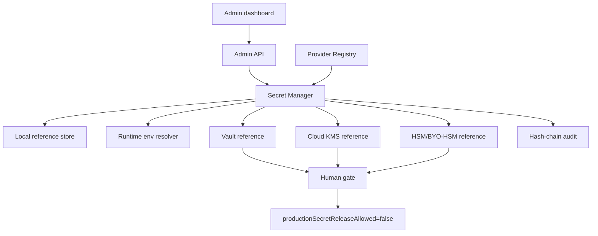
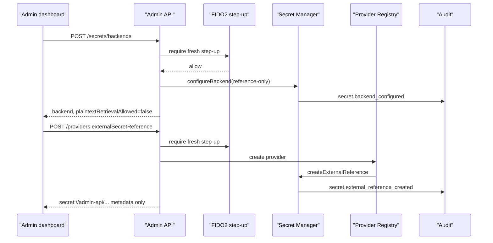

# Step 3.19 Freeze - Secret Backend Contract

Date: 2026-05-21

## Scope

Step 3.19 adds the production-facing contract for secret backends without claiming production HSM readiness. The Admin API can now register Vault, Cloud KMS, HSM and BYO-HSM backend references, expose backend posture in the dashboard, and attach provider credentials to external secret references instead of write-time plaintext.

## Implemented

- `GET /secrets/backend-status`
- `GET /secrets/backends`
- `POST /secrets/backends`
- `SecretManagerService.configureBackend`
- `SecretManagerService.createExternalReference`
- `SecretManagerService.rotateExternalReference`
- Provider creation can use `externalSecretReference + secretBackendId`.
- Provider secret rotation can rotate an external reference.
- Admin dashboard Secret Backend form and status cards.
- Dashboard Playwright smoke clicks Secret Backend registration.
- Tests for:
  - Vault/KMS/HSM backend contract remains reference-only.
  - env runtime token status does not leak plaintext.
  - provider external secret references avoid API-key plaintext.
  - external references containing secret material are rejected.

## Security Invariants

- Secret backend registration stores references and evidence only.
- Plaintext retrieval remains `false`.
- Production secret release remains `false`.
- HSM/BYO-HSM is not marked production ready.
- Runtime environment remains a gated resolver only for live smoke.
- Provider tokens are not returned by API, UI, audit or artifacts.
- PHANTOM remains separate and cannot unlock baseline secrets.

## Mermaid

## Remaining

- Real Vault token/auth method integration.
- Real KMS/HSM attestation and signing operations.
- External WORM anchor for audit hash chain.
- Production HSM go-live requires HUMAN GATE with Security, Infra and Compliance.
