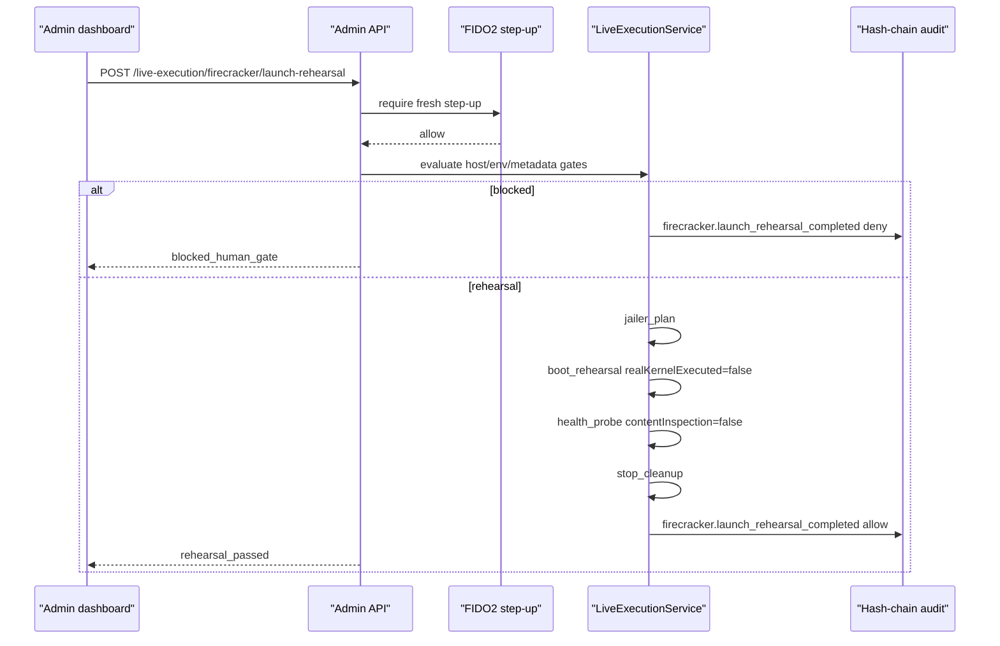

# Step 3.20 Freeze - Firecracker Launch Rehearsal

Date: 2026-05-21

## Scope

Step 3.20 adds an audited Firecracker launch rehearsal layer. It validates that a qualified host can pass the SYLION launch contract for communicator microVMs without executing a real kernel, storing terminal data, mutating cloud resources, or releasing production secrets.

## Implemented

- `FIRECRACKER_LAUNCH_REHEARSAL` resource type.
- `GET /live-execution/firecracker/launch-rehearsals`
- `POST /live-execution/firecracker/launch-rehearsal`
- Admin SDK helpers for listing/running launch rehearsals.
- Admin dashboard Launch Rehearsal form and evidence cards.
- Tests for:
  - qualified local host rehearsal path,
  - blocked host/env gate path,
  - rejection of metadata containing secrets or communication content.

## Gate Model

| Gate | Required For Pass |
| --- | --- |
| Host qualification | `readyForFirecrackerLaunch=true` |
| Env flag | `SYLION_FIRECRACKER_LAUNCH_REHEARSAL_ALLOWED=true` |
| Confirmation | admin rehearsal confirmation |
| Workload names | approved communicator set only |
| Metadata hygiene | no secrets, no terminal data, no message/chat content |

## Security Invariants

- Real Firecracker kernel execution remains `false`.
- `productionExecutionAllowed=false`.
- `secretsReleaseAllowed=false`.
- `terminalDataStored=false`.
- PHANTOM remains outside baseline unlock.
- Audit records every rehearsal result.
- The rehearsal is not a claim that production Firecracker is ready.

## Mermaid

## Remaining

- Real Firecracker binary launch on qualified Linux/KVM host.
- Jailer namespace validation with actual kernel/rootfs artifacts.
- Persistent runtime reconciliation history.
- WORM audit external anchor.
- Production execution requires HUMAN GATE with Platform, SRE, Security and Compliance.
