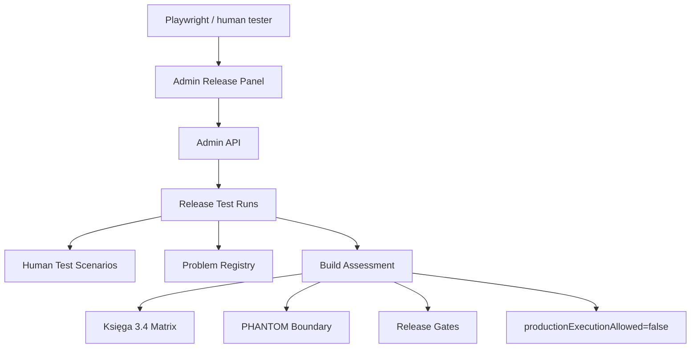
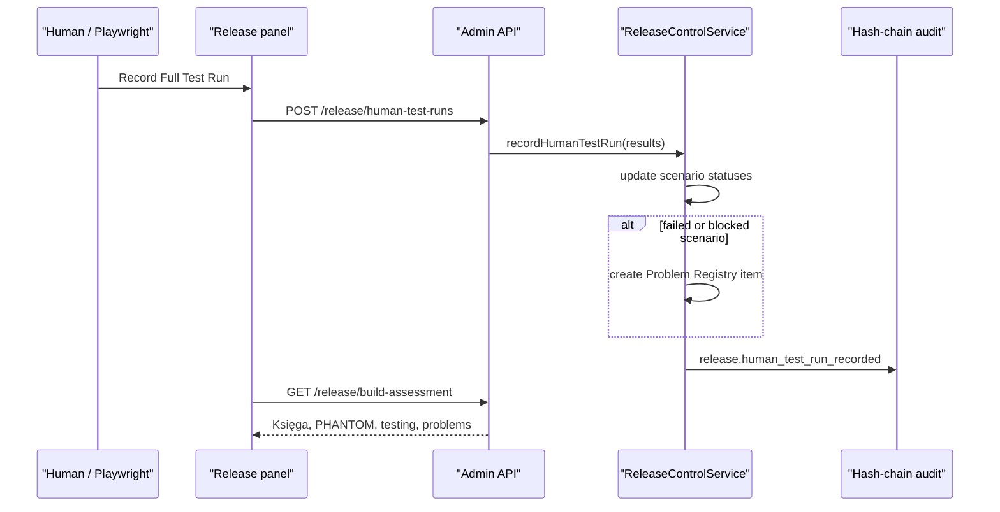

# Step 3.21 Freeze - Human Test Inventory And Build Assessment

Date: 2026-05-21

## Scope

Step 3.21 adds a full human/Playwright test-run inventory and a build assessment view. This closes the loop requested for deep testing: every complete dashboard pass can be recorded, scenario results are persisted, failures can create Problem Registry entries, and the release view summarizes current state against Księga 3.4 and PHANTOM v3.0.

## Implemented

- `RELEASE_TEST_RUN` resource type.
- `GET /release/human-test-runs`
- `POST /release/human-test-runs`
- `GET /release/build-assessment`
- Admin SDK helpers for listing/recording full human test runs.
- Admin dashboard Full Test Run form and cards.
- Admin dashboard Build Assessment cards.
- Playwright dashboard smoke records a full test run.
- Tests for:
  - successful full dashboard pass inventory,
  - automatic problem creation for failed/blocked scenarios,
  - rejection of prohibited operational content in test notes.

## Build Assessment

The assessment is deliberately conservative:

- `productionExecutionAllowed=false`
- PHANTOM execution remains false.
- PHANTOM certification claim remains false.
- Księga 3.4 blocked controls remain visible.
- Open release problems remain blockers until verified or accepted as risk.

## Mermaid

## Remaining

- Browser-level issue classification from screenshots.
- Automatic attachment of Playwright artifact IDs to every scenario.
- CI job that runs dashboard smoke and posts test-run evidence.
- Production readiness still requires HUMAN GATE for provider mutation, real Firecracker, HSM, router firmware and PHANTOM legal/CISO/architect review.
