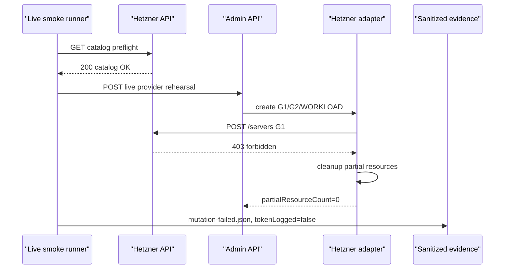

# Step 3.22 Freeze - Hetzner Live Permission Gate

Date: 2026-05-21

## Scope

Step 3.22 hardens the real Hetzner live smoke path after testing a cost-limited one-time token. The token passed read-only catalog preflight but failed at the first server creation call with `403 forbidden`, before any baseline resource was created.

## Implemented

- Hetzner live smoke preflight now requests larger catalog pages with `per_page=100`.
- Default smoke server type changed from unavailable `cx22` to available low-cost `cpx11`.
- Hetzner adapter now captures sanitized provider error fields:
  - `providerStatus`
  - `providerErrorCode`
  - `providerErrorMessage`
  - `tokenLogged=false`
- Live smoke runner writes `mutation-failed.json` when provider mutation fails before baseline creation.

## Evidence

Current live smoke result:

```json
{
  "provider": "hetzner",
  "status": "mutation_failed_before_baseline",
  "providerStatus": 403,
  "providerErrorCode": "forbidden",
  "providerErrorMessage": "permission denied",
  "partialResourceCount": 0,
  "cleanupResults": [],
  "tokenLogged": false
}
```

Evidence file:

- `docs/admin-panel-v2/test-artifacts/step3-18-hetzner-live-smoke/mutation-failed.json`

## Security Decision

No VPS was created. Cleanup had no resources to delete. The result proves that the live path reaches the provider mutation gate, but the supplied token lacks server creation permission.

## Mermaid



## Next Gate

To run the full paid smoke, provide a fresh project-scoped Hetzner token with server create/delete permission and keep:

- `SYLION_LIVE_SMOKE_CONFIRM=I_UNDERSTAND_COST_AND_CLEANUP`
- `SYLION_HETZNER_SERVER_TYPE=cpx11`
- `SYLION_LIVE_MAX_SERVERS=3`

Revoke the exposed one-time token after this run.
