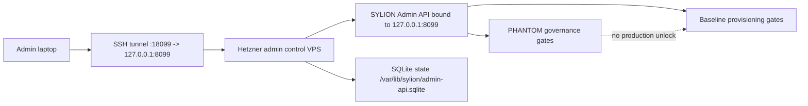
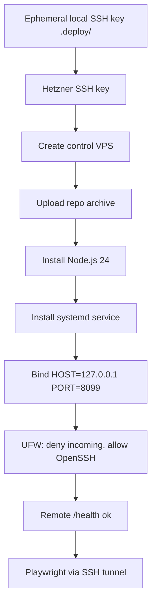

# Step 3.23 Freeze - Hetzner Admin Control VPS Deploy

## Scope

This step deploys the SYLION Admin API and admin/operator web shells to a dedicated Hetzner control VPS.

- Server: `sylion-admin-control-20260521204258`
- Public IPv4: `188.245.227.27`
- Service: `sylion-admin-api.service`
- Runtime: Node.js 24 with `node:sqlite`
- Data path: `/var/lib/sylion/admin-api.sqlite`
- App path: `/opt/sylion-secure`
- Admin API bind: `127.0.0.1:8099`
- Access path: SSH tunnel only

## Security Decision

The admin panel is not exposed as a public HTTP service.



## Deployment Graph



## Operator Baseline Readiness

After this deploy, operator creation can be exercised through the admin panel against persistent server state. The current implementation still preserves these gates:

- Operator baseline remains exactly 3 VPS: G1, G2, WORKLOAD.
- Live provider mutation requires explicit live unlock and approval binding.
- Firecracker launch remains rehearsal/gated; real kernel execution is not enabled.
- PHANTOM remains governance/lab-gated and does not unlock baseline production execution.
- GrapheneOS image generation remains an artifact pipeline concern until the ADB/device installation step is explicitly run.

## Access Command

```powershell
ssh -i .deploy\sylion_hetzner_admin_ed25519 -L 18099:127.0.0.1:8099 root@188.245.227.27
```

Then open:

```text
http://127.0.0.1:18099/admin
```

## Evidence

- Remote service status: `active (running)`.
- Remote health check: `{"status":"ok","service":"admin-api"}`.
- Remote socket check: `127.0.0.1:8099` only.
- Node runtime: `v24.15.0`.
- Operator portal Playwright smoke passed through SSH tunnel.
- Full admin dashboard Playwright smoke exposed a test synchronization issue around async toast/refresh handling on persistent remote state; the API action completed, but the smoke runner did not reliably observe the toast.
- A Step 3.23 deploy operator was created on the remote control VPS with `vpsPerOperator=3` and a local lab baseline pipeline.

## Residual Risks

- The Hetzner API key used for deployment must be revoked after this step.
- The control VPS is live and billing accrues until the server is deleted.
- The deploy path is still manual; next step should convert it into a repeatable deployment script with rollback.
- Full production operator creation with durable live G1/G2/WORKLOAD resources must remain behind the existing live gates and cost confirmation.
- Dashboard smoke should be made idempotent against persistent remote state before it becomes a release gate.
