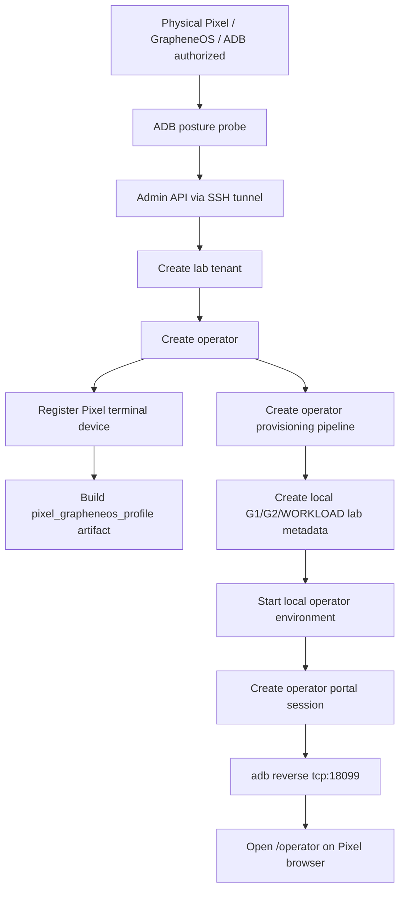

# Step 3.24 Freeze - Pixel ADB Operator Lab

## Scope

This step connects a physical Pixel with ADB enabled to the already deployed SYLION Admin API through the local SSH tunnel and validates the Pixel terminal path for a newly created operator.

- Admin API target: `http://127.0.0.1:18099`
- Physical device transport: ADB over USB
- Operator terminal mode: `pixel_grapheneos`
- Router package: Puli AX physical package still pending
- VPN state: local lab only, IPsec IKEv2 planned
- Production execution: disabled

## Flow



## Implemented Harness

Command:

```powershell
npm run test:pixel-adb-operator-lab
```

The harness:

- discovers the authorized ADB device,
- reads only posture metadata with `getprop`,
- hashes the build fingerprint instead of storing the raw fingerprint,
- creates a dedicated tenant and operator,
- registers the Pixel as `pixel_grapheneos`,
- registers a laptop terminal for comparison,
- builds a signed `pixel_grapheneos_profile` artifact,
- creates local lab G1/G2/WORKLOAD metadata,
- starts a local operator environment,
- verifies `/operator-api/me`, `/operator-api/vpn-status`, `/operator-api/devices`, and `/operator-api/terminal-profiles`,
- opens the operator portal on the Pixel through `adb reverse`.

## Evidence

Latest local run:

```json
{
  "adbSerial": "46141FDAP009CZ",
  "operatorId": "op_a25dbb3b-cd54-4fcd-a9b5-d52f271c7633",
  "tenantId": "tenant_489ae2b4-927c-4dec-9d71-32825b03ed50",
  "pixelDeviceId": "device_022d1926-e430-4ee7-91be-8d61f58b1a22",
  "artifactId": "artifact_9b93609d-eb24-478c-a3c2-7d76a3709a14",
  "pipelineId": "op_pipe_e40269fe-9c6b-4311-8d65-d8b3ee48685c",
  "localLabId": "local_lab_vps_96be36c4-bd3e-4381-b3f8-7b48b71757e9",
  "environmentId": "op_env_db1d15d5-7f4e-40f8-95bc-126aad31a21f",
  "vpnState": "local_lab_connected",
  "vpnTransport": "ipsec_ikev2_planned",
  "terminalMode": "pixel_grapheneos",
  "pixelProfileAvailable": true,
  "productionExecutionAllowed": false,
  "operationalDataOnTerminal": false,
  "openedOperatorPortalOnPixel": true
}
```

## Security Boundaries

- No chat, file contents, wallet data, seeds, passwords, private keys, or terminal operational data are read from the Pixel.
- ADB is used only for lab posture metadata, local port reverse, and opening the operator portal URL.
- The Pixel remains a thin terminal; operational state remains behind G1/G2/WORKLOAD.
- Firecracker execution remains a planned/rehearsal gate, not a real kernel launch.
- PHANTOM remains separate and does not unlock baseline execution.

## Residual Risks

- The Pixel is lab-qualified only until a formal hardware qualification record is completed.
- The Puli AX package is pending physical validation.
- The phone browser session is opened by ADB for lab testing; production onboarding must use FIDO2/HSM and policy-controlled enrollment.
- Real VPN profile installation is not performed yet; current status is `ipsec_ikev2_planned`.
