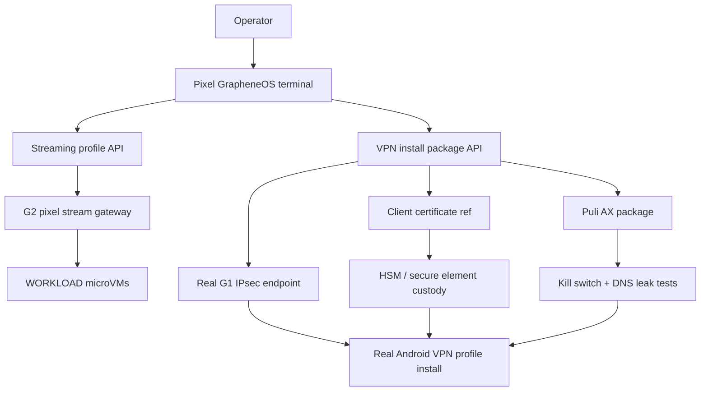
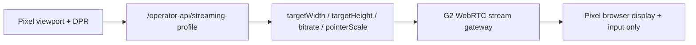

# Step 3.25 Plan - Real VPN Package and Pixel Streaming Adaptation

## Decision

Real VPN installation on Pixel is blocked until a real G1 IPsec endpoint, certificate reference, and router validation exist. The system now exposes the install package gate and the streaming adaptation profile so the Pixel path can be tested without pretending production VPN is ready.

## Dependency Graph

## Pixel Streaming Model

The Pixel should not receive a fixed desktop resolution. The G2 stream gateway must adapt per session:

- browser viewport width and height,
- device pixel ratio,
- orientation,
- network budget,
- pointer/touch scale,
- keyboard overlay mode.

Current profile contract:

## Implementation Added

- `/operator-api/vpn-install-package`
- `/operator-api/streaming-profile`
- Operator portal `Streaming` view
- Mobile and landscape CSS constraints for Pixel screens
- Pixel ADB harness checks VPN package state and streaming profile

## Real VPN Human Gate

Real install can start only after:

- G1 has a real public IPsec endpoint,
- client certificate is issued through approved HSM/secure-element custody,
- Puli AX package passes physical validation,
- DNS leak and kill-switch tests pass,
- operator FIDO2 unlock path is active,
- rollback and revocation path is documented.

## Next Implementation Step

Build the real VPN package generator:

1. Create G1/G2/WORKLOAD live resources for one operator under explicit cost gate.
2. Issue reference-only certificates for Pixel, G1, G2, WORKLOAD.
3. Generate an Android IKEv2 profile manifest without private keys in repo.
4. Push only the profile reference to Pixel via ADB.
5. Verify Pixel route and DNS state without reading operational data.
6. Record audit and rollback evidence.
