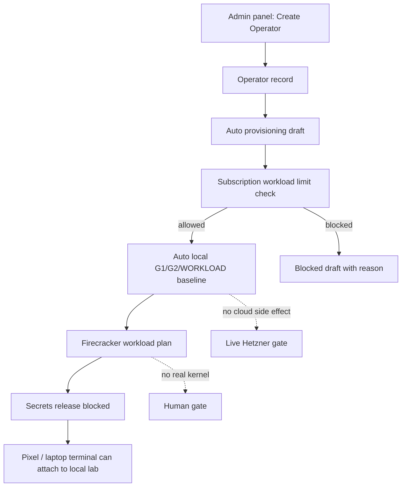

# Step 3.26 Freeze - Automatic Operator Baseline

## Decision

Creating an operator from the admin panel now automatically generates the operator baseline package:

- G1,
- G2,
- WORKLOAD,
- Firecracker workload plan per selected communicator template,
- CDR-required workload metadata,
- secrets-release denial gates,
- live cloud and production execution still blocked.

This matches the product model: admin creates an operator, and the system immediately prepares that operator's isolated baseline. Real Hetzner mutation, real Firecracker kernel launch, real VPN install, and production secret release remain gated.

## Flow

## API Response Contract

`POST /operators` returns:

- `operator`,
- `provisioningDraft`,
- `baselineProvisioning`.

When subscription limits allow the selected communicator templates, `baselineProvisioning.status` is `local_lab_ready`. When the tier blocks the requested workload count, `baselineProvisioning` is `null` and `provisioningDraft.status` is `blocked_draft`.

## Security Boundary

- Auto baseline is metadata/local-lab only.
- No live Hetzner VPS is created by plain operator creation.
- No private keys, VPN secrets, wallet data, chat content, files, or production credentials are generated or stored.
- Workload microVMs are planned as Firecracker-isolated but real kernel execution remains blocked.
- PHANTOM remains outside baseline execution.

## Next Step

Convert the live cloud gate into an explicit "promote automatic baseline to live" action:

1. select operator,
2. verify FIDO2 step-up,
3. verify provider budget/cost confirmation,
4. create live G1/G2/WORKLOAD in Hetzner,
5. bind certificate references,
6. generate VPN profile package,
7. run Pixel route/DNS test,
8. record rollback evidence.
