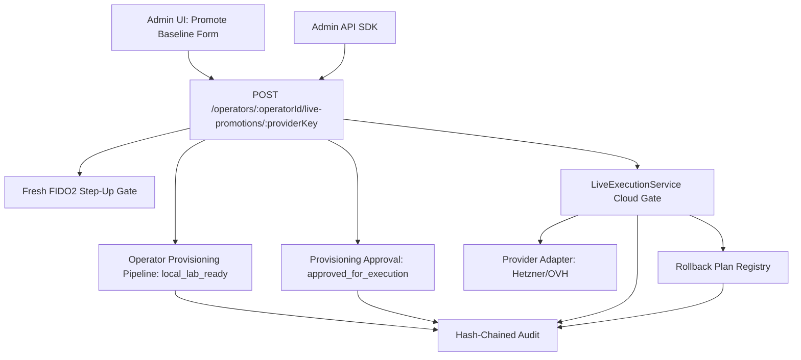
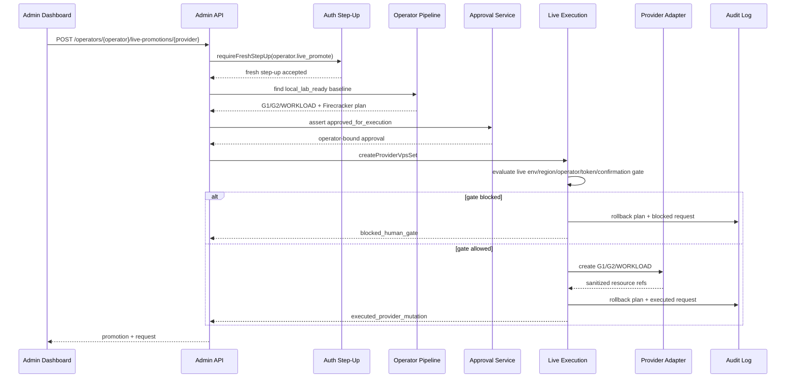

# Step 3.27 Freeze - Promote Operator Baseline To Live

## Scope

Step 3.27 connects the automatic operator baseline created in Step 3.26 with the existing live cloud gate. Creating an operator still creates only a local lab G1/G2/WORKLOAD baseline and a Firecracker workload plan. Live provider resources are created only through an explicit promotion request.

## Implemented Contract

| Area | Status | Notes |
| --- | --- | --- |
| Automatic local baseline prerequisite | implemented | Live promotion requires `local_lab_ready` with exactly G1, G2 and WORKLOAD |
| Live promotion endpoint | implemented | `POST /operators/:operatorId/live-promotions/:providerKey` |
| Human gate | implemented | Fresh FIDO2 step-up is required before the promotion request |
| Approval binding | implemented | Approval must be `approved_for_execution` and match the operator |
| Provider live gate | implemented | Reuses env allowlist, region allowlist, live confirmation and token checks |
| Rollback evidence | implemented | Rollback plan is recorded before/with request, including blocked no-op plan |
| Admin UI | implemented | Providers view includes a Step 3.27 Promote Baseline form with helptip |
| Production execution flag | blocked | `productionExecutionAllowed` remains false by design |

## Mermaid - Module Dependency Graph



## Mermaid - Promotion Runtime Flow



## Security Invariants Preserved

- Operator creation does not call cloud providers.
- Terminal modes still do not store operational data.
- Each operator baseline remains exactly 3 isolated VPS roles: G1, G2, WORKLOAD.
- Firecracker workloads remain planned until host and launch gates pass.
- Provider secrets are write-time/runtime references only and are not returned by the API.
- Live mutation requires local baseline, approval, fresh step-up, env allowlist, region allowlist, live confirmation and rollback evidence.
- PHANTOM remains separate and cannot unlock baseline live execution.

## Tests

```text
npm test -- services/admin-api/test/step3-27-promote-operator-baseline-live.test.js
```

Result: 109 passing tests, including:

- blocked live promotion without env unlock,
- live provider mutation only after all gates,
- rejection when the automatic local baseline is missing,
- provider token and API secret non-leakage.

## Next Step Candidate

Step 3.28 should add a dashboard-driven end-to-end Playwright scenario for:

1. create tenant,
2. create operator,
3. create provider reference,
4. create and approve promotion approval,
5. submit Promote Baseline,
6. verify blocked/executed gate state,
7. verify rollback plan and audit cards.
