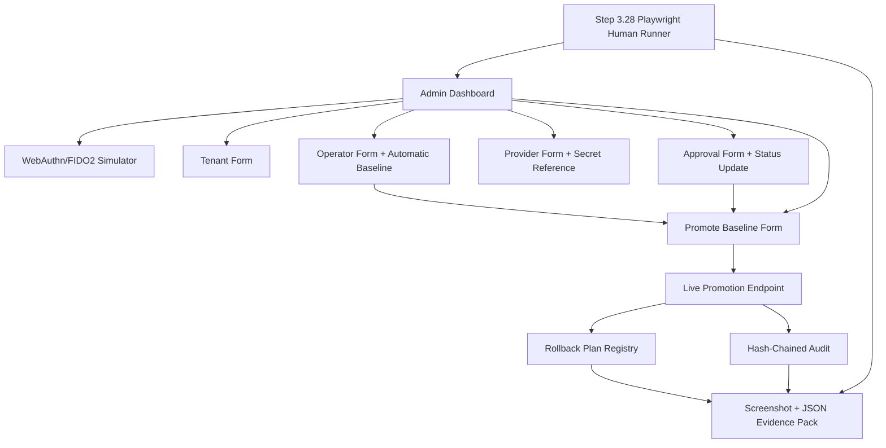
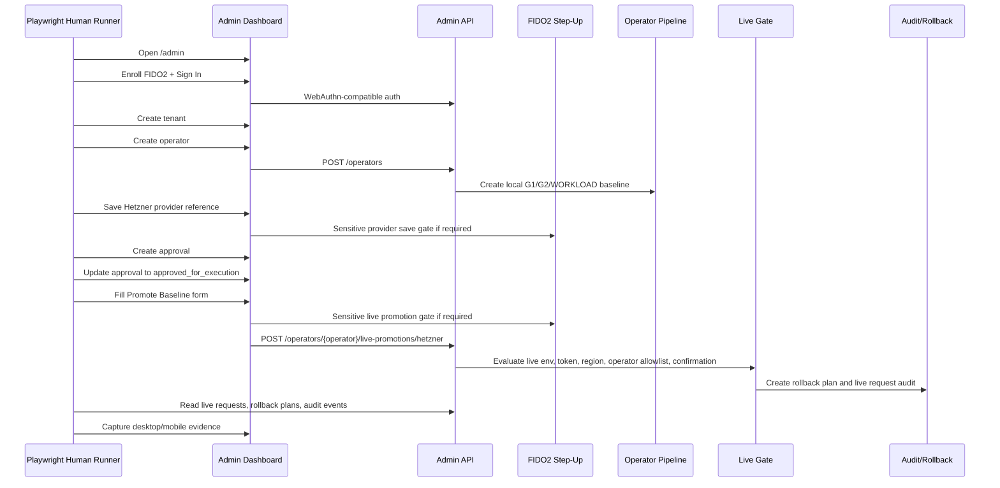

# Step 3.28 Freeze - Full Human Dashboard Live Promotion Test

## Scope

Step 3.28 turns the Step 3.27 baseline promotion feature into a reproducible human-style dashboard test. The runner clicks the admin panel through the same workflow an administrator would use:

1. login with WebAuthn-compatible local simulator,
2. create tenant,
3. create operator,
4. verify automatic local G1/G2/WORKLOAD baseline,
5. save Hetzner provider reference,
6. create and approve provisioning approval,
7. promote the operator baseline through the Step 3.27 live gate,
8. verify live request, rollback plan, audit events and no secret leakage,
9. capture desktop and mobile evidence.

The test intentionally does not turn on live provider mutation by default. In the normal local/VPS environment the expected result is `blocked_human_gate` with `sideEffectAllowed=false`.

## Implemented Artifacts

| Artifact | Status | Path |
| --- | --- | --- |
| Human dashboard runner | implemented | `scripts/admin-step3-28-human-live-promotion.mjs` |
| npm command | implemented | `npm run test:dashboard-live-promotion` |
| Evidence pack | implemented | `docs/admin-panel-v2/test-artifacts/step3-28-human-live-promotion/` |
| Summary JSON | implemented | `docs/admin-panel-v2/test-artifacts/step3-28-human-live-promotion/summary.json` |
| Mermaid dependency graph | implemented | `docs/admin-panel-v2/diagrams/84-step3-28-human-live-promotion-test.mmd` |

## Mermaid - Module Dependencies



## Mermaid - Human Runtime Flow



## Acceptance Matrix

| Check | Result |
| --- | --- |
| Dashboard login succeeds | passed |
| Tenant created through UI | passed |
| Operator created through UI | passed |
| Operator has automatic `local_lab_ready` baseline | passed |
| Baseline has exactly 3 roles | passed |
| Hetzner provider reference saved through UI | passed |
| Provider secret cleared and not leaked | passed |
| Approval created through UI | passed |
| Approval set to `approved_for_execution` through UI | passed |
| Promote Baseline form submitted through UI | passed |
| Live request recorded | passed |
| Rollback plan recorded | passed |
| Audit includes live request and rollback plan events | passed |
| `productionExecutionAllowed=false` | passed |
| Default run has no cloud side effect | passed |
| Mobile Providers view captured | passed |

## Evidence Summary

Latest verified run:

```json
{
  "status": "passed",
  "liveRequestStatus": "blocked_human_gate",
  "liveRequestSideEffectAllowed": false,
  "liveRequestProductionExecutionAllowed": false,
  "rollbackPlanStatus": "planned_blocked_no_resources",
  "auditEvents": [
    "live_cloud.rollback_plan_created",
    "live_cloud.vps_set_blocked"
  ],
  "secretLeakDetected": false
}
```

## Problem Found And Fixed

The first human run found a real dashboard bug in `createProvider`: after an async sensitive action, `event.currentTarget` could no longer be used to clear the provider API secret field. The fix captures the form before awaiting and clears the secret field via `form.elements.namedItem("apiSecret").value = ""`.

## Security Invariants Preserved

- Creating an operator does not create live provider resources.
- Live promotion requires local baseline, approval, step-up-capable flow, live confirmation and provider gate evaluation.
- Provider secret is not returned in live request, rollback, audit or DOM evidence.
- Rollback plan exists even for blocked requests.
- `productionExecutionAllowed` remains false in the tested path.
- PHANTOM remains separate and does not unlock baseline execution.

## Next Step Candidate

Step 3.29 should add a remote/VPS dashboard-live-promotion run mode that writes separate evidence for the deployed control plane, then adds a gated optional Hetzner live-smoke variant that can be enabled only with explicit env flags and budget-limited provider credentials.
