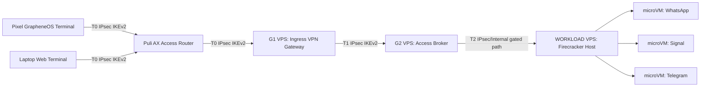
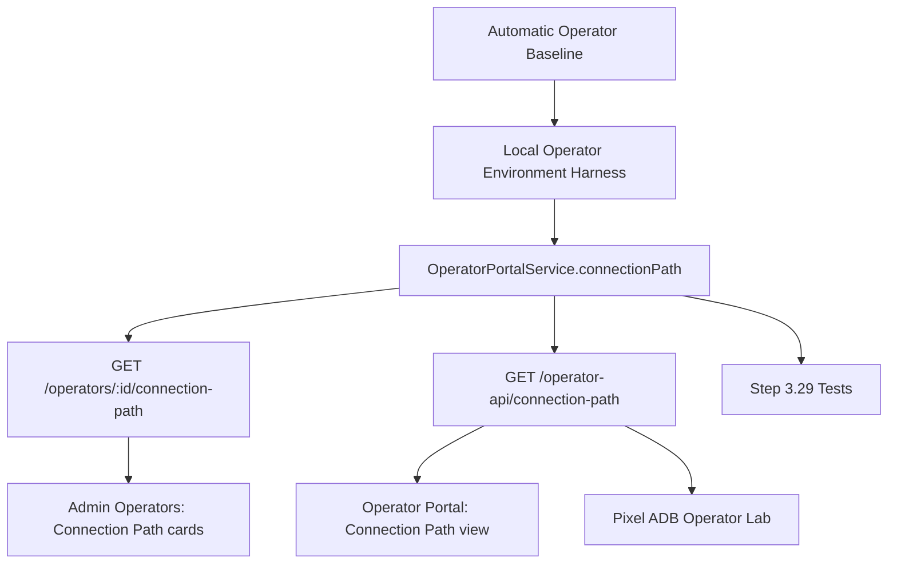
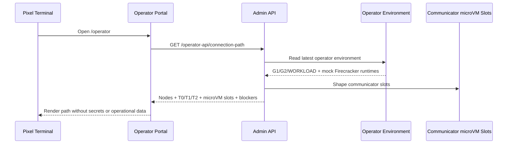

# Step 3.29 Freeze - Pixel VPN To Communicator microVM Path

## Scope

Step 3.29 makes the operator terminal path visible and testable:

`Pixel GrapheneOS or laptop terminal -> Puli AX -> G1 -> G2 -> WORKLOAD -> isolated Firecracker communicator microVMs`

This is still a gated contract/lab path. It does not deploy production strongSwan profiles, release HSM-backed certificates, start real Firecracker kernels, or store communicator data on the terminal.

## Implemented Contract

| Area | Status | Notes |
| --- | --- | --- |
| Operator connection path model | implemented | Nodes, VPN segments, blockers and communicator microVM slots |
| Admin endpoint | implemented | `GET /operators/:operatorId/connection-path?terminalMode=pixel_grapheneos` |
| Operator endpoint | implemented | `GET /operator-api/connection-path` |
| Pixel terminal mode | implemented | Path label and ADB smoke integration |
| Laptop terminal mode | implemented | Separate terminal path, same G1/G2/WORKLOAD baseline |
| VPN segments | implemented | `T0`, `T1`, `T2`, IPsec IKEv2/mutual certificate contract |
| Firecracker communicator slots | implemented | One isolated slot per planned communicator workload |
| Operator portal view | implemented | New `Connection Path` view |
| Admin panel view | implemented | Operators tab can load connection path cards |
| Production execution | blocked | `productionExecutionAllowed=false` and `sideEffectAllowed=false` |

## Mermaid - Runtime Path



## Mermaid - Module Dependencies



## Mermaid - Operator Portal Flow



## Security Invariants

- Terminal stores no operational data.
- Terminal path cannot bypass G1/G2.
- VPN baseline remains IPsec IKEv2 with mutual certificate authentication.
- Puli AX remains physically gated until router validation.
- Each operator keeps separate G1/G2/WORKLOAD baseline.
- Communicator slots target only WORKLOAD and require Firecracker isolation.
- CDR remains mandatory for communicator/file-transfer paths.
- Secrets release remains denied.
- PHANTOM remains separate and cannot unlock this baseline path.

## Acceptance Evidence

Implemented tests:

- `Step 3.29 exposes Pixel -> G1 -> G2 -> WORKLOAD -> communicator microVM path`
- `Step 3.29 keeps laptop terminal path separate and production-blocked`
- existing Step 3.17 operator portal terminal tests still pass
- operator portal smoke now opens `Connection Path`

Expected default state:

```json
{
  "state": "local_lab_connected",
  "segments": ["T0", "T1", "T2"],
  "protocol": "ipsec_ikev2",
  "microVmSlots": ["whatsapp", "signal", "telegram"],
  "secretsReleaseAllowed": false,
  "productionExecutionAllowed": false
}
```

## Known Blockers

- `real_ipsec_profile_not_deployed`
- `hsm_or_secure_element_client_certificate_required`
- `puli_ax_physical_package_validation_pending`
- `dns_leak_and_kill_switch_tests_required`
- `firecracker_host_qualification_required_for_real_launch`
- `fido2_operator_unlock_required`

## Next Step Candidate

Step 3.30 should prepare the Puli AX router package once the physical router is available:

1. OpenWrt package inventory,
2. strongSwan IKEv2 profile templates,
3. nftables kill switch,
4. DNS leak prevention tests,
5. router posture registration,
6. Pixel -> Puli AX -> G1 physical smoke.
