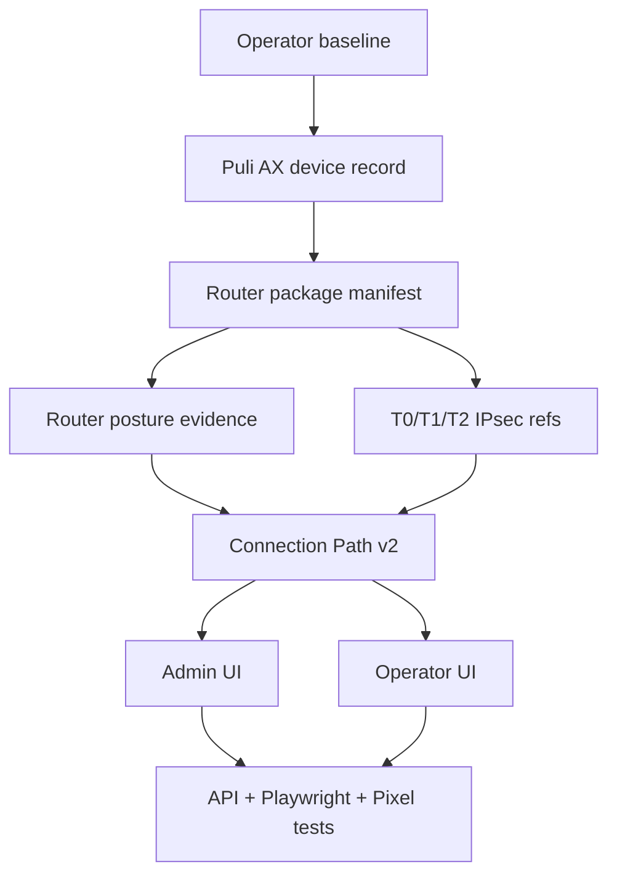
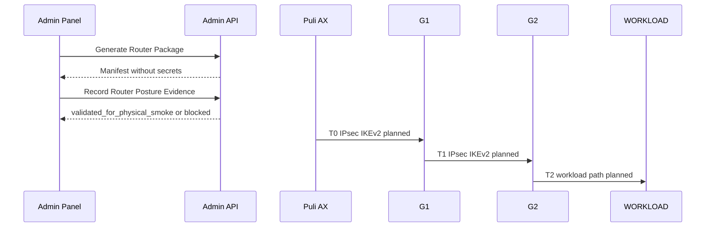

# Step 3.30 Freeze - Puli AX Router VPN Readiness

## Scope

Step 3.30 adds the router package and posture readiness layer for:

`Pixel or laptop terminal -> Puli AX -> G1 -> G2 -> WORKLOAD -> communicator microVM`

This is a readiness contract. It generates manifests and records validation evidence, but it does not install firmware, deploy production strongSwan profiles, release HSM-backed private keys, or enable production VPN execution.

## Implemented Contract

| Area | Status | Notes |
| --- | --- | --- |
| Router package service | implemented | `RouterReadinessService.generatePackage` |
| Router posture service | implemented | `RouterReadinessService.validatePosture` |
| Admin endpoints | implemented | `/operators/:id/router-package`, `/operators/:id/router-posture`, `/router/packages`, `/router/postures` |
| Operator path integration | implemented | `connection-path` now exposes package/posture state |
| Admin UI | implemented | Operators view has package and posture forms plus evidence cards |
| Operator UI | implemented | Connection Path shows router package, posture and physical-smoke status |
| Tests | implemented | API, negative secret checks, dashboard smoke path |
| Production execution | blocked | `productionExecutionAllowed=false` remains invariant |

## Mermaid - Router Readiness Dependencies

## Mermaid - Physical Smoke Gate

## Manifest Requirements

- target hardware: `GL.iNet GL-XE3000 Puli AX`
- firmware baseline: `OpenWrt 23.05+`
- packages: `strongSwan`, `nftables`, `dnsmasq-full`, CA bundle
- controls: default-drop kill switch, DNS tunnel-only, WAN admin disabled, SSH key auth only, LAN-to-WAN bypass blocked
- profiles: `T0`, `T1`, `T2`
- certificate references only
- no private keys, API keys, tokens, seed phrases or passwords

## Security Invariants

- terminal stores no operational data
- no G1/G2 bypass
- IPsec IKEv2 remains baseline transport
- mutual certificate authentication is required
- CDR remains mandatory for file transfer paths
- HSM/secure-element certificate custody remains blocked until physical enrollment
- production execution remains false

## Known Blockers

- physical Puli AX install pending
- real HSM/FIDO2 certificate ceremony pending
- DNS leak and kill-switch failure tests pending
- signed firmware reproducibility evidence pending
- real strongSwan endpoint deployment pending

## Next Step Candidate

Step 3.31 should use the physical Puli AX router:

1. capture actual OpenWrt/GL.iNet firmware inventory,
2. validate package install on the device,
3. run DNS leak and kill-switch tests,
4. capture Pixel -> Puli AX -> G1 physical smoke evidence,
5. update router posture from benchtop to physical evidence.
