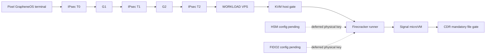

# Step 3.31 Freeze - Signal Workload Execution Path

Step 3.31 turns the Signal communicator path from a visual-only preview into a production-gated execution contract.

The current sprint intentionally excludes the physical Puli AX router bring-up, and physical HSM/FIDO2 can remain deferred. VPN/IPsec, KVM/Firecracker and CDR are modeled as real substrate gates. The operator panel now exposes the exact state of each gate before a Signal workload can be launched.

## Implemented

| Area | Status | Notes |
| --- | --- | --- |
| Operator Signal view | implemented | `Signal Preview` renders Pixel -> G1 -> G2 -> WORKLOAD -> Signal |
| Signal execution API | implemented | `GET /operator-api/workload-execution/signal` |
| Signal launch request API | implemented | `POST /operator-api/workload-execution/signal/start` |
| VPN substrate gate | implemented | Ready when real IPsec env gate is set |
| KVM/Firecracker gate | implemented | Requires KVM, Firecracker binary, kernel and rootfs refs |
| CDR substrate | implemented | Real control-plane CDR is enforced as mandatory |
| HSM/FIDO2 physical keys | deferred/configurable | Admin/operator panels keep configuration surfaces |
| Pixel ADB human test | implemented | Opens `operator#signal-preview` on connected Pixel |
| Live Signal container | implemented | `sylion/signal-workload:prod-candidate` is built from Kasm base plus current official Signal Desktop package |
| Private workload bind | implemented | noVNC workload ports bind to the operator private network address for G2 access, not localhost-only |

## Live Verification - 2026-05-22

Verified on the current Hetzner operator baseline:

- Pixel GrapheneOS has an active IKEv2 tunnel to G1 with address `10.43.0.1/32`.
- G1 sees the mutual-cert IKEv2 SA for `pixel.OP-001@sylion.internal`.
- G2 reaches the Signal workload on the private path and receives the expected noVNC auth challenge.
- WORKLOAD runs `sylion-signal-desktop` from `sylion/signal-workload:prod-candidate`.
- Signal Desktop package inside the workload is `8.11.0`.
- Pixel opens `https://signal.sylion.internal/` through the VPN path and renders the real Signal Desktop QR pairing screen.

Residual item: Android/Vanadium still shows an internal TLS warning until the SYLION internal TLS CA is installed through the GrapheneOS device provisioning profile.

## Mermaid

## Remaining Blockers Before Real Launch

- Firecracker binary must be installed and pinned on a qualified Linux/KVM host.
- Signal workload kernel, rootfs and approved image refs must be bound.
- Signal account enrollment reference must be configured by the operator.
- DNS leak and kill-switch tests must pass on the real path.
- Final production launch still requires explicit human production approval.
