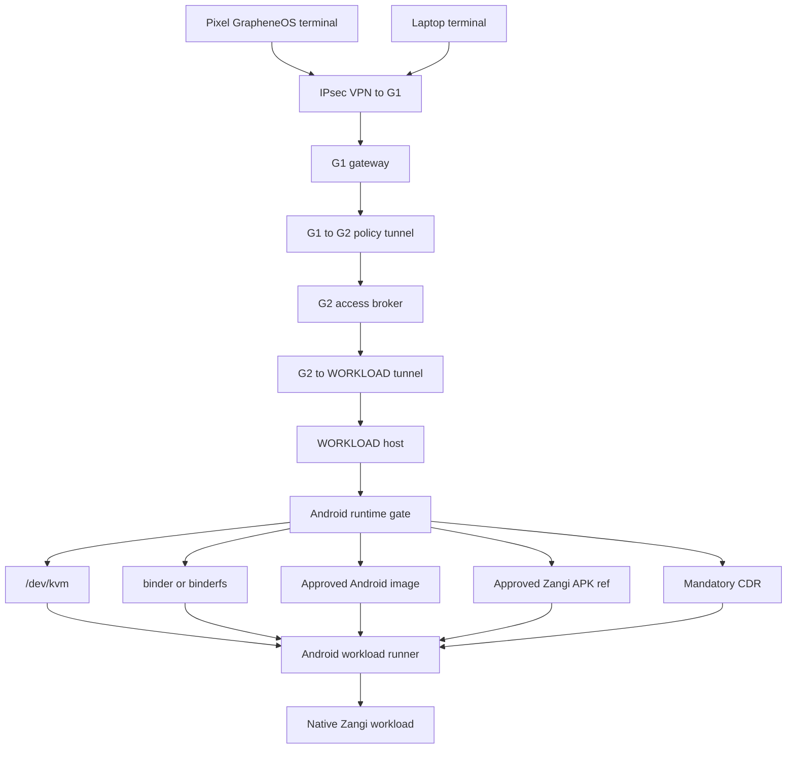
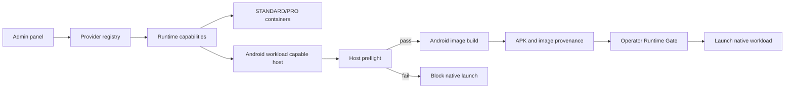

# Step 3.36 Freeze - Android-Native Zangi Runtime Gate

Date: 2026-05-22

## Decision

Zangi is not treated as a normal web workload. The operator panel may expose a compatibility browser container for documentation/download visibility, but production Zangi must run through an Android-native workload runner with:

- KVM exposed to the WORKLOAD host or a dedicated Android runtime host
- binder or binderfs available for Android userspace
- approved and pinned Android workload image
- approved Zangi APK/source artifact reference
- VPN path Pixel/laptop -> G1 -> G2 -> WORKLOAD
- mandatory CDR on file ingress/egress
- no operational data stored on the terminal

The current Hetzner Cloud WORKLOAD VPS is not approved for native Zangi execution because it does not expose the required runtime substrate.

## Live Hetzner Preflight

Command:

```bash
node scripts/android-workload-host-preflight.mjs --host=178.105.197.37 --user=sylion --key=.deploy/sylion_hetzner_admin_ed25519
```

Observed facts:

| Check | Result |
| --- | --- |
| Kernel | `6.8.0-117-generic` |
| Architecture | `x86_64` |
| Virtualization | `kvm` |
| `/dev/kvm` | `false` |
| `/dev/binder` | `false` |
| binderfs mount | `0` |
| `/dev/ashmem` | `false` |

Verdict: blocked. This host cannot run production Android-native Zangi workloads yet.

## Implemented System Behavior

| Surface | Behavior |
| --- | --- |
| Operator Workload Control | Zangi catalog entry now declares `nativeRuntimeRequired=true` and `nativeRuntimeClass=android_workload` |
| Runtime Gate API | `GET /operator-api/workload-execution/zangi` reports Android runtime blockers |
| Runtime Gate UI | Operator panel includes a Runtime Gate view for Signal and Zangi |
| Provider capability model | Providers now expose `androidWorkloads` in runtime capabilities |
| Tests | Step 3.32 verifies Zangi launch is blocked until Android host gates pass |

## Dependency Graph



## Deployment Graph



## Next Implementation Step

To make native Zangi real, select one approved substrate:

1. Hetzner dedicated/root server or another bare-metal host where KVM and binderfs can be enabled.
2. Cloud shape with supported nested virtualization and binderfs.
3. Managed Android workload provider, only if it can preserve tenant isolation, CDR, audit, and no terminal-side data.

Until that substrate passes preflight, the current Zangi container remains compatibility-only and must not be called production-native Zangi.
