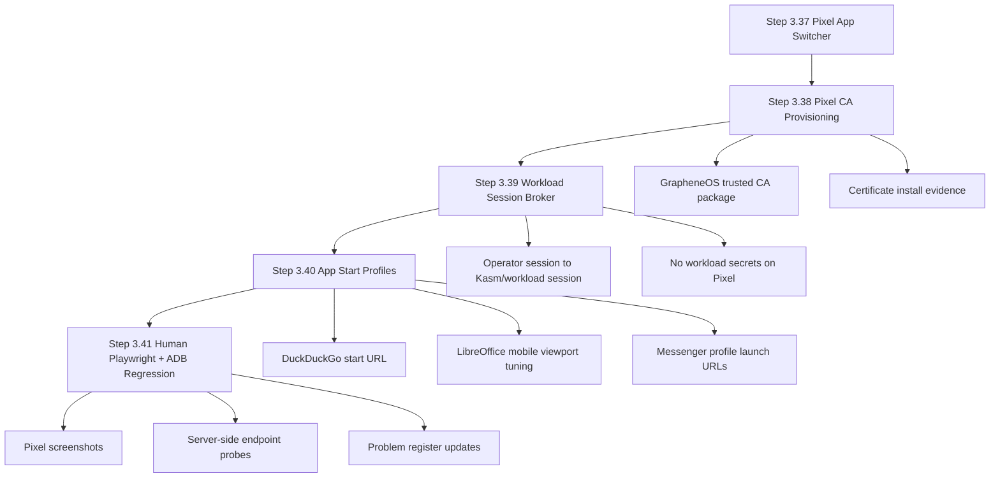

# Step 3.37 - Pixel workload human test plan

Date: 2026-05-22

## Scope

This step freezes the current Pixel operator journey and defines the human-style test matrix for moving between:

- Operator Portal settings.
- Workload Control.
- Security Unlock.
- Backup and Panic.
- Jurisdiction.
- Matrix Server.
- Subscription.
- Audit.
- Signal, WhatsApp, Telegram, Threema, Zangi, LibreOffice, DuckDuckGo, and Exodus workload endpoints.

The required route is:

## Current Live State

- Admin API is deployed on Hetzner admin VPS.
- Operator Portal is served through `operator.sylion.internal`.
- G2 proxies internal workload names to WORKLOAD private IP.
- WORKLOAD currently runs containers for DuckDuckGo, LibreOffice, WhatsApp, Telegram, Threema, Zangi compatibility mode, Signal Kasm image, and Exodus compatibility mode.
- Pixel can open the Operator Portal through the VPN path.
- The Operator Portal now includes a mobile `Apps` switcher for returning to settings or opening workload applications.

## Human Test Matrix

| Area | Human action | Expected result | Status |
| --- | --- | --- | --- |
| Pixel session bootstrap | Open `operator.sylion.internal/operator#app-switcher` with an operator session | Token is accepted only on localhost or `*.sylion.internal`, then removed from URL | Pass |
| Mobile navigation | Tap bottom nav items | Operator can move between Overview, Apps, Devices, Workloads, and Workload Control | Pass |
| Operator controls | Tap Workload Control, Runtime Gate, Security Unlock, Backup and Panic, Jurisdiction, Matrix Server, Subscription, Audit | Panel opens the selected operator-scoped configuration view without full page reload | Pass |
| Workload launcher | Tap DuckDuckGo | Browser workload opens through `duckduckgo.sylion.internal` | Pass with CA warning |
| Workload launcher | Tap LibreOffice | LibreOffice workload opens through `libreoffice.sylion.internal` | Blocked by CA warning until cert install |
| Workload launcher | Tap Signal | Signal endpoint reaches Kasm and returns authentication challenge | Expected `401` until Kasm auth/session model is wired |
| Workload launcher | Tap WhatsApp, Telegram, Threema, Zangi, Exodus | Internal endpoints return through G2 and route to WORKLOAD containers | Server-side pass, Pixel visual pass still pending after CA trust |
| Certificate trust | Open internal workload on Pixel | No certificate warning | Fail: internal CA not installed in GrapheneOS |
| Zangi certificate SAN | Open `zangi.sylion.internal` | Cert SAN contains Zangi hostname | Fixed on G2 |
| Exodus certificate SAN | Open `exodus.sylion.internal` | Cert SAN contains Exodus hostname | Fixed on G2 |

## Problems Found

1. GrapheneOS/Vanadium does not trust the internal self-signed SYLION CA.
   - Evidence: Pixel shows `NET::ERR_CERT_AUTHORITY_INVALID`.
   - Impact: every workload first shows a certificate warning.
   - Required fix: add the internal CA to the Pixel provisioning/profile flow, or switch internal TLS to a certificate chain trusted by the terminal policy.

2. Automated ADB `file://` certificate installation is not sufficient on GrapheneOS.
   - Evidence: certificate installer reports that it cannot read the certificate file.
   - Impact: CA install currently needs a better Android/GrapheneOS-specific flow or manual install from Files.
   - Required fix: implement a GrapheneOS certificate provisioning step in the Pixel image/profile package.

3. DuckDuckGo workload currently launches the LinuxServer Firefox container default new tab.
   - Evidence: after bypassing the CA warning, the user sees Firefox new tab, not DuckDuckGo-first UX.
   - Impact: route works, but product experience is not yet polished.
   - Required fix: set browser start URL/profile policy to DuckDuckGo, or use a browser image configured as SYLION DuckDuckGo.

4. Signal is reachable but still gated by Kasm authentication.
   - Evidence: G2 returns `401` for `signal.sylion.internal`.
   - Impact: the Pixel path reaches Signal substrate, but one-click operator transition is not complete.
   - Required fix: wire operator session to workload session broker without storing operational data on the terminal.

5. Zangi remains compatibility-mode only.
   - Evidence: Android-native runtime gate remains blocked until KVM/binderfs/approved Android image/APK references pass.
   - Impact: Zangi can be shown as a browser/container placeholder, but not as production Android-native app execution.
   - Required fix: Android workload host qualification or alternative provider with the required runtime.

## Next Implementation Plan

## Regression Checklist

- Run `npm.cmd test`.
- Verify no leaked Hetzner/API tokens with repository secret scan.
- Confirm G2 Nginx certificate SAN includes all internal workload hostnames.
- Confirm all workload containers are running on WORKLOAD VPS.
- Confirm all G2 endpoints return expected HTTP status.
- Open Pixel Operator Portal via `operator.sylion.internal`.
- Navigate to `Apps`.
- Open DuckDuckGo, LibreOffice, Signal, and Zangi from Pixel.
- Return to the Operator Portal after each workload.
- Capture screenshots for each pass/fail.
- Record every failure in release problems or the step document.

