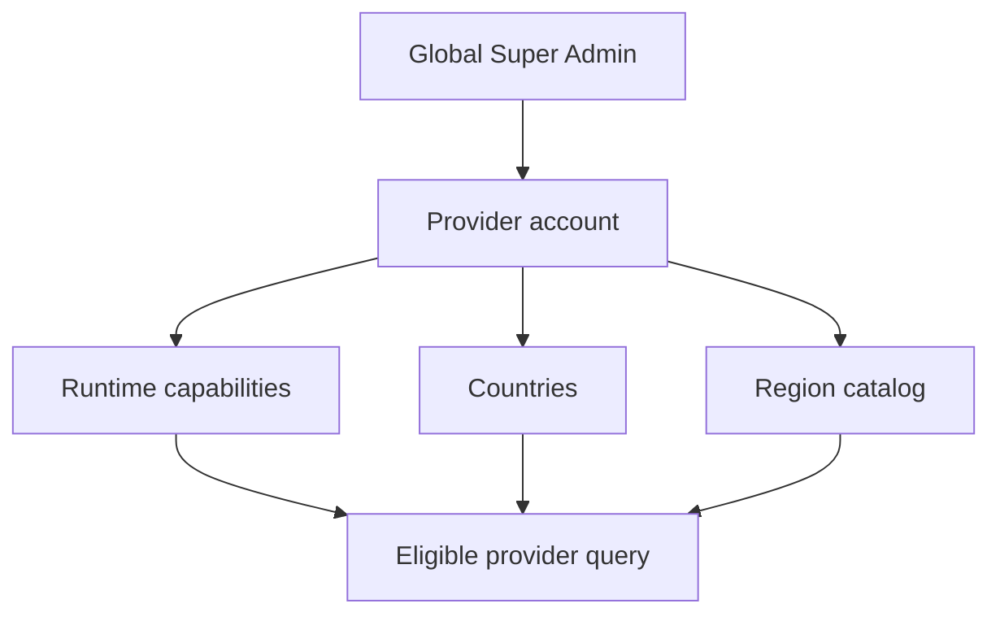
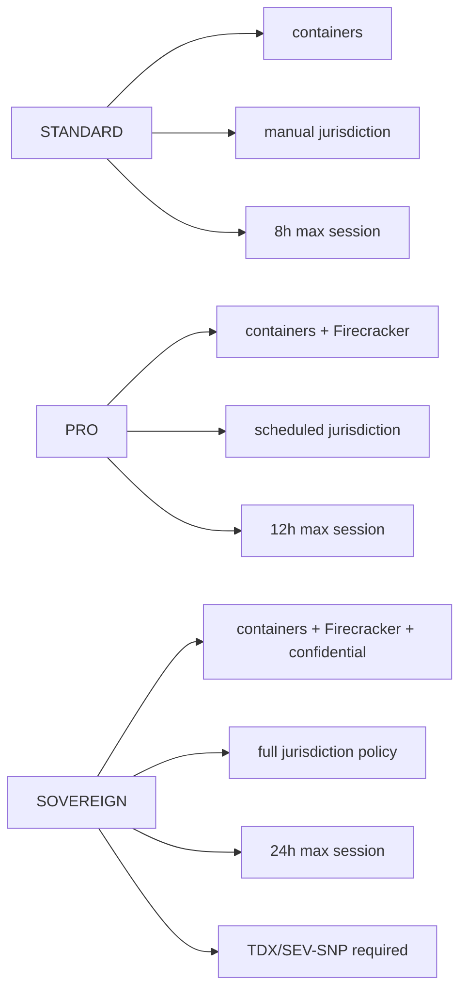

# Step 3.38 - Provider tiers, Pixel CA provisioning and workload broker

Date: 2026-05-22

## Scope

This step adds production-facing control-plane contracts for:

- VPS provider country/region capability modeling.
- Firecracker/KVM, Android workload, Intel TDX and AMD SEV-SNP provider filtering.
- Detailed subscription tier policy surfaces.
- Operator-level jurisdiction rotation settings by country, provider and frequency.
- Pixel GrapheneOS internal CA provisioning guidance.
- Workload session broker contract for moving from the operator panel into workload apps.

## Provider Model

Provider accounts now expose:

- `countries`
- `regions`
- `regionCatalog`
- `runtimeCapabilities.containers`
- `runtimeCapabilities.firecracker`
- `runtimeCapabilities.androidWorkloads`
- `runtimeCapabilities.intelTdx`
- `runtimeCapabilities.amdSevSnp`
- `runtimeCapabilities.recommendedTier`

The admin API also exposes `/providers/eligible` for country/capability/tier filtering.

## Tier Policy

Each plan now exposes:

- `jurisdictionPolicy`
- `providerPolicy`
- `sessionPolicy`

CDR remains mandatory for all tiers. PHANTOM execution remains disabled.

## Operator Rotation

Operator portal jurisdiction settings now include:

- mode
- regions
- countries
- providers
- frequency hours
- derived rotation scopes

Tier gates:

- STANDARD: disabled/manual only, one-provider rotation.
- PRO: scheduled rotation, multi-provider rotation, minimum 24h frequency.
- SOVEREIGN: full policy, all-VPS/certificate rotation scopes, minimum 4h frequency.

## Pixel CA Provisioning

The operator API exposes `/operator-api/pixel-ca-provisioning`.

The package is reference-only unless a public CA PEM is supplied through environment configuration. It never includes private keys. GrapheneOS user presence remains required for the trusted CA install.

Known blocker:

- Direct ADB `file://` certificate install is marked blocked because GrapheneOS may reject the file URI. The supported path is the GrapheneOS certificate installer through Settings / Files.

## Workload Session Broker

The operator API exposes `/operator-api/workload-session-broker/:templateKey`.

The broker returns:

- internal workload URL
- auth mode
- app template
- terminal handoff rules
- blockers
- no terminal-side operational storage
- no clipboard by default
- CDR-required file transfer state

Signal remains `kasm_session_broker_required` until the workload auth handoff is wired to the operator session.

## Test Coverage

Added `step3-38-provider-tier-pixel-broker.test.js`:

- Provider country/region/capability filtering.
- Detailed subscription tier policy exposure.
- Operator jurisdiction country/provider/frequency gates.
- Pixel CA package safety.
- Workload broker terminal-safety invariants.

