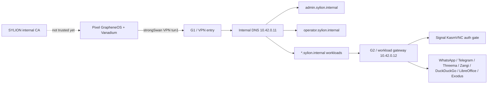

# Step 3.40 - Pixel live human regression

Date: 2026-05-22

This step adds a repeatable ADB-driven regression for the physical Pixel terminal against the Hetzner-hosted SYLION path.

## Scope

- Pixel 9 Pro with GrapheneOS over ADB.
- Existing strongSwan VPN session on the Pixel.
- Internal DNS for `*.sylion.internal`.
- Admin panel through `https://admin.sylion.internal/admin`.
- Operator panel through `https://operator.sylion.internal/operator`.
- Workload endpoints:
  - `signal.sylion.internal`
  - `whatsapp.sylion.internal`
  - `telegram.sylion.internal`
  - `threema.sylion.internal`
  - `zangi.sylion.internal`
  - `duckduckgo.sylion.internal`
  - `libreoffice.sylion.internal`
  - `exodus.sylion.internal`

## Test Harness

Command:

```bash
npm run test:pixel-live-human-regression
```

The harness:

1. Logs into the real admin API on the admin VPS through SSH.
2. Creates a live test tenant, operator, Pixel device record and operator session.
3. Pushes the current SYLION internal CA certificate to `Downloads/sylion-internal-ca.crt` on the Pixel.
4. Opens GrapheneOS security settings for user-present CA installation.
5. Opens the admin panel on the Pixel.
6. Opens the operator panel on the Pixel with a scoped operator session.
7. Opens every workload hostname on the Pixel.
8. Captures screenshots and UI dumps for evidence.
9. Checks Pixel VPN, internal DNS and host reachability.
10. Fails the run if CA trust warnings or non-production workload UIs are detected.

## Current Result

Status: `failed_with_findings`

Evidence directory:

```text
docs/admin-panel-v2/test-artifacts/step3-40-pixel-live-human-regression/
```

Confirmed working:

- Pixel is visible and authorized via ADB.
- Pixel runs GrapheneOS / Android 16 on Pixel 9 Pro.
- strongSwan VPN is connected.
- VPN interface `tun1` exists with `10.43.0.1/32`.
- Android connectivity reports a validated VPN network.
- DNS through tunnel is visible as `10.42.0.11`.
- Pixel can reach:
  - `admin.sylion.internal`
  - `operator.sylion.internal`
  - `signal.sylion.internal`
  - `duckduckgo.sylion.internal`
  - `libreoffice.sylion.internal`
  - `zangi.sylion.internal`
  - `10.42.0.10`
  - `10.42.0.12`
- Server-side HTTPS probes return:
  - Admin/operator: `200`
  - Signal: `401` KasmVNC auth gate
  - Other workload hostnames: `200`
- Internal certificate SAN contains all current SYLION internal names.

Findings:

1. GrapheneOS/Vanadium does not trust the SYLION internal CA yet.
2. Every Pixel workload/admin/operator page currently shows `NET::ERR_CERT_AUTHORITY_INVALID`.
3. Android/GrapheneOS does not resolve the legacy `android.credentials.INSTALL` intent for direct CA installation.
4. CA install must use a user-present GrapheneOS path:
   - Settings
   - Security and privacy
   - More security settings
   - Encryption and credentials
   - Install a certificate
   - CA certificate
   - `Downloads/sylion-internal-ca.crt`
5. `/operator-api/vpn-install-package` still reports `blocked_human_gate` even though a live strongSwan VPN exists on the Pixel. The operator control plane must be updated to reconcile live VPN evidence.
6. The test cannot yet prove DuckDuckGo browsing, LibreOffice use or communicator usability because TLS trust blocks the visual path before the application UI loads.

## Mermaid Flow



## Next Required Work

1. Complete CA installation on the Pixel with user presence, then rerun the harness.
2. Update operator API VPN package state so live strongSwan evidence can mark the VPN path as installed/active.
3. After CA trust passes, rerun Pixel visual tests and verify actual application UI for:
   - DuckDuckGo browsing
   - LibreOffice
   - Signal
   - Zangi
   - WhatsApp
   - Telegram
   - Threema
   - Exodus
4. Replace any placeholder workload endpoint with a real app container or mark it blocked with an explicit finding.
5. Add a router package handoff test for Puli AX when the device arrives.

