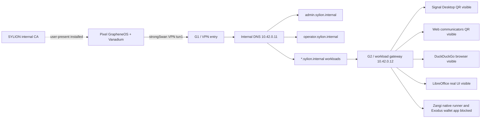

# Step 3.40 - Pixel live human regression

Date: 2026-05-22

This step adds a repeatable ADB-driven regression for the physical Pixel terminal against the Hetzner-hosted SYLION path.

## Scope

- Pixel 9 Pro with GrapheneOS over ADB.
- Existing strongSwan VPN session on the Pixel.
- Internal DNS for `*.sylion.internal`.
- Admin panel through `https://admin.sylion.internal/admin`.
- Operator panel through `https://operator.sylion.internal/operator`.
- Workload endpoints:
  - `signal.sylion.internal`
  - `whatsapp.sylion.internal`
  - `telegram.sylion.internal`
  - `threema.sylion.internal`
  - `zangi.sylion.internal`
  - `duckduckgo.sylion.internal`
  - `libreoffice.sylion.internal`
  - `exodus.sylion.internal`

## Test Harness

Command:

```bash
npm run test:pixel-live-human-regression
```

The harness:

1. Logs into the real admin API on the admin VPS through SSH.
2. Creates a live test tenant, operator, Pixel device record and operator session.
3. Pushes the current SYLION internal CA certificate to `Downloads/sylion-internal-ca.crt` on the Pixel.
4. Opens GrapheneOS security settings for user-present CA installation.
5. Opens the admin panel on the Pixel.
6. Opens the operator panel on the Pixel with a scoped operator session.
7. Opens every workload hostname on the Pixel.
8. Captures screenshots and UI dumps for evidence.
9. Checks Pixel VPN, internal DNS and host reachability.
10. Fails the run if CA trust warnings or non-production workload UIs are detected.

## Current Result

Status: `failed_with_findings`

Evidence directory:

```text
docs/admin-panel-v2/test-artifacts/step3-40-pixel-live-human-regression/
```

Confirmed working:

- Pixel is visible and authorized via ADB.
- Pixel runs GrapheneOS / Android 16 on Pixel 9 Pro.
- strongSwan VPN is connected.
- VPN interface `tun1` exists with `10.43.0.1/32`.
- Android connectivity reports a validated VPN network.
- DNS through tunnel is visible as `10.42.0.11`.
- After user-present CA installation, `admin.sylion.internal` and the operator panel load on the Pixel without the previous `NET::ERR_CERT_AUTHORITY_INVALID` blocker.
- Pixel can reach:
  - `admin.sylion.internal`
  - `operator.sylion.internal`
  - `signal.sylion.internal`
  - `duckduckgo.sylion.internal`
  - `libreoffice.sylion.internal`
  - `zangi.sylion.internal`
  - `10.42.0.10`
  - `10.42.0.12`
- Server-side HTTPS probes return:
  - Admin/operator: `200`
  - Signal: `200` after G2 workload-auth handoff
  - Other workload hostnames: `200`
- Internal certificate SAN contains all current SYLION internal names.
- Operator panel is reachable on the Pixel and exposes the app switcher plus operator controls.
- Signal Desktop renders on Pixel and shows the QR device-link screen.
- WhatsApp Web renders on Pixel and shows the QR login screen.
- Telegram Web renders on Pixel and shows the QR/login screen.
- Threema Web renders on Pixel and shows the QR login screen.
- DuckDuckGo renders on Pixel through the remote browser workload.
- LibreOffice renders a real LibreOffice remote desktop surface on the Pixel.

Findings:

1. Android/GrapheneOS does not resolve the legacy `android.credentials.INSTALL` intent for direct CA installation.
2. CA install must use a user-present GrapheneOS path:
   - Settings
   - Security and privacy
   - More security settings
   - Encryption and credentials
   - Install a certificate
   - CA certificate
   - `Downloads/sylion-internal-ca.crt`
3. `/operator-api/vpn-install-package` still reports `blocked_human_gate` even though a live strongSwan VPN exists on the Pixel. The operator control plane must be updated to reconcile live VPN evidence.
4. Zangi is not production-ready: current evidence is an official Zangi web/download surface, not an isolated Android-native workload runner.
5. Exodus exposes the official download/product surface, not the actual wallet app UI. Exodus remains operator-risk-accepted and must never store wallet secrets in SYLION control-plane metadata.
6. The current test treats HTTP `200` plus stream-shell visibility as insufficient for production. Each workload must prove app-specific UI on Pixel or stay blocked in the catalog.

## Mermaid Flow



## Next Required Work

1. Update operator API VPN package state so live strongSwan evidence can mark the VPN path as installed/active.
2. Move G2 workload-auth handoff from live patch into the baseline provisioning path and session broker model.
3. Implement the Android-native runtime path for Zangi before calling it production.
4. Decide whether Exodus is supported as a downloadable/operator-owned wallet or replaced by a real isolated desktop/mobile wallet workload behind explicit risk acceptance.
5. Add interactive Pixel assertions:
   - type a DuckDuckGo query and verify navigation.
   - open LibreOffice Writer/Calc.
   - close/open workload tabs through the operator app switcher.
   - reset/recreate a workload from the operator settings panel and confirm CDR/audit events.
6. Add a router package handoff test for Puli AX when the device arrives.
