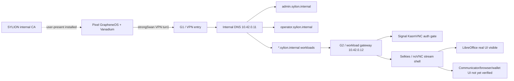

# Step 3.40 - Pixel live human regression

Date: 2026-05-22

This step adds a repeatable ADB-driven regression for the physical Pixel terminal against the Hetzner-hosted SYLION path.

## Scope

- Pixel 9 Pro with GrapheneOS over ADB.
- Existing strongSwan VPN session on the Pixel.
- Internal DNS for `*.sylion.internal`.
- Admin panel through `https://admin.sylion.internal/admin`.
- Operator panel through `https://operator.sylion.internal/operator`.
- Workload endpoints:
  - `signal.sylion.internal`
  - `whatsapp.sylion.internal`
  - `telegram.sylion.internal`
  - `threema.sylion.internal`
  - `zangi.sylion.internal`
  - `duckduckgo.sylion.internal`
  - `libreoffice.sylion.internal`
  - `exodus.sylion.internal`

## Test Harness

Command:

```bash
npm run test:pixel-live-human-regression
```

The harness:

1. Logs into the real admin API on the admin VPS through SSH.
2. Creates a live test tenant, operator, Pixel device record and operator session.
3. Pushes the current SYLION internal CA certificate to `Downloads/sylion-internal-ca.crt` on the Pixel.
4. Opens GrapheneOS security settings for user-present CA installation.
5. Opens the admin panel on the Pixel.
6. Opens the operator panel on the Pixel with a scoped operator session.
7. Opens every workload hostname on the Pixel.
8. Captures screenshots and UI dumps for evidence.
9. Checks Pixel VPN, internal DNS and host reachability.
10. Fails the run if CA trust warnings or non-production workload UIs are detected.

## Current Result

Status: `failed_with_findings`

Evidence directory:

```text
docs/admin-panel-v2/test-artifacts/step3-40-pixel-live-human-regression/
```

Confirmed working:

- Pixel is visible and authorized via ADB.
- Pixel runs GrapheneOS / Android 16 on Pixel 9 Pro.
- strongSwan VPN is connected.
- VPN interface `tun1` exists with `10.43.0.1/32`.
- Android connectivity reports a validated VPN network.
- DNS through tunnel is visible as `10.42.0.11`.
- After user-present CA installation, `admin.sylion.internal` and the operator panel load on the Pixel without the previous `NET::ERR_CERT_AUTHORITY_INVALID` blocker.
- Pixel can reach:
  - `admin.sylion.internal`
  - `operator.sylion.internal`
  - `signal.sylion.internal`
  - `duckduckgo.sylion.internal`
  - `libreoffice.sylion.internal`
  - `zangi.sylion.internal`
  - `10.42.0.10`
  - `10.42.0.12`
- Server-side HTTPS probes return:
  - Admin/operator: `200`
  - Signal: `401` KasmVNC auth gate
  - Other workload hostnames: `200`
- Internal certificate SAN contains all current SYLION internal names.
- Operator panel is reachable on the Pixel and exposes the app switcher plus operator controls.
- LibreOffice renders a real LibreOffice remote desktop surface on the Pixel.

Findings:

1. Android/GrapheneOS does not resolve the legacy `android.credentials.INSTALL` intent for direct CA installation.
2. CA install must use a user-present GrapheneOS path:
   - Settings
   - Security and privacy
   - More security settings
   - Encryption and credentials
   - Install a certificate
   - CA certificate
   - `Downloads/sylion-internal-ca.crt`
3. `/operator-api/vpn-install-package` still reports `blocked_human_gate` even though a live strongSwan VPN exists on the Pixel. The operator control plane must be updated to reconcile live VPN evidence.
4. Signal reaches the private workload host but stops at a browser basic-auth gate. Pixel does not yet see the Signal Desktop session.
5. WhatsApp, Telegram and Threema expose only a generic SYLION/Selkies stream shell or browser new-tab state in the human visual evidence. The actual communicator UI is not verified.
6. Zangi is not production-ready: current evidence is either the generic stream shell or a public Zangi download page. Production Zangi still requires an isolated Android-native workload runner.
7. DuckDuckGo is misconfigured as a generic Firefox/Google new-tab workload, not a DuckDuckGo browsing workload.
8. Exodus exposes only the generic stream shell or browser state; the actual Exodus wallet UI is not verified. Exodus remains operator-risk-accepted and must never store wallet secrets in SYLION control-plane metadata.
9. The current test now treats HTTP `200` plus stream-shell visibility as insufficient for production. Each workload must prove app-specific UI on Pixel.

## Mermaid Flow



## Next Required Work

1. Update operator API VPN package state so live strongSwan evidence can mark the VPN path as installed/active.
2. Wire workload session broker credentials into the Pixel launch path so Signal opens the Signal Desktop stream instead of a browser auth prompt.
3. Replace generic stream-shell placeholders with real workload images for WhatsApp, Telegram, Threema, DuckDuckGo and Exodus, or keep them explicitly blocked in the catalog.
4. Implement the Android-native runtime path for Zangi before calling it production.
5. Add app-specific Pixel assertions:
   - Signal Desktop visible after auth handoff.
   - WhatsApp Web QR/session screen visible.
   - Telegram Web/Desktop visible.
   - Threema Web/Desktop visible.
   - Zangi native runtime visible.
   - DuckDuckGo search page visible and can browse.
   - LibreOffice can open Writer/Calc.
   - Exodus wallet app visible only behind operator-risk acceptance.
6. Add a router package handoff test for Puli AX when the device arrives.
