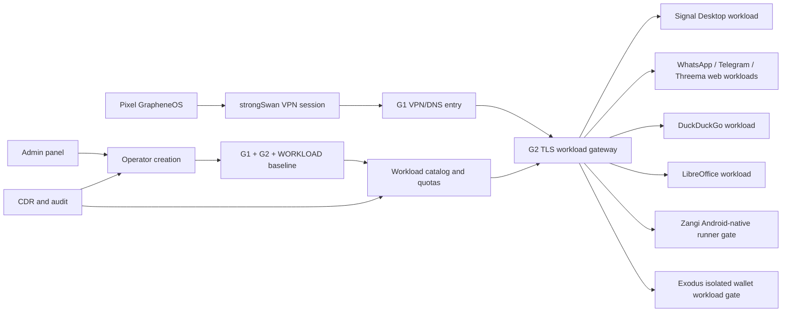

# Step 3.41 - Live production hardening pass

Date: 2026-05-22

This step moves the Hetzner live path closer to production and records the remaining blockers without storing session QR screenshots or secrets in the repository.

## Live Changes Applied

- WORKLOAD VPS browser containers were recreated with app-specific launch targets:
  - DuckDuckGo: `https://duckduckgo.com/`
  - WhatsApp Web: `https://web.whatsapp.com/`
  - Telegram Web: `https://web.telegram.org/k/`
  - Threema Web: `https://web.threema.ch/`
  - Zangi official download surface: `https://zangi.com/en-us/download`
  - Exodus official download surface: `https://www.exodus.com/download/`
- Chromium workloads now start with first-run and crashed-session restore suppression flags.
- G2 workload gateway now performs the Signal workload auth handoff server-side so Pixel does not stop on a browser Basic Auth prompt.
- Pixel regression harness now analyzes visible UI text instead of raw XML attributes and allows canvas/noVNC visual evidence where the app surface is visible only in the screenshot stream.

## Latest Pixel Result

Command:

```bash
npm run test:pixel-live-human-regression
```

Status: `failed_with_findings`

Confirmed working on Pixel through `Pixel -> VPN -> G1 -> G2 -> WORKLOAD`:

- Admin panel loads over internal TLS.
- Operator panel loads over internal TLS.
- Signal Desktop renders the QR device-link screen.
- WhatsApp Web renders the QR login screen.
- Telegram Web renders the QR/login screen.
- Threema Web renders the QR login screen.
- DuckDuckGo renders and is ready for browsing.
- LibreOffice renders the desktop launcher.
- Internal DNS and tunnel reachability are working.
- G2 returns `200` for all tested workload hostnames.

Remaining blockers:

1. `/operator-api/vpn-install-package` still reports `blocked_human_gate`; the API must reconcile live strongSwan evidence before this can be marked production-ready.
2. Zangi is not production-ready as a workload. The current surface is the official download page, not an isolated Android-native runner.
3. Exodus is not production-ready as an app workload. The current surface is the official download page, not a wallet app running inside an isolated environment. Wallet secrets remain operator-owned and must not enter SYLION control-plane metadata.

## Dependency Graph



## Next Production Tasks

1. Persist the G2 workload-auth handoff into the generated G2 provisioning artifact instead of relying on the live hotfix.
2. Add an operator-visible reset/recreate action for each workload slot with CDR, audit event, quota check and panic-policy awareness.
3. Update `/operator-api/vpn-install-package` to return `ready` when live Pixel VPN evidence proves the installed path is active.
4. Implement Zangi through an Android-native isolated workload runner, or keep it blocked in the authorized app catalog.
5. Decide Exodus support mode:
   - blocked/download-only reference,
   - isolated desktop/mobile wallet runner,
   - or explicit operator-risk-accepted external app.
6. Extend Pixel human tests to click through:
   - DuckDuckGo search and web navigation,
   - LibreOffice Writer/Calc launch,
   - operator workload reset/recreate controls,
   - app switcher navigation between panel and workloads.
