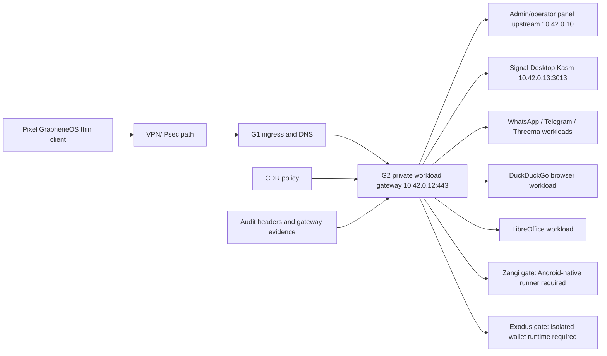

# Step 3.42 - G2 workload gateway runtime

Date: 2026-05-22

This step moves the live G2 workload gateway from a manual hotfix into a repeatable provisioning artifact.

## Implemented Runtime

The repository now contains `scripts/install-g2-workload-gateway.mjs`.

It renders and deploys the G2 nginx gateway for:

- `admin.sylion.internal` and `operator.sylion.internal` to the admin control plane.
- `signal.sylion.internal` to the Signal Desktop Kasm workload.
- `whatsapp.sylion.internal`, `telegram.sylion.internal`, `threema.sylion.internal`.
- `duckduckgo.sylion.internal` and `libreoffice.sylion.internal`.
- `zangi.sylion.internal` and `exodus.sylion.internal` with explicit production gates.

The gateway binds only to `10.42.0.12:443`.

## Security Properties

- Terminal receives pixels and input transport only.
- Workload secrets are not generated into the nginx gateway config.
- Signal auth handoff is read from a root-only nginx snippet.
- Every route emits:
  - `X-Sylion-Terminal-Data-Stored: false`
  - `X-Sylion-G1-G2-Bypass: false`
  - `X-Sylion-CDR-Required: true`
  - `X-Sylion-Workload-Gateway: g2`
- File transfer remains CDR-gated.
- G1/G2 bypass remains disallowed.
- Zangi stays blocked as production until an Android-native isolated workload runner exists.
- Exodus stays blocked as production until an isolated wallet runtime and operator risk model are approved.

## Live Evidence

Live G2 deploy:

```bash
npm run live:g2-workload-gateway
```

Confirmed on Hetzner:

| Hostname | Result | Notes |
| --- | --- | --- |
| `signal.sylion.internal` | `200` on GET | KasmVNC Signal surface reachable through G2 |
| `whatsapp.sylion.internal` | `200` | Workload stream shell reachable |
| `telegram.sylion.internal` | `200` | Workload stream shell reachable |
| `threema.sylion.internal` | `200` | Workload stream shell reachable |
| `duckduckgo.sylion.internal` | `200` | Browser workload reachable |
| `libreoffice.sylion.internal` | `200` | Office workload reachable |
| `zangi.sylion.internal` | `200` | Marked `android_native_runner_required` |
| `exodus.sylion.internal` | `200` | Marked `isolated_wallet_runtime_required` |

G2 has exactly one `zangi.sylion.internal` server block after emptying the old extra workload hotfix file.

Pixel human regression:

```bash
npm run test:pixel-live-human-regression
```

Status: `failed_with_findings`.

Confirmed:

- Pixel GrapheneOS is connected to `SYLION` VPN over `tun1`.
- Internal DNS resolves workload names to `10.42.0.12`.
- Pixel can ping `admin.sylion.internal`, `operator.sylion.internal`, `signal.sylion.internal`, `duckduckgo.sylion.internal`, `libreoffice.sylion.internal`, `zangi.sylion.internal`, `10.42.0.10`, and `10.42.0.12`.
- Admin panel returns `200`.
- Operator panel returns `200`.
- Signal returns `200` and reaches the KasmVNC Signal workload surface through G2.
- WhatsApp, Telegram, Threema, DuckDuckGo, LibreOffice, Zangi, and Exodus workload hostnames return `200`.

Findings:

1. GrapheneOS CA install still requires human presence because Android certificate installation cannot be completed silently over ADB.
2. `/operator-api/vpn-install-package` still reports a human gate.
3. Zangi remains non-production until Android-native isolated workload runner exists.
4. Exodus remains non-production until isolated wallet workload support is approved.

## Mermaid Graph



## Tests

```bash
node --test services/admin-api/test/step3-42-g2-workload-gateway.test.js
```

Coverage:

- private G2 bind contract,
- no generated Signal password,
- Signal auth include path,
- no public workload exposure,
- CDR/thin-client headers,
- Zangi and Exodus production gate headers.

## Remaining Work

1. Extend the provisioning pipeline so every newly created operator automatically receives this G2 gateway artifact.
2. Add workload reset/recreate actions that call the live runtime and emit audit/CDR events.
3. Extend Pixel human regression to click through Signal, DuckDuckGo search, LibreOffice launch, workload switching and operator panel return flow.
4. Replace Zangi download/browser surface with an Android-native isolated workload runner.
5. Decide Exodus wallet support mode before calling it production.
