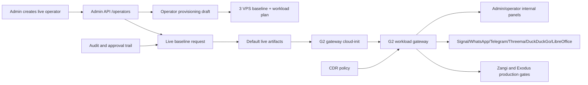

# Step 3.44 - Automatic G2 gateway provisioning

Date: 2026-05-22

This step connects the live G2 workload gateway from Step 3.42 to automatic operator creation.

## Implemented

When an admin creates an operator with `liveBaseline.enabled=true`, the Admin API now generates default live baseline artifacts:

- G2 nginx workload gateway cloud-init.
- Internal host routes for admin/operator panels and workload apps.
- Thin-client safety headers.
- CDR-required headers.
- Root-only Signal auth handoff include.
- Production gates for Zangi and Exodus.

The admin can still provide explicit `liveBaseline.userDataByRole.G2` for a specialized deployment, but the default path no longer creates a bare G2.

The Hetzner live operator script now uses the same artifact builder, so scripted live creation and panel-driven live creation stay aligned.

## Security Properties

- No provider API token is returned in the operator creation response.
- No Signal workload password is embedded in generated G2 cloud-init.
- Signal auth is delegated to `/etc/nginx/snippets/sylion-signal-auth.conf`.
- G2 remains the workload access broker.
- Terminal-side operational data remains forbidden.
- Workload file ingress/egress remains CDR-gated.
- Production execution remains blocked until human gates and runtime gates pass.

## Dependency Graph



## Tests

```bash
node --test services/admin-api/test/step3-33-live-operator-create-baseline.test.js services/admin-api/test/step3-42-g2-workload-gateway.test.js
```

Assertions:

- live operator creation passes G2 user-data to the provider adapter,
- generated G2 user-data includes workload hostnames,
- generated G2 user-data includes thin-client/CDR headers,
- generated G2 user-data contains no Signal password,
- response includes artifact summary for the G2 gateway.

## Next

1. Add WORKLOAD default cloud-init builder without plaintext workload passwords.
2. Add operator-visible reset/recreate actions wired to live runtime operations.
3. Extend Pixel regression to click app switching and reset/recreate flows.
