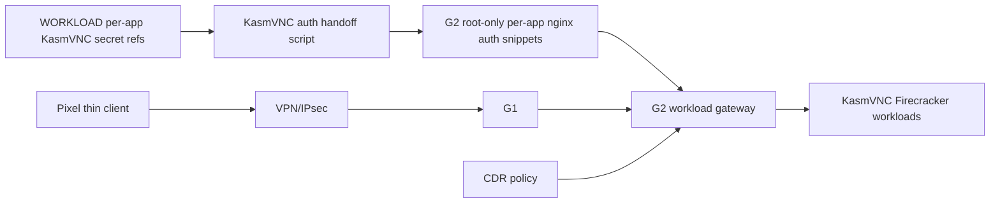

# Step 3.45 - KasmVNC auth handoff

Date: 2026-05-22

This step turns live KasmVNC workload authentication handoff into a repeatable operation.

## Implemented

The repository now contains:

```bash
npm run live:signal-auth-handoff
```

Legacy Signal-only handoff is preserved for migration, but the current Firecracker/KasmVNC path uses:

```bash
node scripts/sync-kasm-auth-handoff.mjs --app=all --apply
```

or:

```bash
npm run live:kasm-auth-handoff
```

The script:

- reads per-app KasmVNC stream auth from AX102 WORKLOAD root-only stream secret files,
- writes per-app snippets such as `/etc/nginx/snippets/sylion-kasm-auth-signal.conf` and `/etc/nginx/snippets/sylion-kasm-auth-duckduckgo.conf` on G2 with `0600` permissions,
- reloads nginx,
- smoke-tests app hostnames through G2 without printing secrets.

No secret is printed to stdout.

## Live Evidence

Latest live result:

```json
{
  "applied": true,
  "apps": [
    "duckduckgo:200",
    "libreoffice:200",
    "whatsapp:200",
    "telegram:200",
    "threema:200",
    "signal:200",
    "exodus:200"
  ],
  "secretPrinted": false,
  "noSecretInRepo": true,
  "terminalDataStored": false,
  "g2BrokerOnly": true
}
```

## Security Properties

- No KasmVNC password is committed to the repository.
- No KasmVNC password is printed in the command result.
- G2 snippets are root-owned and `0600`.
- KasmVNC workloads stay reachable only through the G2 workload gateway.
- Thin-client invariant is preserved: terminal receives pixels/input, not workload data.
- CDR remains required for file transfer.

## Dependency Graph



## Next

1. Trigger this handoff automatically after G2 and WORKLOAD both report boot evidence.
2. Add operator-visible workload reset/recreate controls that re-run the handoff when any KasmVNC workload is recreated.
3. Add Pixel regression coverage for each KasmVNC app after reset/recreate.
