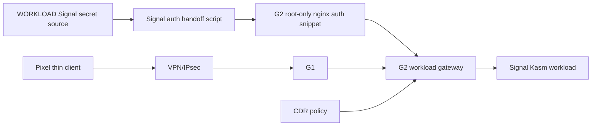

# Step 3.45 - Signal auth handoff

Date: 2026-05-22

This step turns the live Signal workload authentication handoff into a repeatable operation.

## Implemented

The repository now contains:

```bash
npm run live:signal-auth-handoff
```

This runs `scripts/sync-signal-auth-handoff.mjs`.

The script:

- reads Signal VNC auth from the WORKLOAD VPS,
- prefers `/etc/sylion/workload-secrets/signal.env`,
- falls back to the existing `sylion-signal-desktop` container environment for older live stacks,
- writes `/etc/nginx/snippets/sylion-signal-auth.conf` on G2 with `0600` permissions,
- reloads nginx,
- smoke-tests `signal.sylion.internal` through G2.

No secret is printed to stdout.

## Live Evidence

Latest live result:

```json
{
  "applied": true,
  "secretPrinted": false,
  "signalStatus": "200",
  "terminalDataStored": false,
  "g1G2BypassAllowed": false,
  "cdrRequired": true
}
```

## Security Properties

- No Signal password is committed to the repository.
- No Signal password is printed in the command result.
- G2 snippet is root-owned and `0600`.
- Signal stays reachable only through G2 workload gateway.
- Thin-client invariant is preserved: terminal receives pixels/input, not workload data.
- CDR remains required for file transfer.

## Dependency Graph



## Next

1. Trigger this handoff automatically after G2 and WORKLOAD both report boot evidence.
2. Add operator-visible workload reset/recreate controls that re-run the handoff when Signal is recreated.
3. Add Pixel regression coverage for Signal after reset/recreate.
