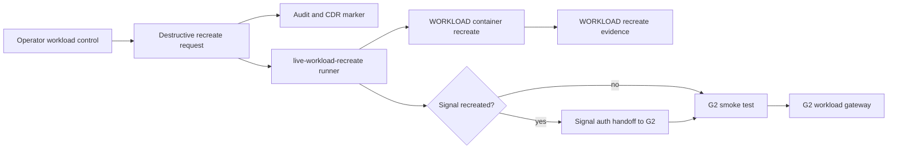

# Step 3.46 - Live workload recreate runner

Date: 2026-05-22

This step adds a repeatable live runner for recreating workload containers on the WORKLOAD VPS and reconnecting Signal through G2.

## Implemented

The repository now contains:

```bash
npm run live:workload-recreate -- --app=signal
```

Supported apps:

- `signal`
- `whatsapp`
- `telegram`
- `threema`
- `duckduckgo`
- `libreoffice`
- `zangi`
- `exodus`
- `all`

The runner:

- recreates the selected container on WORKLOAD,
- binds only to the private `10.42.x` workload address,
- writes recreate evidence on WORKLOAD,
- requires CDR for file transfer,
- stores no terminal-side operational data,
- preserves volumes by default,
- supports explicit `--wipe-volume` for destructive clean rebuilds,
- reruns Signal auth handoff automatically when Signal or all workloads are recreated,
- smoke-tests the selected app through G2.

## Live Evidence

Latest live Signal recreate:

```json
{
  "applied": true,
  "secretPrinted": false,
  "workloadEvidence": {
    "component": "live_workload_recreate",
    "app": "signal",
    "wipeVolume": false,
    "cdrRequired": true,
    "terminalDataStored": false,
    "privateBindOnly": true
  },
  "signalHandoff": {
    "applied": true,
    "secretPrinted": false,
    "signalStatus": "200",
    "terminalDataStored": false,
    "g1G2BypassAllowed": false,
    "cdrRequired": true
  },
  "smoke": {
    "signal": "200"
  },
  "productionExecutionAllowed": false
}
```

## Operator Panel Contract

Destructive workload control requests now expose a concrete live runner plan:

- `npm run live:workload-recreate -- --app=<app>`
- `wipeVolumeDefault=false`
- `wipeVolumeRequiresPanicOrFourEyes=true`
- `signalAuthHandoffRequired=true` when Signal or all workloads are recreated.

The panel still queues intent first. Production execution remains guarded by subscription quota, CDR, panic policy, session unlock and future four-eyes approval for volume wipe.

## Mermaid



## Remaining Work

1. Wire the queued operator request to an approved backend job instead of manually invoking the script.
2. Add four-eyes approval before `--wipe-volume`.
3. Extend Pixel regression to click reset/recreate in the operator panel and verify Signal after recreate.
