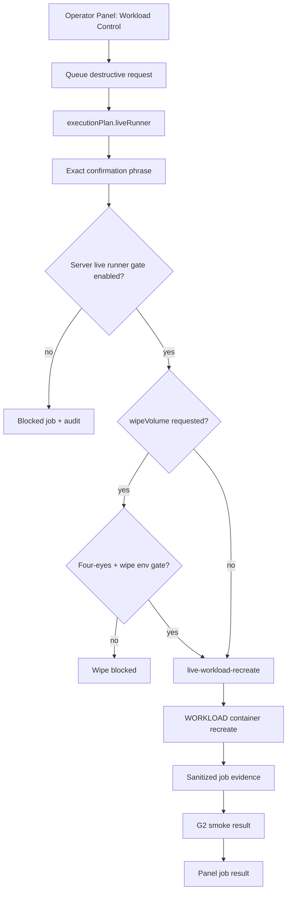

# Step 3.47 - Operator panel live recreate job

Date: 2026-05-22

This step wires destructive operator workload requests to a backend job endpoint that can run the live WORKLOAD recreate runner after explicit gates pass.

## Implemented

Operator flow:

1. Operator opens Workload Control.
2. Operator queues `rotate_app` or `recreate_all`.
3. Panel receives a destructive request with `executionPlan.liveRunner`.
4. Operator submits the live runner form with:
   - request id,
   - exact confirmation phrase `RUN_LIVE_WORKLOAD_RECREATE`,
   - optional wipe flag,
   - optional four-eyes reference for wipe.
5. API checks server-side gate `SYLION_OPERATOR_LIVE_WORKLOAD_RUNNER_ENABLED=true`.
6. API runs `npm run live:workload-recreate -- --app=<app>`.
7. API stores sanitized job evidence and returns it to the panel.

Default execution preserves volumes. Volume wipe stays blocked unless `SYLION_ALLOW_WORKLOAD_WIPE=true` and a four-eyes approval reference is provided.

## Security Contract

- CDR remains mandatory.
- Terminal operational data remains forbidden.
- Workload services must stay private-bound.
- Signal recreate requires Signal auth handoff evidence.
- Secrets from runner stdout are never returned to the panel.
- PHANTOM remains outside this path.
- `productionExecutionAllowed` remains false as a product claim; this is a gated live ops job, not a full production release declaration.

## Mermaid

## Acceptance Tests

- Without server gate, execute endpoint returns `blocked_before_live_runner`.
- With fake approved runner, execute endpoint returns `completed_live_workload_recreate`.
- DuckDuckGo Browser maps to runner app `duckduckgo`.
- Job evidence includes CDR, no terminal storage, private bind requirement and smoke result.
- Audit records started/completed or blocked state without leaking secrets.

## Remaining Work

1. Run the new endpoint from Pixel through the real internal URL and capture Playwright/ADB evidence.
2. Enable the server gate only on the admin VPS environment after confirming SSH key path and service user permissions.
3. Add asynchronous job polling if recreate duration becomes too long for a single HTTP request.
4. Extend the same job path to Firecracker tier runners when kernel/rootfs/TDX/SEV-SNP gates are ready.
