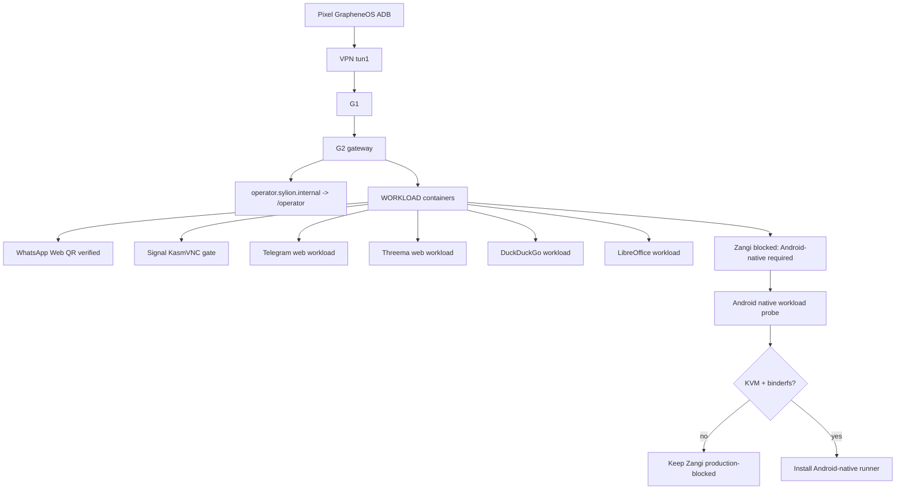

# Step 3.48 - Pixel human regression and Android-native workload gate

Date: 2026-05-22

## Live Pixel Regression

Executed against real Hetzner VPS path and a real Pixel over ADB:

`Pixel GrapheneOS -> VPN tun1 -> G1 -> G2 -> WORKLOAD -> app gateway`

Observed working evidence:

- Pixel ADB authorized: Pixel 9 Pro.
- VPN reported connected by Android connectivity service.
- VPN interface: `tun1`.
- DNS through tunnel: yes.
- Pixel can ping `admin.sylion.internal`, `operator.sylion.internal`, `signal.sylion.internal`, `duckduckgo.sylion.internal`, `libreoffice.sylion.internal`, `zangi.sylion.internal`, `10.42.0.10`, and `10.42.0.12`.
- Operator portal renders on Pixel through `operator.sylion.internal/operator`.
- WhatsApp renders real web login QR through `whatsapp.sylion.internal`.
- Server-side G2 probes return HTTP 200 for Signal, WhatsApp, Telegram, Threema, Zangi, DuckDuckGo, LibreOffice, Exodus.

Findings:

1. Pixel CA install still requires GrapheneOS user-present certificate installation.
2. Operator VPN install package is still `blocked_human_gate`.
3. Zangi is not a native Android workload yet; current path opens public Zangi download/web gate.
4. Exodus is not verified as an isolated wallet runtime yet.
5. `operator.sylion.internal/` previously resolved to the admin shell because G2 shared admin/operator vhost root.

Fix completed in this step:

- G2 now has a separate `operator.sylion.internal` vhost.
- `operator.sylion.internal/` redirects to `/operator`.
- Gateway test now prevents admin/operator vhost collapse from returning.

Raw screenshots are intentionally not committed because some workload screens can include pairing QR codes or operational visual state. The regression summary remains local under:

`docs/admin-panel-v2/test-artifacts/step3-40-pixel-live-human-regression/summary.json`

## Android-Native Workload Probe

Added:

```bash
npm run live:android-native-probe
```

Purpose:

- Probe current WORKLOAD host for native Android workload readiness.
- Gate Zangi before claiming production native execution.
- Preserve the rule that a web download page is not a native Zangi workload.

Current Hetzner WORKLOAD evidence:

- `/dev/kvm`: missing on current VPS.
- binderfs: not established.
- approved Zangi APK ref: missing unless `SYLION_ZANGI_APK_REF` is set.
- approved Android workload image: missing unless `SYLION_ANDROID_WORKLOAD_IMAGE_REF` is set.

Verdict:

The current WORKLOAD VPS can run browser/container workloads, but it is not approved for native Android workload execution. Zangi must remain blocked until we move the Android-native runner to a host/flavor/provider with KVM/binderfs support or a bare-metal Android runtime substrate.

## Mermaid



## Next Required Work

1. Install SYLION CA manually on GrapheneOS, then rerun Pixel regression.
2. Convert VPN install package from `blocked_human_gate` to a user-present install bundle.
3. Select provider/flavor for Android-native workloads with `/dev/kvm` and binderfs support.
4. Implement Zangi native runner only after the probe passes.
5. Decide Exodus runtime: blocked wallet workload, isolated desktop app, or excluded from production tiers.
