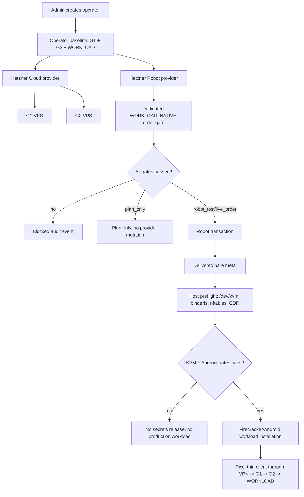
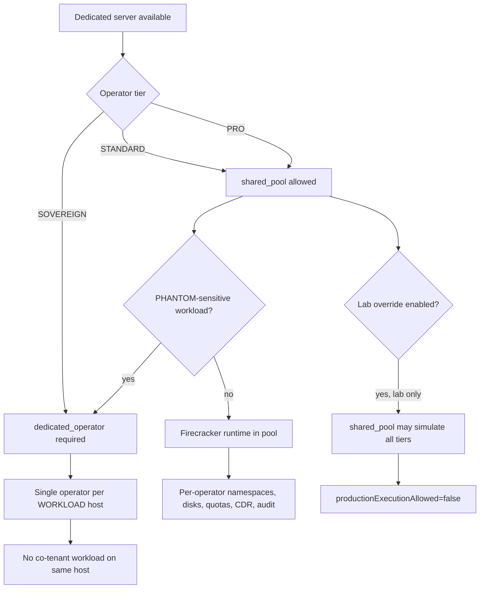

# Step 3.49 - Hetzner Robot Dedicated WORKLOAD_NATIVE Gate

Date: 2026-05-22

## Freeze

Hetzner Robot webservice ordering is now modeled as a separate provider path from Hetzner Cloud.

- `hetzner` remains the Cloud API adapter for G1/G2/basic VPS workflows.
- `hetzner_robot` represents dedicated/root server ordering for per-operator `WORKLOAD_NATIVE`.
- Every operator still keeps the Ksiegi 3.4 baseline of exactly 3 machines: G1, G2 and WORKLOAD.
- The WORKLOAD may be upgraded to a dedicated bare-metal host when Firecracker/KVM/Android native workloads are required.
- STANDARD and PRO may use a controlled `WORKLOAD_POOL` on one dedicated bare-metal host, with separate Firecracker/Android runtimes, network namespaces, storage quotas and audit partitions per operator.
- SOVEREIGN and PHANTOM-sensitive workloads must use `dedicated_operator` tenancy: a fully dedicated WORKLOAD host for that operator only.
- Ordering is default-deny and requires admin step-up, an approved provisioning approval, explicit live/cost/hardware confirmations and runtime env gates.
- No Robot username/password is stored in provider records, audit events, API responses or terminal-side state.

## Runtime Gates

Required env for Robot test/live execution:

```text
SYLION_PROVIDER_MODE=live
SYLION_LIVE_ALLOWED=true
SYLION_LIVE_ALLOWLIST_OPERATORS=*
SYLION_LIVE_ALLOWED_REGIONS=fsn1,nbg1,hel1
SYLION_HETZNER_ROBOT_ALLOWED_PRODUCTS=AX102,...
SYLION_HETZNER_ROBOT_MAX_MONTHLY_EUR=120
SYLION_HETZNER_ROBOT_USER=<runtime secret>
SYLION_HETZNER_ROBOT_PASSWORD=<runtime secret>
SYLION_HETZNER_ROBOT_ORDERING_ENABLED=true
```

Additional paid order gate:

```text
SYLION_HETZNER_ROBOT_PAID_ORDER_ALLOWED=true
```

Without the paid gate the system can still record `plan_only` and, when Robot supports it safely for the selected transaction, `robot_test` flows, but it must not place a paid order.

Temporary lab override for the first shared dedicated test host:

```text
SYLION_WORKLOAD_TENANCY_LAB_OVERRIDE=true
```

This override permits one shared dedicated host to exercise STANDARD, PRO, SOVEREIGN and PHANTOM-sensitive flows during lab testing only. Any order or environment created under this override remains `productionExecutionAllowed=false` and must be requalified before production.

## Admin Panel

The Providers view now includes:

- provider type `Hetzner Robot Dedicated`
- dedicated workload order form
- product allowlist fields via env gates
- order modes:
  - `plan_only`
  - `robot_test`
  - `live_order`
- workload tenancy modes:
  - `shared_pool` for STANDARD/PRO only
  - `dedicated_operator` for PRO optional and SOVEREIGN/PHANTOM mandatory
- evidence cards for dedicated workload orders

The form is intentionally explicit about paid risk and hardware verification. KVM/binderfs must still be verified on the delivered server before Firecracker or Android workload secrets are released.

## Dependency Graph



## Tier Tenancy Decision



## Security Position

`shared_pool` is a cost-optimized tier model, not equivalent to fully dedicated hardware. It must never be marketed or shown as the same isolation class as `dedicated_operator`.

Required controls for shared pool:

- per-operator Firecracker jailer namespaces
- per-operator storage quotas and encrypted volumes
- no shared application containers across operators
- no cross-operator network routes
- CDR remains mandatory
- blue-team monitoring must alert on host, runtime, key, route or namespace drift

Residual risk: host kernel/root compromise can affect all operators on the shared physical host. This is acceptable only for STANDARD/PRO with explicit tier wording.

## Implemented

- `services/admin-api/src/modules/live/hetznerRobotAdapter.js`
- `hetzner_robot` provider metadata and capabilities
- dedicated workload order persistence and API routes
- admin panel order controls and evidence cards
- SDK methods for dedicated workload orders
- tests for:
  - Robot provider capability matrix
  - blocked paid ordering without gates
  - plan-only flow without provider mutation
  - Robot adapter Basic auth and sanitized responses

## Verification

```text
npm.cmd test
151/151 passing
```

## Remaining Production Work

- Configure Robot credentials only on the admin VPS runtime environment.
- Add real product discovery UI from `/order/server/product` before paid ordering is enabled.
- After a dedicated server is delivered, run host preflight:

```bash
ls -l /dev/kvm
egrep -c '(vmx|svm)' /proc/cpuinfo
lsmod | grep kvm
mount | grep binder
uname -a
```

- Install Firecracker/KVM runtime and Android workload runner only after gates pass.
- Rerun Pixel human regression against the new `WORKLOAD_NATIVE` path.
