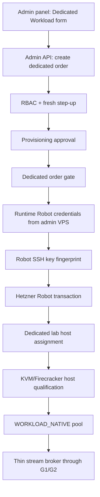

# Step 3.50 - Hetzner Robot Live Dedicated Lab Host

## Freeze

This step moves the dedicated WORKLOAD_NATIVE path from a catalog-only gate to a real Hetzner Robot transaction path.

Scope:

- provider: Hetzner Robot Dedicated
- lab product: `AX102-U`
- lab location: `HEL1`
- install image: `Ubuntu 24.04 LTS base`
- addon: `primary_ipv4`
- intended role: first shared lab WORKLOAD_NATIVE host for Firecracker/KVM validation

The host remains a lab host until qualification evidence proves KVM, IOMMU, microcode, firewalling, CDR, stream brokering, and tenant isolation.

## Human Gate Result

Robot ordering was explicitly enabled in Hetzner Robot and runtime credentials were installed only on the admin VPS as systemd environment drop-ins.

No Robot username or password is stored in provider records, API responses, docs, commits, or terminal-side state.

## Implementation Notes

- `HetznerRobotAdapter` now normalizes nested Robot catalog rows under `product`.
- Robot order requests use official array field names:
  - `authorized_key[]`
  - `addon[]`
- Robot order requests uppercase the location before provider submission while the SYLION control plane can keep lower-case region policy IDs.
- The admin panel defaults the dedicated workload form to `AX102-U`, `hel1`, and `Ubuntu 24.04 LTS base`.
- The Robot SSH key is referenced by provider fingerprint, not by a local label.

## Transaction Evidence

Safe evidence only:

- `robot_test` transaction accepted and returned cancelled/no-side-effect status.
- one `live_order` transaction was accepted for `AX102-U` in `HEL1`.
- live transaction status at freeze time: `in process`.
- server number and IP were not yet assigned at freeze time.

## Dependency Graph

## Next Gates

1. Poll Robot until the live transaction has `server_number` and `server_ip`.
2. SSH/install/bootstrap the host with Ubuntu 24.04 baseline.
3. Verify `/dev/kvm`, AMD SVM, IOMMU, kernel lockdown posture, nftables, and microcode state.
4. Install Firecracker and run a no-secret microVM smoke test.
5. Register the host in the admin panel as `WORKLOAD_NATIVE_LAB_01`.
6. Keep `productionExecutionAllowed=false` until tenant isolation and human Pixel regression pass.

## Sources

Hetzner Robot Webservice documentation confirms:

- Basic Auth over HTTPS.
- `GET /key` and `POST /key` for SSH keys.
- dedicated order endpoint `POST /order/server/transaction`.
- `authorized_key[]`, `addon[]`, and `test=true` transaction semantics.

Reference: https://robot.hetzner.com/doc/webservice/en.html
