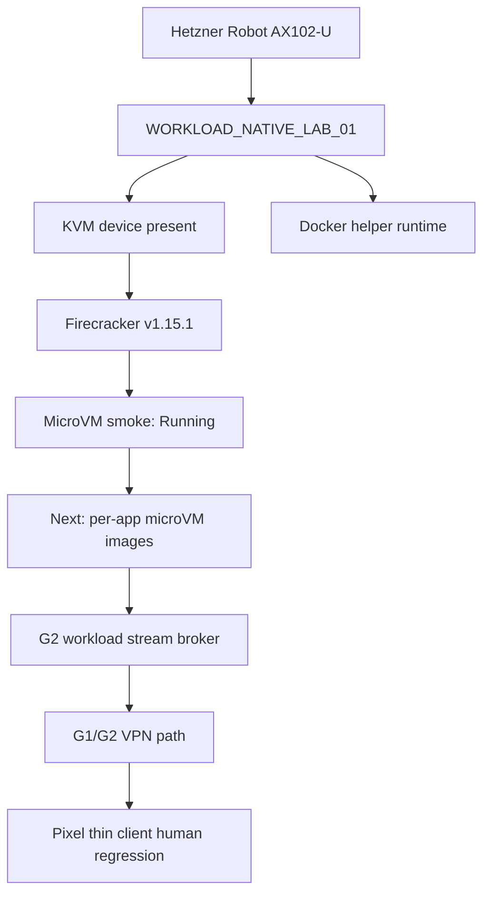

# Step 3.51 - WORKLOAD_NATIVE_LAB_01 Bootstrap

## Freeze

Hetzner Robot delivered the first dedicated lab workload host:

- role: `WORKLOAD_NATIVE_LAB_01`
- hostname: `sylion-workload-native-lab-01`
- server number: `2983993`
- product: `AX102-U`
- location: `HEL1`
- public IPv4: `65.109.123.72`
- public IPv6: `2a01:4f9:3051:1729::2`
- OS: Ubuntu 24.04.3 LTS

The ED25519 host key was verified against the Hetzner delivery email before SSH bootstrap.

## Lab Qualification

Current verdict: `LAB_ACCEPT_KVM_FIRECRACKER_SMOKE_PASSED`.

Evidence:

- `/dev/kvm` present.
- AMD-V/SVM visible for 32 CPU threads.
- Firecracker v1.15.1 installed from the official Firecracker GitHub release.
- Jailer v1.15.1 installed.
- A minimal Firecracker microVM reached `Running`.
- Docker/containerd installed only as helper runtime for build and STANDARD/PRO lab validation.

Evidence files:

- `test-artifacts/step3-51-workload-native-lab-host/bootstrap-preflight.json`
- `test-artifacts/step3-51-workload-native-lab-host/firecracker-install.json`
- `test-artifacts/step3-51-workload-native-lab-host/firecracker-smoke.json`
- `test-artifacts/step3-51-workload-native-lab-host/hardware-qualification.json`
- `test-artifacts/step3-51-workload-native-lab-host/container-runtime.json`

## Production Blockers

This host is not production-approved yet.

Known blockers:

- tenant isolation not validated
- G1/G2 private path not bound to this dedicated host
- workload images for Signal/Telegram/WhatsApp/Threema/Zangi/DuckDuckGo/LibreOffice/Exodus not built as production artifacts
- thin stream broker not bound to approved workload sources
- HSM/PKI production release not integrated
- Pixel human regression pending
- Secure Boot is disabled
- TPM is missing
- IOMMU evidence is not visible in `dmesg`

## Architecture Impact

## Next Implementation Step

1. Add a workload-native host registry to the admin API so the panel can show delivered Robot host state.
2. Bind `WORKLOAD_NATIVE_LAB_01` to the existing operator environment as lab substrate.
3. Build first app image path:
   - `signal` as Linux desktop thin-stream workload first
   - `duckduckgo` browser workload second
   - `libreoffice` productivity workload third
4. Create per-app Firecracker launch manifests with isolated tap network names.
5. Route stream access only via G2, never direct public bind.
6. Run Pixel ADB human regression through the operator panel.

## Gate Status

Decision: ACCEPT FOR LAB.

Human gate: REQUIRED before production.

Baseline impact: no G1/G2 bypass allowed; terminal remains thin-client only.

PHANTOM impact: no PHANTOM production behavior enabled.
