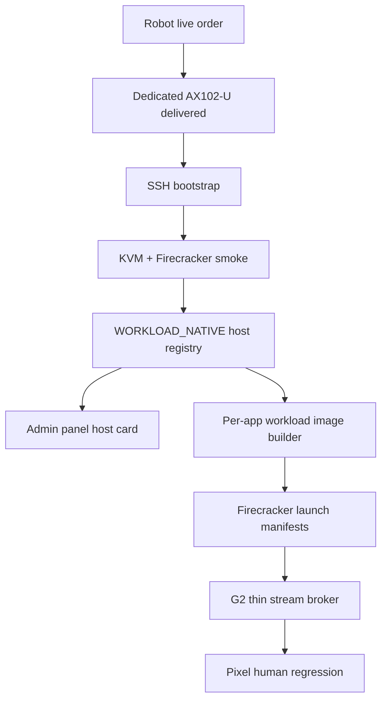

# Step 3.52 - WORKLOAD_NATIVE Host Registry

## Freeze

The delivered Hetzner Robot dedicated host is now represented in the SYLION control plane, not only in external docs.

Registered live host:

- host id: `WORKLOAD_NATIVE_LAB_01`
- server number: `2983993`
- product: `AX102-U`
- region: `hel1`
- public IPv4: `65.109.123.72`
- public IPv6: `2a01:4f9:3051:1729::2`
- lifecycle: `lab_qualified`
- tenancy: `shared_pool`

## Implemented

- Admin API resource: `workload_native_host`.
- Endpoints:
  - `GET /live-execution/workload-native/hosts`
  - `POST /live-execution/workload-native/hosts`
- Fresh admin step-up is required before host registration.
- Evidence sanitizer rejects tokens, passwords, private keys, PEM material and similar sensitive runtime data.
- Admin UI shows `WORKLOAD_NATIVE Hosts` under live execution.
- The real host was registered through the deployed admin API.

## Lab Readiness Checks

The live registration passed:

- `kvm_device`
- `amd_virtualization`
- `firecracker_binary`
- `jailer_binary`
- `microvm_smoke`
- `auditd`
- `apparmor`
- `container_helper_runtime`
- `production_blockers_declared`

## Production Boundary

This registry does not approve production execution.

Production remains blocked by:

- tenant isolation not validated
- G1/G2 private path not bound
- workload images not built
- thin stream broker not bound
- HSM/PKI not integrated
- Pixel human regression pending
- Secure Boot disabled
- TPM missing
- IOMMU not visible in `dmesg`

## Dependency Graph

## Verification

- `npm.cmd test`: `156/156` passed.
- Deployed admin API restarted successfully on the admin VPS.
- Browser check confirmed the deployed `/admin` shell contains `WORKLOAD_NATIVE Hosts`.
- Live API registration returned `labReady=true` and `productionExecutionAllowed=false`.

## Next Step

Build the first real app workload path:

1. Create per-app image manifest model for Signal, DuckDuckGo and LibreOffice.
2. Build a no-secret Firecracker launch manifest for the first app.
3. Keep app stream access private behind G2.
4. Add dashboard controls for build, launch, stop, recreate and evidence view.
5. Run Pixel ADB human regression against the operator panel.
