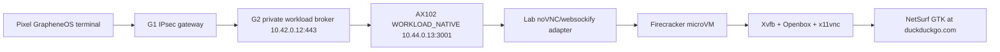

# Step 3.58 - Native DuckDuckGo GUI Firecracker Workload

Status: implemented as lab evidence, not production release.

This step replaces the Step 3.57 HTML stream-smoke with a real GUI workload path for DuckDuckGo. The browser desktop runs inside a Firecracker microVM on the Hetzner AX102 dedicated workload host. The AX102 host provides a lab-only noVNC/websockify adapter and exposes it only on the private workload address for G2. Per `ADR-g2-session-broker-001`, noVNC is not the production G2 Session Broker.

## Live Path



## Implemented

- `scripts/launch-native-firecracker-gui-workload.mjs`
  - Builds a per-run 8 GB rootfs from the native base rootfs.
  - Enables Ubuntu `universe` in the temporary rootfs.
  - Installs X11/noVNC browser dependencies into the rootfs.
  - Boots a real Firecracker microVM with KVM.
  - Starts `Xvfb`, `openbox`, `netsurf-gtk https://duckduckgo.com/`, and `x11vnc` inside the microVM.
  - Starts host-side noVNC/websockify as the workload-session-broker.
  - Binds the stream only to `10.44.0.13:3001`.
  - Verifies the stream through G2 at `https://duckduckgo.sylion.internal/vnc.html`.
  - Writes sanitized evidence to `/opt/sylion-workloads/evidence/native-firecracker-gui-duckduckgo.json`.

## Verified Evidence

Latest successful run:

```json
{
  "component": "native_firecracker_gui_workload",
  "appKey": "duckduckgo",
  "hostHttpCode": "200",
  "noVncMarker": true,
  "ready": true,
  "g2": {
    "code": "200",
    "marker": true,
    "g2_header": true,
    "terminal_header": true
  },
  "readyThroughG2": true,
  "terminalDataStored": false,
  "productionExecutionAllowed": false
}
```

## Security Boundary

- Browser UI runs in the Firecracker guest.
- noVNC/websockify is a lab adapter on AX102, not the production G2 Session Broker.
- The host stream bind remains private: `10.44.0.13:3001`.
- G2 remains the only broker path from Pixel/operator terminal to workload.
- No terminal operational data is stored.
- CDR remains mandatory for file movement.
- This does not yet prove Pixel touch UX; Pixel ADB human regression is the next gate.
- HSM-backed CA remains a production blocker.

## Remaining Blockers

- Add native GUI rootfs launchers for Signal, WhatsApp, Telegram, Threema, Zangi, LibreOffice, and Exodus.
- Bind operator panel lifecycle controls to the native GUI runner.
- Add screenshot and click evidence through Pixel ADB.
- Replace lab/bootstrap CA with production HSM-backed CA.
- Add per-operator scheduling, panic wipe, backup, and subscription quota controls to the native runner.

## Commands

```powershell
node scripts/launch-native-firecracker-gui-workload.mjs --apply --require-ready
node scripts/verify-pixel-g1-g2-native-path.mjs --require-ready
npm.cmd test
```
