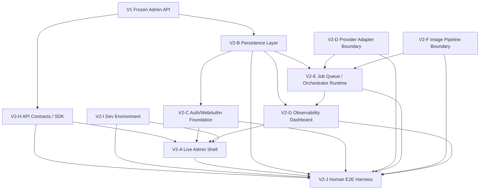
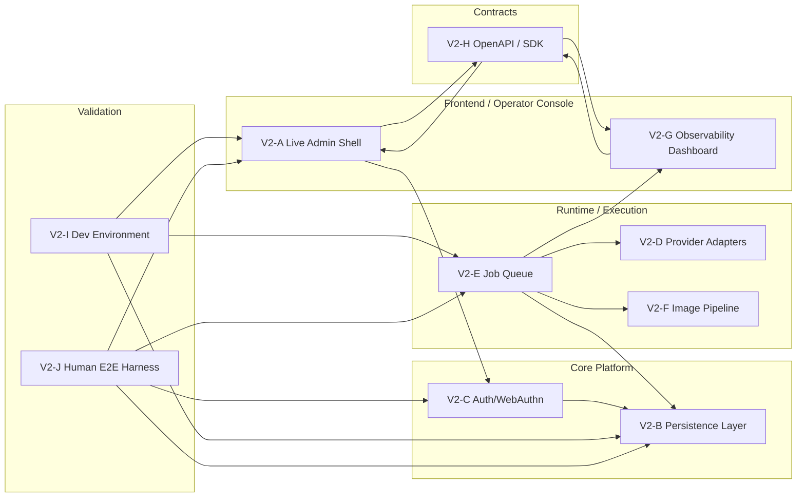
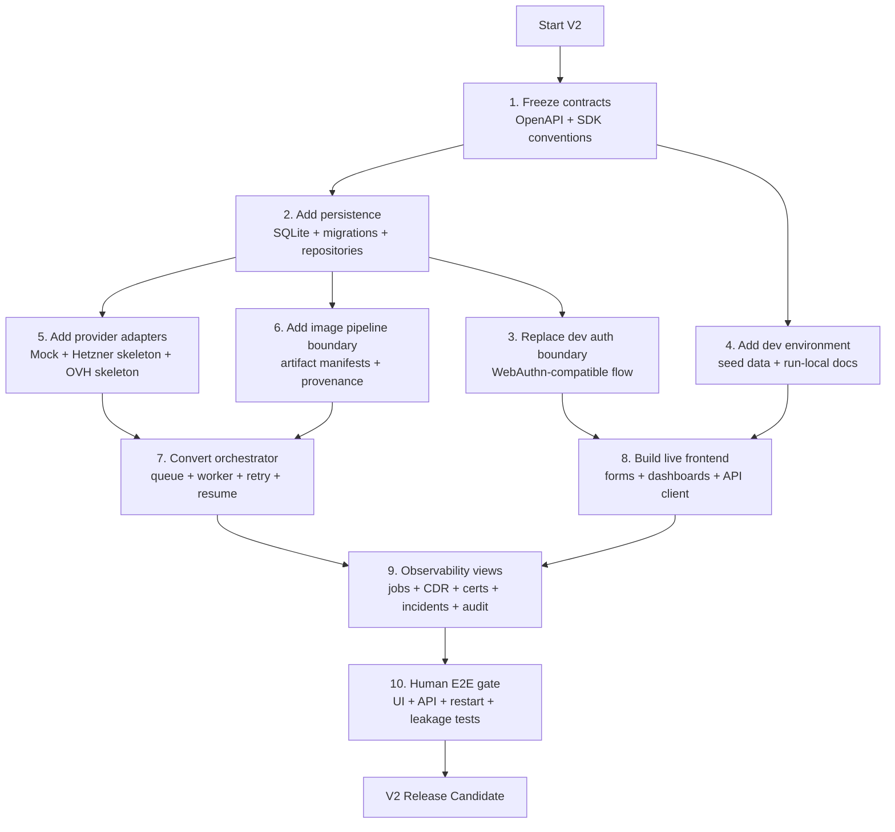
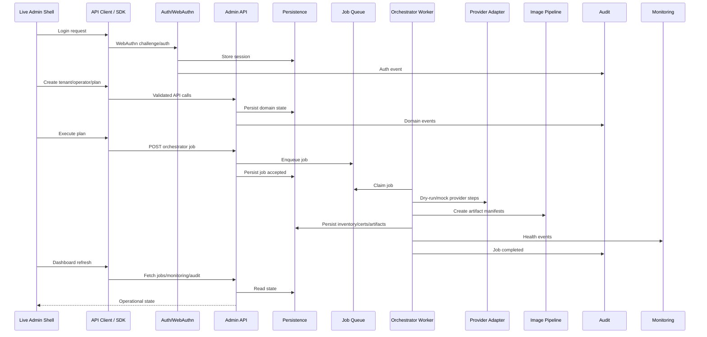
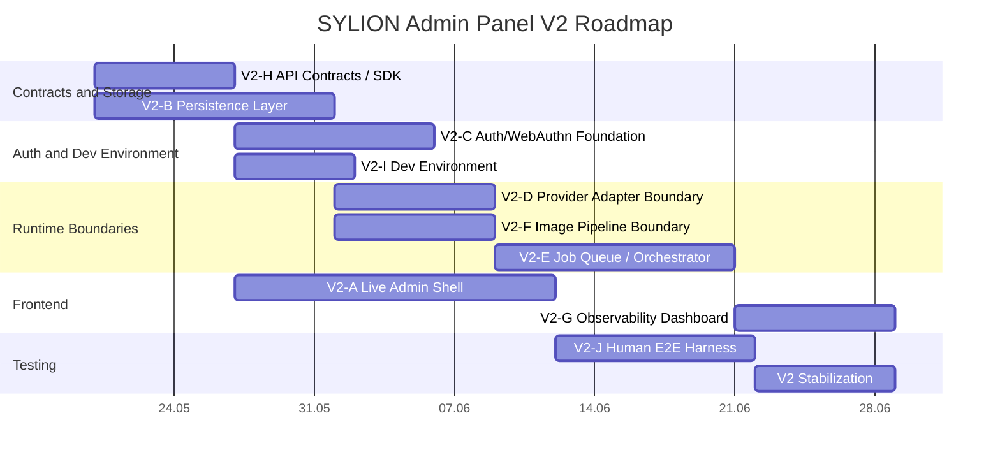

# SYLION Admin Panel V2 - Diagramy Mermaid

Aktualizacja: diagramy kolejnego etapu po Step 2 sa w `STEP3_DIAGRAMS.md` oraz w plikach:

```text
diagrams/06-step3-module-dependencies.mmd
diagrams/07-step3-module-map.mmd
diagrams/08-step3-deployment-graph.mmd
diagrams/09-step3-runtime-sequence.mmd
diagrams/10-step3-roadmap-gantt.mmd
diagrams/11-step3-2-module-dependencies.mmd
diagrams/12-step3-2-module-map.mmd
diagrams/13-step3-2-deployment-graph.mmd
diagrams/14-step3-2-runtime-flow.mmd
diagrams/15-step3-2-roadmap-gantt.mmd
```

Ten plik zbiera diagramy w jednym miejscu. Te same diagramy są też zapisane jako osobne pliki `.mmd` w `docs/admin-panel-v2/diagrams/`.

## 1. Graf Zależności Modułów

Źródło: `diagrams/01-module-dependencies.mmd`



## 2. Mapa Modułów

Źródło: `diagrams/02-module-map.mmd`



## 3. Plan Wdrożenia

Źródło: `diagrams/03-deployment-plan.mmd`



## 4. Runtime Flow

Źródło: `diagrams/04-runtime-flow.mmd`



## 5. Roadmap Gantt

Źródło: `diagrams/05-roadmap-gantt.mmd`


