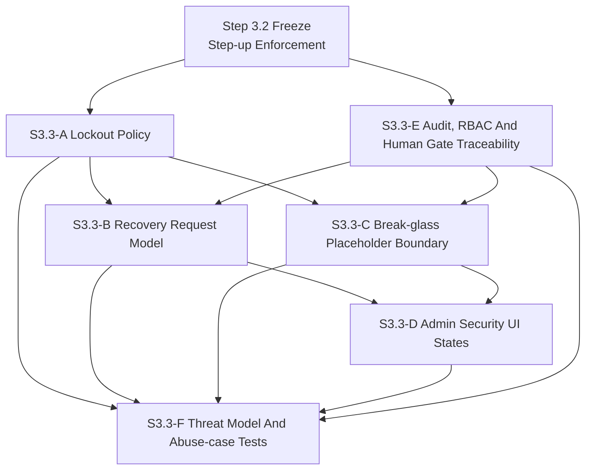
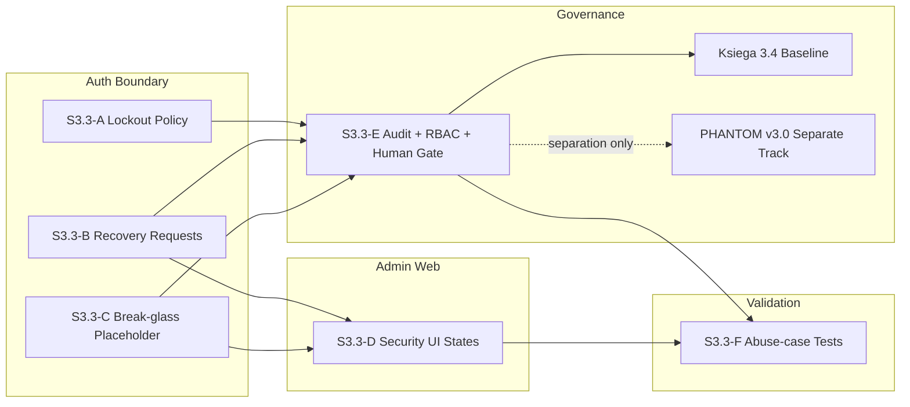
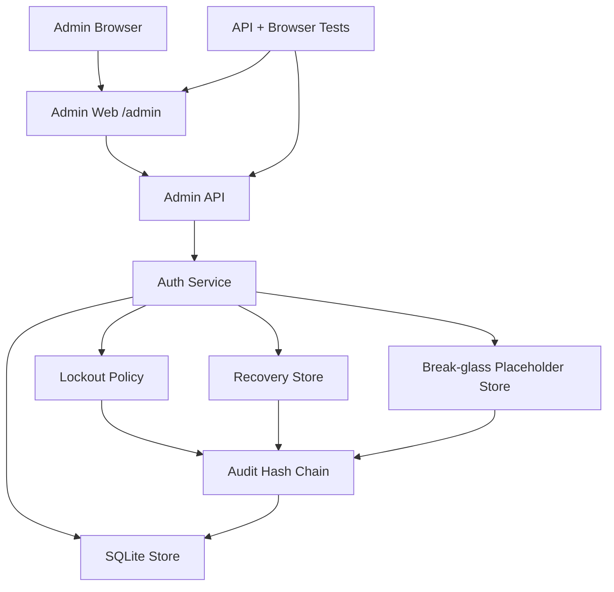
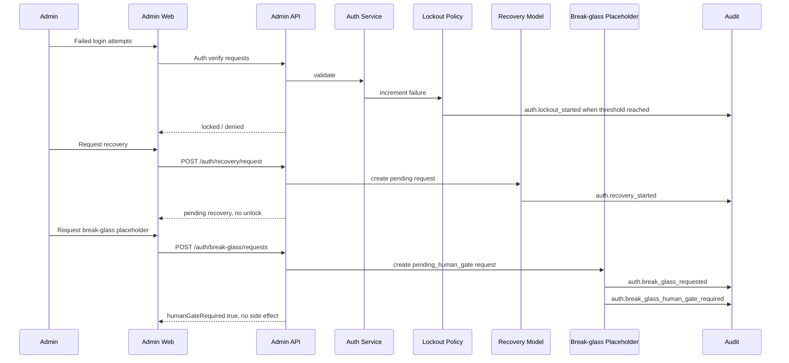
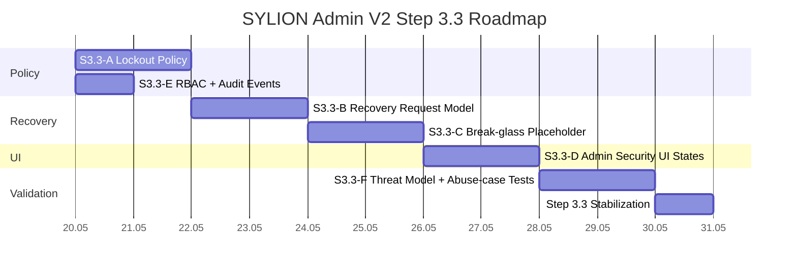

# SYLION Admin Panel V2 Step 3.3 - Mermaid Diagrams

Ten plik zbiera diagramy Step 3.3 w jednym miejscu. Te same diagramy sa zapisane jako osobne pliki `.mmd` w `docs/admin-panel-v2/diagrams/`.

## 1. Module Dependency Graph

Zrodlo: `diagrams/16-step3-3-module-dependencies.mmd`

## 2. Module Map

Zrodlo: `diagrams/17-step3-3-module-map.mmd`

## 3. Deployment Graph

Zrodlo: `diagrams/18-step3-3-deployment-graph.mmd`

## 4. Runtime Flow

Zrodlo: `diagrams/19-step3-3-runtime-flow.mmd`

## 5. Roadmap Gantt

Zrodlo: `diagrams/20-step3-3-roadmap-gantt.mmd`

