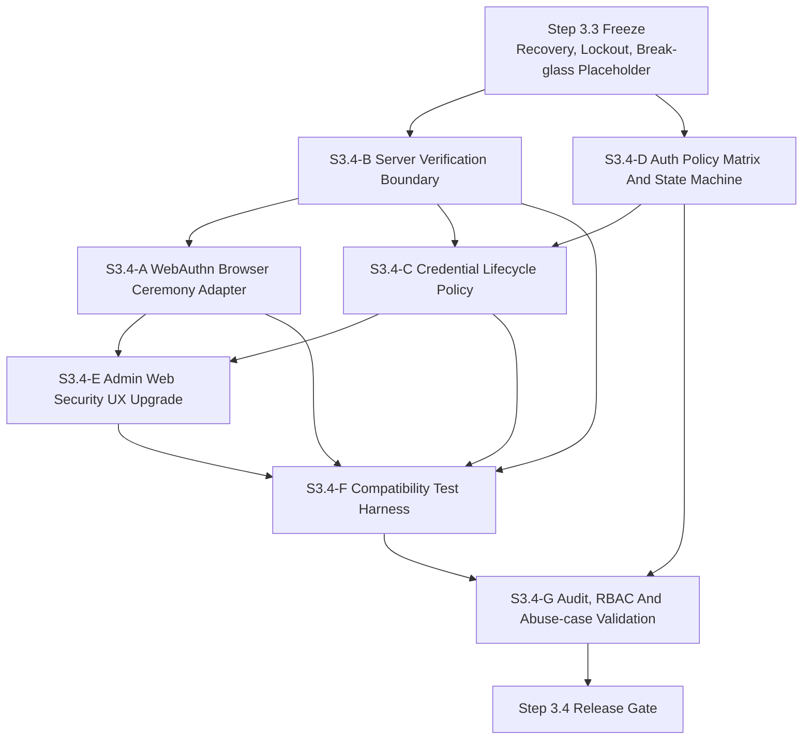
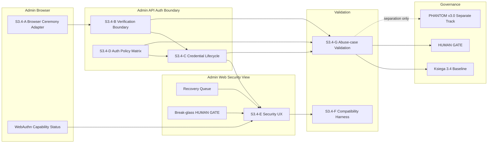
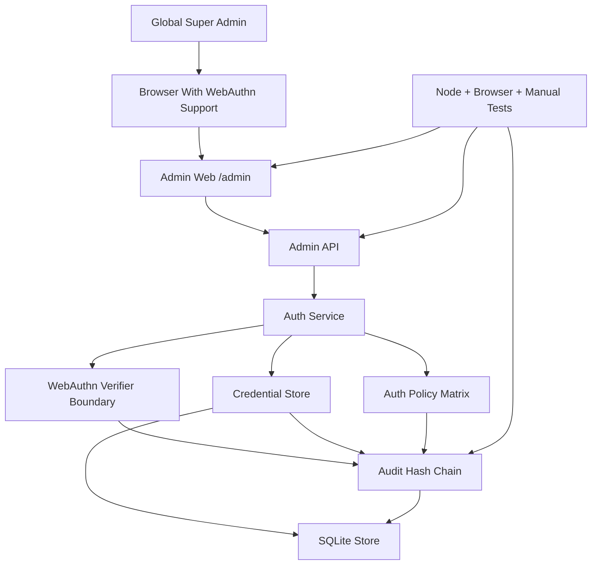
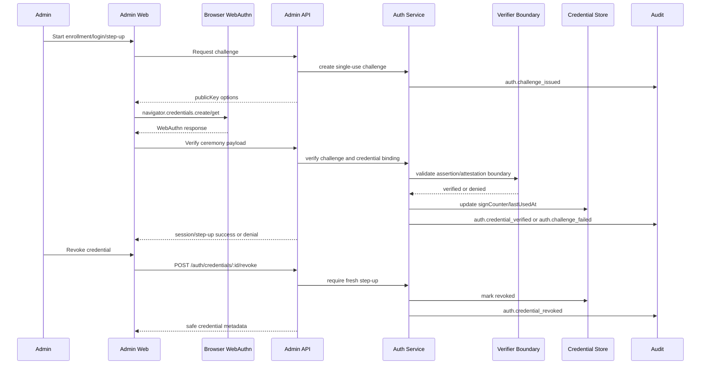
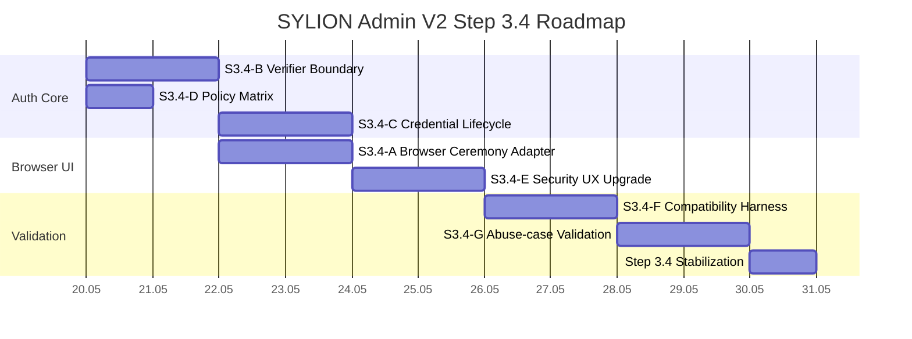

# SYLION Admin Panel V2 Step 3.4 - Mermaid Diagrams

Ten plik zbiera diagramy Step 3.4 w jednym miejscu. Te same diagramy sa zapisane jako osobne pliki `.mmd` w `docs/admin-panel-v2/diagrams/`.

## 1. Module Dependency Graph

Zrodlo: `diagrams/21-step3-4-module-dependencies.mmd`

## 2. Module Map

Zrodlo: `diagrams/22-step3-4-module-map.mmd`

## 3. Deployment Graph

Zrodlo: `diagrams/23-step3-4-deployment-graph.mmd`

## 4. Runtime Flow

Zrodlo: `diagrams/24-step3-4-runtime-flow.mmd`

## 5. Roadmap Gantt

Zrodlo: `diagrams/25-step3-4-roadmap-gantt.mmd`

