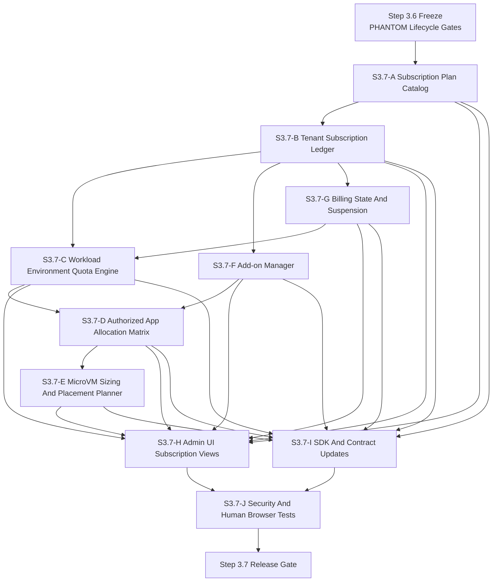
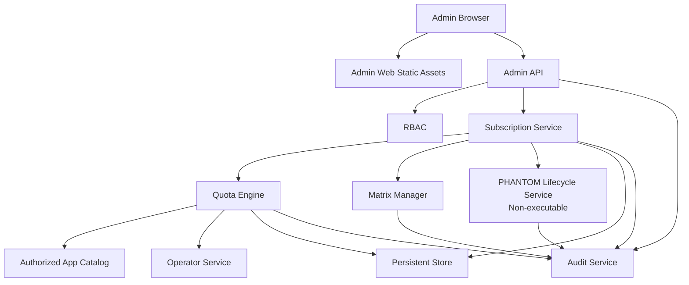
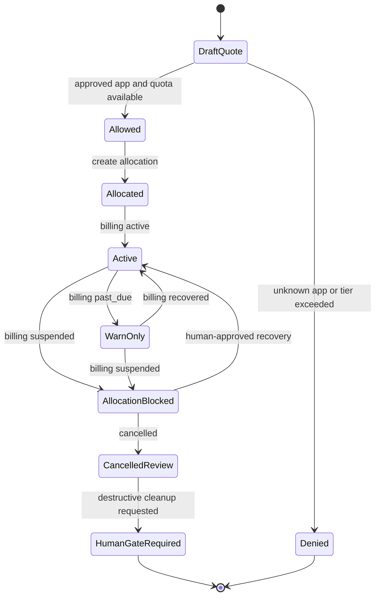
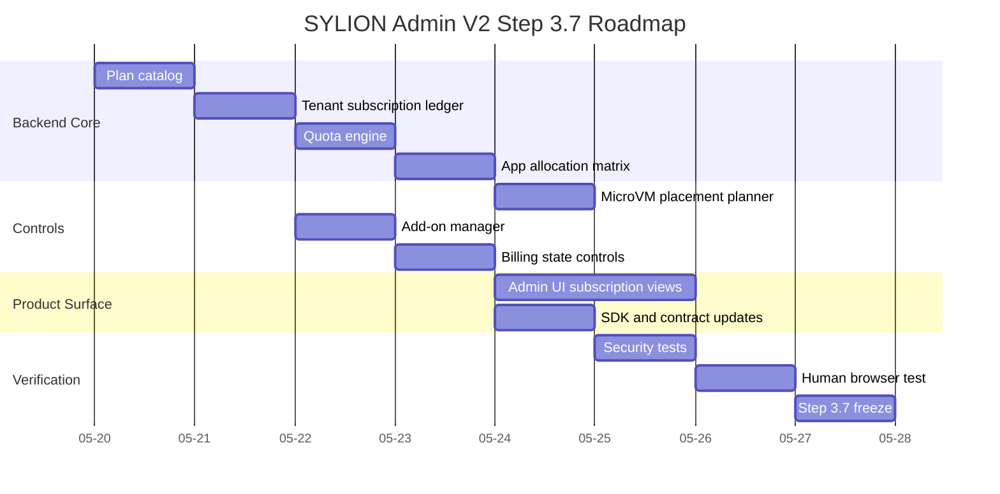

# SYLION Admin Panel V2 Step 3.7 - Mermaid Diagrams

This file collects Step 3.7 diagrams in one place. The same diagrams are also stored as separate `.mmd` files in `docs/admin-panel-v2/diagrams/`.

## Module Dependency Graph

## Deployment Graph

## Quota State Machine

## Roadmap

