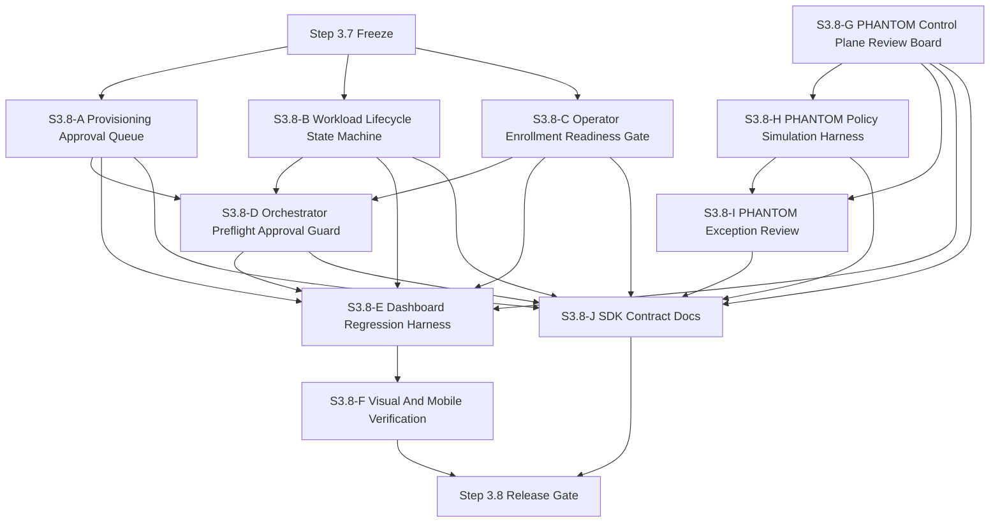
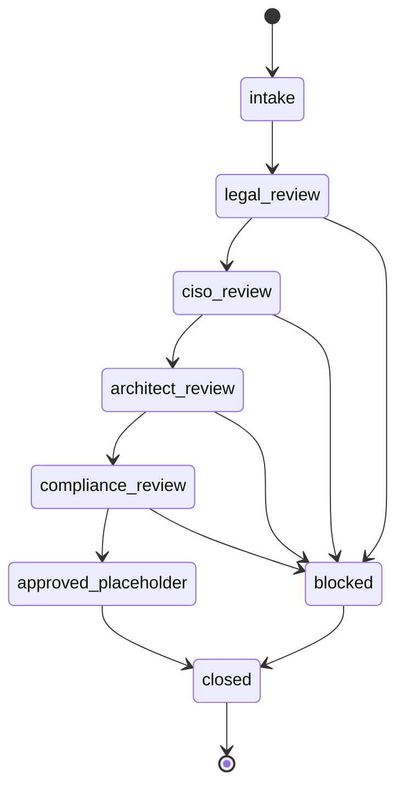
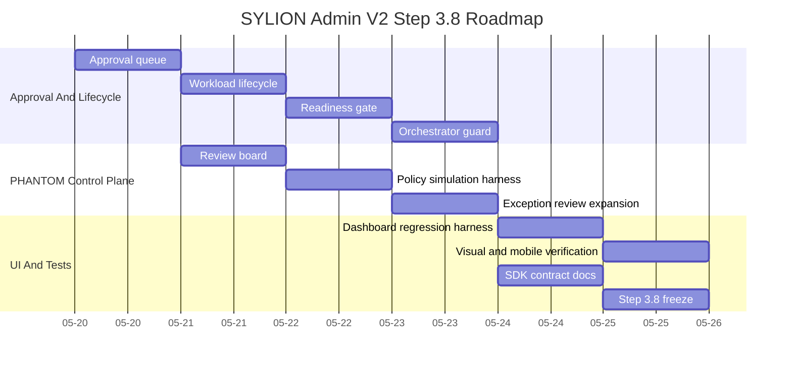

# SYLION Admin Panel V2 Step 3.8 - Mermaid Diagrams

This file collects Step 3.8 diagrams. Separate `.mmd` files live in `docs/admin-panel-v2/diagrams/`.

## Dependencies

## PHANTOM Review Flow

## Roadmap

