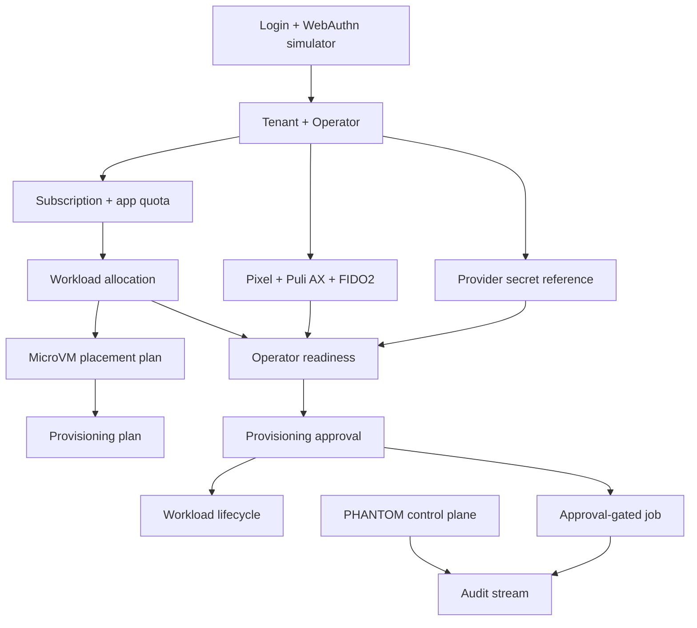

# Step 3.8 Dashboard Playwright Checklist

Date: 2026-05-20

Scope: Admin Panel Step 3.8 approval gates, workload lifecycle, PHANTOM extended control plane, and audit visibility.

## Browser Test Result

Status: PASS with noted tooling findings.

Screenshot:

`docs/admin-panel-v2/assets/step3-8-dashboard-playwright.png`

## Passed Click-Through Scenarios

1. Login through the dashboard using WebAuthn-compatible simulator and typed password.
2. Operators tab: create tenant and operator.
3. Providers tab: save provider API secret and verify secret reference card, not plaintext.
4. Devices tab: register Pixel GrapheneOS, GL.iNet GL-XE3000 Puli AX, and FIDO2 key.
5. Subscriptions tab: create approved app, update subscription, quote workload, create allocation, create placement plan.
6. Provisioning and Approvals tabs: generate plan, evaluate readiness, create approval, approve it, transition workload lifecycle.
7. Provisioning tab: execute approval-gated orchestrator job.
8. PHANTOM tab: create capability, approval, risk, package, evidence, approval pack, readiness, simulation, assignment, review board item, policy simulation, and exception.
9. Audit tab: verify hash-chain event stream renders after the full flow.

## Problems Identified

1. Browser automation `locator.fill()` fails in this environment because the virtual clipboard is not installed.
   - Impact: test runner cannot rely on `fill()` for password/secret/text fields.
   - Mitigation used: click field and type through the DOM interaction layer.
   - Product impact: none observed in the app; this is a test harness limitation.

2. Provider card assertion initially raced the async refresh/render cycle.
   - Impact: first browser run reported `provider card not rendered`, but the provider card appeared after refresh.
   - Mitigation used: wait for `.mini-card` visibility after submit.
   - Product impact: the panel works, but test scripts must wait for card render after async actions.

3. Full-page screenshot capture returned no data once during a long audit page.
   - Impact: full-page capture may be flaky in the in-app browser backend.
   - Mitigation used: viewport screenshot was captured successfully.
   - Product impact: none observed.

## Required Regression Coverage Going Forward

