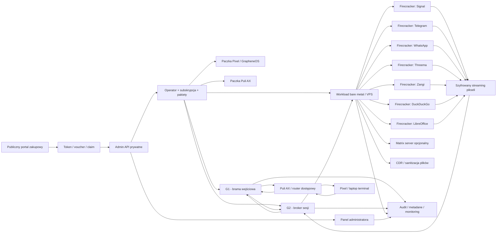
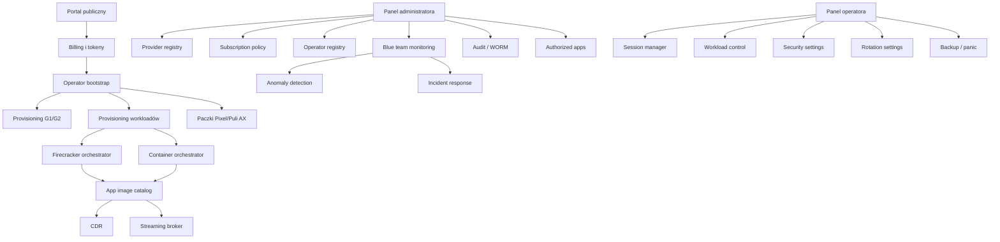
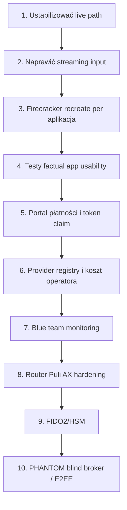

# Księga 4.0: SYLION + PHANTOM

## Aktualny baseline techniczny systemu i profilu PHANTOM

**Wersja:** 2026-06-01  
**Nazwa normatywna:** Księga 4.0  
**Zakres:** SYLION Secure, PHANTOM v3.0, panel administratora, panel operatora, publiczny portal zakupowo-tokenowy, G1/G2, Puli AX, Pixel/GrapheneOS, workloady, Firecracker, CDR, rotacje jurysdykcyjne, tiering, zasady używania i aktualny stan wdrożenia.  
**Charakter dokumentu:** aktualny baseline techniczny. Dokument opisuje architekturę, moduły, zasady, zagrożenia, mechanizmy obrony, ograniczenia i roadmapę. Nie jest instrukcją obchodzenia zabezpieczeń telekomunikacyjnych, nie zawiera sekretów, haseł, tokenów, kluczy API ani procedur manipulacji publicznymi identyfikatorami sieci komórkowej.

---

# 1. Czym jest Księga 4.0

Księga 4.0 jest aktualnym dokumentem bazowym systemu SYLION i profilu PHANTOM. Jej zadaniem jest zamrożenie najbardziej aktualnego rozumienia architektury, zasad bezpieczeństwa, podziału modułów, uprawnień paneli, tierów, rotacji, threat modelu i stanu wdrożenia.

Ten dokument nie jest materiałem marketingowym. Jest dokumentem technicznym, który ma służyć do:

- prowadzenia implementacji;
- weryfikowania, czy kod i infrastruktura nie odchodzą od architektury;
- planowania testów;
- odróżniania funkcji gotowych od częściowych i roadmap;
- rozmowy z developerami i operatorami infrastruktury;
- oceny ryzyka;
- wyznaczania granicy między SYLION baseline a PHANTOM.

Księga 4.0 przyjmuje, że SYLION i PHANTOM są jednym spójnym systemem, ale nie wszystkie funkcje PHANTOM są częścią podstawowego produktu. Baseline SYLION musi być możliwy do wdrożenia legalnie, audytowalnie i produkcyjnie. PHANTOM jest profilem rozszerzonym, z ostrzejszymi warstwami sprzętowymi, proceduralnymi i rotacyjnymi, ale z wyraźnymi bramkami human gate i lab-only tam, gdzie funkcje dotykają warstw regulowanych albo wysokiego ryzyka.

---

# 2. Założenia nadrzędne

SYLION jest platformą do tworzenia i obsługi izolowanych środowisk operatorskich. Operator nie pracuje bezpośrednio na swoim urządzeniu końcowym. Terminal, na przykład Pixel z GrapheneOS albo laptop, pełni rolę cienkiego klienta. Właściwe aplikacje, komunikatory, przeglądarka, narzędzia biurowe i środowiska specjalne działają po stronie zdalnych workloadów, najlepiej w izolowanych mikroVM Firecracker albo w mniej zaawansowanych tierach w kontenerach.

PHANTOM jest rozszerzeniem architektury SYLION dla profili wysokiego ryzyka. Dodaje ostrzejszą separację sprzętową, polityki rotacji, silniejsze wymagania wobec terminala, routera, ścieżki transmisji, workloadów, audytu i zasad operacyjnych. PHANTOM nie może być traktowany jako pojedyncza funkcja. To profil architektoniczny obejmujący terminal, router, G1, G2, workload, CDR, policy engine, monitoring, procedury awaryjne oraz rygor użycia.

Podstawowy model:

- terminal nie przechowuje danych roboczych;
- obraz aplikacji jest strumieniowany do terminala;
- wejście użytkownika jest przesyłane do zdalnego środowiska;
- G1 odpowiada za wejście i pierwszą warstwę dostępu;
- G2 odpowiada za broker sesji, kontrolę połączenia i dostęp do workloadów;
- workloady uruchamiają aplikacje w oddzielnych środowiskach;
- CDR kontroluje i sanitizuje przepływ plików;
- panel administratora zarządza systemem, providerami, tierami, operatorami i monitoringiem;
- panel operatora pozwala operatorowi kontrolować własne środowiska w granicach subskrypcji;
- portal publiczny sprzedaje tokeny, pozwala je claimować i uruchamia proces tworzenia operatora.

---

# 3. Status normatywny elementów

W całej księdze obowiązują cztery statusy:

| Status | Znaczenie |
|---|---|
| **Baseline** | Element wymagany w każdym tierze produkcyjnym. |
| **PHANTOM** | Element wymagany dla profili Phantom i Sovereign albo dla operacji wysokiego ryzyka. |
| **Lab-only** | Element może istnieć wyłącznie jako kontrolowany test laboratoryjny, z rejestrem, zatwierdzeniami i bez automatycznego wykonania w produkcie. |
| **Roadmap** | Element zaplanowany, częściowo zaprojektowany lub częściowo zaimplementowany, ale nie może być komunikowany jako gotowy produkcyjnie. |

Szczególnie istotne ograniczenie: funkcje dotyczące warstwy telekomunikacyjnej, identyfikatorów radiowych, kart SIM i modemów mogą być opisane w systemie wyłącznie jako polityka, kwalifikacja sprzętu, test laboratoryjny i mechanizm governance. System produkcyjny nie powinien oferować użytkownikowi wykonawczych funkcji służących do manipulowania identyfikatorami w publicznych sieciach telekomunikacyjnych.

## 3.1. Baseline Księgi 4.0: wymagania nienegocjowalne

| Obszar | Wymaganie baseline |
|---|---|
| Terminal | Terminal jest cienkim klientem. Nie przechowuje danych roboczych, historii komunikacji, kluczy workloadów ani plików operatora. |
| G1/G2 | Każdy operator dostaje indywidualne G1 i G2. Nie wolno łączyć operatorów na wspólnej bramie bez formalnego ADR. |
| Workload | Aplikacje działają poza terminalem. W Pro i wyżej wymagany jest Firecracker albo silniejsza izolacja. |
| CDR | CDR jest obowiązkowe dla każdego tieru i każdego przepływu plików między strefami. |
| Providerzy | Providerzy są wybierani z rejestru administratora, z opisem krajów, kosztów i capabilities. |
| Rotacja | Rotacja jest funkcją polityki subskrypcji, nie dowolną akcją operatora. |
| Tokeny | Token nie zawiera sekretów, jest jednorazowy albo limitowany, claim jest atomowy, a płatności są idempotentne. |
| Portal | Portal publiczny jest odseparowany od panelu admina, operatora i workload streamów. |
| Panel admina | Panel admina działa wyłącznie jako prywatna konsola zarządzania, monitoringu i audytu. |
| Panel operatora | Operator widzi wyłącznie swoje środowiska, limity, sesje i polityki. |
| PHANTOM | PHANTOM nie jest automatycznie częścią baseline. Wymaga dodatkowych gate'ów, testów i ograniczeń. |
| RF lab | Funkcje RF/telecom pozostają lab-only governance i nie są executorami produktu. |
| Audyt | Operacje krytyczne mają ślad audytowy. Operacje destrukcyjne wymagają polityki four-eyes albo równoważnego gate'u. |

---

# 4. Architektura logiczna

Architektura jest warstwowa. Kompromitacja jednej warstwy nie powinna automatycznie oznaczać kompromitacji pozostałych. Każdy operator ma osobny rekord tożsamości operatorskiej, osobne sekrety, osobne certyfikaty, osobne polityki i osobne ścieżki sesji. W baseline każdy operator otrzymuje indywidualne G1 i G2. Warstwa workload może być współdzielona w niższych tierach, ale tylko przy spełnieniu izolacji środowiskowej, kwot, audytu, wipe/rebuild i braku współdzielenia sekretów.

---

# 5. Granica baseline SYLION i PHANTOM

Baseline SYLION to minimalny produkcyjny rdzeń. Musi działać stabilnie, audytowalnie i bez funkcji, których nie da się obronić prawnie albo technicznie. Baseline obejmuje:

- portal publiczny z tokenami;
- panel administratora;
- panel operatora;
- indywidualne G1 i G2 dla operatora;
- workloady zgodne z tierem;
- CDR;
- audyt;
- provider registry;
- politykę subskrypcji;
- tworzenie paczek terminal/router;
- streaming pikseli;
- rotację w zakresie dopuszczonym przez tier;
- testy stanu faktycznego aplikacji.

PHANTOM dodaje:

- ostrzejsze wymagania terminala;
- korelację Pixel - Puli AX - FIDO2;
- silniejszy posture check;
- dedykowane albo operator-only workloady;
- pełną politykę jurysdykcyjną;
- wyższe wymagania izolacji;
- docelowy blind broker/E2EE streaming;
- silniejsze monitorowanie i reakcję na incydenty;
- bardziej rygorystyczne OPSEC;
- lab-only governance dla elementów RF/telecom.

Zasada Księgi 4.0: nie wolno promować funkcji PHANTOM do baseline, jeśli nie ma testu, audytu, legalnego modelu użycia i jasno zdefiniowanych bramek bezpieczeństwa.

---

# 6. Strefy systemu

## 6.1. Strefa publiczna: portal zakupowy

Portal publiczny jest jedyną częścią systemu, która powinna być publicznie dostępna bez VPN. Jego zadaniem jest sprzedaż dostępu, przyjmowanie płatności, generowanie tokenów i uruchamianie procesu bootstrapu operatora. Portal nie powinien hostować panelu administratora, panelu operatora, workload streamów ani endpointów zarządzających infrastrukturą.

Portal działa na oddzielnym VPS. Do prywatnego Admin API komunikuje się wyłącznie przez wąski, allowlistowany zestaw endpointów `portal-api`. Wymagany jest edge secret, walidacja webhooków płatności, idempotencja i zapis audytowy.

Funkcje portalu:

- wybór tieru;
- wybór typu zakupu: nowy operator, przedłużenie, upgrade, dodatkowa jurysdykcja, dodatkowa pojemność workload, Matrix, przegląd PHANTOM;
- płatność kartą lub przelewem przez Stripe/Mollie;
- płatność krypto przez CoinGate albo równoważnego providera;
- wygenerowanie tokenu po skutecznej płatności;
- wpisanie tokenu i claim;
- uruchomienie procesu tworzenia operatora;
- pobranie paczek startowych dla Pixela i Puli AX;
- obsługa ścieżki resellerów;
- informacja o minimalnym okresie subskrypcji;
- informacja o braku zwrotu po alokacji dedykowanej infrastruktury.

Publicznie zabronione:

- `/admin`;
- `/operator`;
- endpointy providerów VPS;
- endpointy live execution;
- endpointy workload stream;
- endpointy audytu;
- endpointy HSM/FIDO2;
- jakiekolwiek sekrety, konfiguracje VPN, klucze prywatne lub tokeny providerów.

## 6.2. Strefa administratora

Panel administratora jest prywatnym centrum sterowania platformą. Nie powinien być wystawiony publicznie. Dostęp powinien wymagać VPN, uprawnień administracyjnych, MFA/FIDO2 w produkcji, RBAC i audytu.

Główne funkcje administratora:

- tworzenie i edycja operatorów;
- przypisywanie tierów;
- przegląd kosztów operatora;
- zarządzanie długością subskrypcji;
- zarządzanie tokenami i voucherami;
- zarządzanie resellerami;
- konfiguracja providerów VPS i bare metal;
- opis krajów, regionów, lokalizacji i możliwości providerów;
- oznaczanie providerów jako wspierających KVM, Firecracker, TDX, SEV-SNP, bare metal, vSwitch, prywatne VLAN;
- definiowanie polityk rotacji jurysdykcyjnej;
- zatwierdzanie operacji wysokiego ryzyka;
- obserwowanie metadanych i anomalii;
- przegląd ścieżki Pixel - router - G1 - G2 - workload;
- monitoring CDR;
- wykrywanie zmian kluczy, nietypowych sesji, prób logowania, naruszeń polityki;
- zarządzanie autoryzowanymi aplikacjami i obrazami workloadów;
- zarządzanie politykami backupu, panic code i destrukcji danych;
- przygotowanie interfejsów pod HSM/FIDO2;
- przegląd PHANTOM hardening gates;
- przegląd RF lab governance bez funkcji wykonawczych w produkcie.

Panel administratora powinien jasno rozdzielać:

- konfigurację produkcyjną;
- testy laboratoryjne;
- symulacje;
- funkcje roadmap;
- funkcje zablokowane prawnie albo operacyjnie.

## 6.3. Strefa operatora

Panel operatora jest prywatnym panelem użytkownika końcowego. Operator widzi tylko własne środowiska, własną sesję, własny tier, własne limity i własne polityki.

Funkcje operatora:

- wybór terminala: Pixel albo laptop;
- status sesji i licznik czasu do ponownego odblokowania;
- ustawienie czasu sesji w zakresie dopuszczonym przez tier;
- konfiguracja haseł do warstw G1, G2 i workload;
- konfiguracja FIDO2/HSM jako interfejs przygotowany na późniejsze podpięcie sprzętu;
- wybór i kontrola środowisk aplikacji;
- reset, recreate, prepare new session dla aplikacji;
- wybór trybu aplikacji: desktop, web, Android-native, jeśli obraz jest dostępny;
- wgląd w własny ruch i metadane bezpieczeństwa;
- backup operatora;
- panic code z poziomami skutku;
- ustawianie auto-wipe po braku aktywności;
- wniosek o Matrix server;
- konfiguracja rotacji jurysdykcyjnej w granicach tieru;
- zakup rozszerzeń, przedłużenie lub upgrade przez token;
- pobranie paczek startowych, jeśli token i polityka na to pozwalają.

Operator nie powinien móc:

- zmieniać globalnych providerów;
- dodawać globalnie autoryzowanych aplikacji;
- widzieć innych operatorów;
- widzieć kosztów innych operatorów;
- ingerować w CDR poza własną polityką;
- wymuszać operacji niezgodnych z tierem;
- uruchamiać funkcji laboratoryjnych PHANTOM bez zatwierdzeń.

## 6.4. Strefa terminala: Pixel i laptop

Terminal służy do wyświetlania obrazu i przekazywania wejścia. W modelu bezpieczeństwa terminal nie jest miejscem przechowywania danych roboczych. Dla Pixela zakładanym profilem jest GrapheneOS, tryb samolotowy, wyłączona warstwa GSM oraz łączność Wi-Fi wyłącznie do dedykowanego routera.

W docelowym profilu PHANTOM:

- Pixel ma być skorelowany z routerem i FIDO2;
- Pixel nie powinien widzieć opcji połączenia z G1 bez spełnienia polityki terminala;
- router i Pixel powinny używać sparowanej konfiguracji sieciowej;
- zaufanie nie opiera się na samym SSID i haśle Wi-Fi;
- terminal powinien mieć certyfikaty urządzenia i profil CA;
- całość powinna mieć możliwość cofnięcia dostępu po zmianie polityki albo utracie urządzenia.

Laptop jest drugim typem terminala. Ma dostać analogiczną ścieżkę dostępu, ale inny profil ryzyka. Laptop jest wygodniejszy dla pracy biurowej i administracyjnej, natomiast Pixel jest docelowym terminalem mobilnym. Oba typy terminali muszą mieć odrębne polityki urządzenia, certyfikaty, posture checks i limity sesji.

## 6.5. Strefa routera: Puli AX

Puli AX jest routerem dostępowym między terminalem a światem zewnętrznym. W PHANTOM router jest elementem pary sprzętowej z Pixelem i FIDO2. Jego zadania:

- utrzymanie łączności WAN;
- zestawienie tunelu do G1;
- kill switch;
- blokada DNS leak;
- ograniczenie ruchu terminala wyłącznie do dopuszczonych tuneli;
- obsługa paczki konfiguracyjnej z portalu/panelu;
- raportowanie stanu do panelu operatora i administratora;
- rozdzielenie ruchu operatorskiego od lokalnego internetu;
- przyszłe wsparcie dla profili laboratoryjnych RF governance.

Router nie powinien być traktowany jako pełna strefa zaufana. Nawet jeśli router zostanie skompromitowany, ruch z terminala do G1 powinien pozostać szyfrowany i uwierzytelniony. Router jest bramą transportową, nie miejscem przechowywania sekretów operatora.

## 6.6. Strefa G1

G1 jest pierwszą bramą systemu. Odpowiada za wejście operatora do ścieżki SYLION, weryfikację terminala, polityki dostępu, VPN, certyfikaty i wstępne bramkowanie ruchu.

Wymagania G1:

- indywidualne dla operatora;
- rotowalne zgodnie z tierem;
- certyfikaty generowane per operator/per sesja według polityki;
- ograniczony zakres funkcji;
- brak danych aplikacyjnych;
- logowanie metadanych do audytu;
- możliwość odcięcia i rebuild;
- współpraca z G2 przez drugi tunel.

## 6.7. Strefa G2

G2 jest brokerem sesji i warstwą dostępu do workloadów. Obecny projekt dopuszcza użycie brokerów typu Guacamole/Kasm/noVNC jako warstwy testowej, ale docelowy PHANTOM wymaga modelu, w którym broker nie widzi strumienia pikseli w postaci jawnej.

Ryzyko G2 jest wysokie, ponieważ broker sesji znajduje się blisko obrazu i wejścia użytkownika. Dlatego docelowy plan PHANTOM zakłada:

- szyfrowanie strumienia możliwie blisko mikroVM;
- model blind broker;
- ograniczenie funkcji G2 do routingu i kontroli sesji;
- brak trwałego zapisu obrazu;
- brak logowania treści wejścia;
- ścisłe limity sesji;
- per-user session cap;
- audyt zdarzeń bez treści.

## 6.8. Strefa workloadów

Workload jest miejscem uruchamiania aplikacji. Może działać jako:

- kontenery w niższych tierach;
- Firecracker microVM w Pro i wyższych;
- workload dedykowany operatorowi w Phantom i Sovereign;
- workload na bare metal dla wyższych wymagań izolacji;
- workload z confidential computing, gdy provider i sprzęt to wspierają.

Aplikacje docelowe:

- Signal;
- Telegram;
- WhatsApp;
- Threema;
- Zangi;
- DuckDuckGo / przeglądarka;
- LibreOffice;
- Exodus;
- Matrix server jako opcjonalny własny komunikator;
- inne aplikacje autoryzowane globalnie przez superadmina.

Każda aplikacja może mieć różne tryby:

- desktop;
- web;
- Android-native;
- headless/service;
- Matrix/self-hosted.

Tryb aplikacji musi być jawnie widoczny w panelu operatora. Nie wolno prezentować aplikacji web jako pełnego zamiennika aplikacji native, jeśli nie pozwala na rejestrację konta albo ma ograniczenia funkcjonalne.

---

# 7. Modułowość systemu

Główne moduły:

| Moduł | Odpowiedzialność |
|---|---|
| Portal publiczny | Sprzedaż, wybór tieru, płatność, claim tokenu, bootstrap. |
| Billing/token service | Tokeny, vouchery, upgrade, przedłużenia, dodatki, resellerzy. |
| Admin API | Prywatne API systemowe, sterowanie operatorami, providerami i audytem. |
| Operator API | API operatora, sesje, workloady, konfiguracje własne. |
| Provider registry | Kraje, regiony, capabilities, koszty, limity, availability. |
| Subscription policy | Tiers, limity, rotacje, dodatki, session TTL, app quotas. |
| Provisioning | Tworzenie G1, G2, workloadów, certyfikatów, paczek. |
| Workload orchestrator | Kontenery, Firecracker, obrazy, recreate, reset, capacity. |
| Streaming broker | Pixel streaming, input bridge, session gate. |
| CDR | Sanitizacja plików, kontrola przepływu danych, dowody audytowe. |
| Blue team | Monitoring, anomalia, alerty, metadane, incident response. |
| RF lab governance | Tylko kontrolowane testy laboratoryjne, bez automatyzacji produkcyjnej. |
| PHANTOM policy | Wymogi terminala, routera, rotacji, izolacji i zatwierdzeń. |
| HSM/FIDO2 | Interfejsy i docelowe wiązanie kluczy sprzętowych. |

---

# 8. Portal zakupowy, tokeny i resellerzy

## 8.1. Model bez konta klienta

Założenie produktowe mówi, że użytkownik nie powinien mieć klasycznego konta klienta w portalu. Portal powinien działać podobnie do portfela: dowodem prawa do akcji jest token, seed/recovery material albo inny silny artefakt kryptograficzny. W obecnym kodzie istnieje model tokenów i profili/vault ID, natomiast pełny model odzyskiwania przez seed jest wymaganiem projektowym, nie w pełni skończonym elementem produkcyjnym.

Minimalny bezpieczny model:

- token nie jest przechowywany jawnie;
- w bazie znajduje się hash/token digest;
- token jest jednorazowy albo ma jednoznaczny limit użycia;
- claim tokenu jest atomowy;
- webhook płatności jest podpisany i idempotentny;
- token ma typ, tier, datę ważności i zakres;
- po claimie token uruchamia workflow bootstrap;
- token nie może nadawać uprawnień administracyjnych;
- token nie powinien sam zawierać sekretów infrastruktury.

## 8.2. Typy tokenów

| Typ tokenu | Zastosowanie |
|---|---|
| `operator_bootstrap_annual` | Utworzenie nowego operatora z subskrypcją roczną. |
| `subscription_extend_12m` | Przedłużenie subskrypcji o 12 miesięcy. |
| `tier_upgrade` | Upgrade tieru i przeliczenie limitów. |
| `jurisdiction_credit` | Dokupienie prawa do dodatkowej jurysdykcji albo rotacji. |
| `workload_capacity` | Dokupienie pojemności aplikacyjnej/workload. |
| `matrix_server` | Uruchomienie własnego serwera Matrix. |
| `phantom_review` | Wniosek o weryfikację PHANTOM. |
| `phantom_access` | Dostęp PHANTOM po pozytywnej weryfikacji. |

## 8.3. Płatności

Rekomendowany zestaw bramek:

- **Stripe** jako główny provider kart, faktur i B2B;
- **CoinGate** jako provider płatności krypto;
- **Mollie** jako backup dla kart/przelewów w UE;
- opcjonalnie provider lokalny zależny od jurysdykcji sprzedaży.

Wariant anonimowy przez crypto różni się od zakupu na firmę:

- zakup krypto może ograniczać ilość danych rozliczeniowych, ale nie powinien być komunikowany jako pełna anonimowość;
- zakup firmowy wymaga danych do faktury, VAT, rozliczenia i compliance;
- zakup firmowy pozwala na resellerów, faktury, support i większą przewidywalność płatności;
- zakup krypto powinien mieć jednoznaczny regulamin braku zwrotu po alokacji infrastruktury;
- oba typy płatności muszą prowadzić do tego samego bezpiecznego mechanizmu tokenu.

## 8.4. Resellerzy

Reseller ma własną ścieżkę portalu. Może kupować pulę tokenów z rabatem, na przykład 20%, oraz przygotowywać klientowi sprzęt startowy. Reseller nie powinien otrzymywać dostępu do danych operatora po aktywacji profilu.

Scenariusze resellerów:

1. Reseller sprzedaje sam token. Klient sam pobiera paczki i wykonuje bootstrap.
2. Reseller sprzedaje router i Pixel już przygotowane technicznie, ale bez profilu operatora.
3. Reseller dostarcza paczki do wgrania na Pixel i Puli AX, a klient aktywuje je własnym tokenem.
4. Reseller sprzedaje usługę onboardingową, ale FIDO2/HSM i właściwe sekrety końcowe muszą być skonfigurowane przez klienta/operatora.

Wymogi bezpieczeństwa resellerów:

- reseller nie może znać końcowego sekretu operatora;
- tokeny resellera mają limit, termin ważności i ślad audytowy;
- rabat i marża są księgowane w billing module;
- tokeny mogą być cofane przed claimem;
- po claimie tokenu powstaje relacja operator - system, nie operator - reseller;
- reseller nie powinien mieć wglądu w sesje operatora.

---

# 9. Tiers i limity

Minimalny okres subskrypcji w portalu publicznym: **12 miesięcy**. W starszej części kodu istnieje jeszcze dolny guard 6 miesięcy dla niektórych tokenów administracyjnych. To wymaga harmonizacji, ponieważ reguła produktowa mówi obecnie o roku.

| Tier | Cena / miesiąc | Cena roczna | Środowiska aplikacji | Model workload | Rotacja | Przeznaczenie |
|---|---:|---:|---:|---|---|---|
| Pilot | 99 EUR | 1 188 EUR | 6 | shared pool / kontenery | brak albo minimalna | test, mała skala |
| Standard | 199 EUR | 2 388 EUR | 10 | shared pool / kontenery | manualna ograniczona | podstawowa produkcja |
| Pro | 499 EUR | 5 988 EUR | 20 | Firecracker wymagany | harmonogram, provider rotation | intensywna praca |
| Phantom | 1 000 EUR | 12 000 EUR | 40 | dedykowany/ściśle izolowany workload | pełna polityka | wysoki profil ryzyka |
| Sovereign | 2 999 EUR | 35 988 EUR | 60 | operator-only dedicated workload | pełna polityka | najwyższa izolacja |

Wspólne wymagania:

- CDR obowiązkowe w każdym tierze;
- każdy operator ma indywidualne G1 i G2;
- każdy operator ma osobną subskrypcję, limity, certyfikaty i polityki;
- operator nie może przekroczyć liczby środowisk aplikacyjnych wynikającej z tieru;
- globalny superadmin zarządza listą autoryzowanych aplikacji;
- operator wybiera i replikuje aplikacje w granicach limitu.

Przykład limitów aplikacji:

- Pilot: 6 środowisk, na przykład 2 Signal, 2 Telegram, 1 DuckDuckGo, 1 LibreOffice;
- Standard: 10 środowisk;
- Pro: 20 środowisk z Firecracker;
- Phantom: 40 środowisk, dedykowany workload;
- Sovereign: 60 środowisk, dedykowany workload i najwyższe wymagania izolacji.

---

# 10. Zaktualizowana polityka rotacji i wykorzystania VPS

## 10.1. Zasada bazowa

Każdy operator niezależnie od tieru dostaje indywidualne G1 i G2. Te warstwy są osobnymi punktami bezpieczeństwa. Kompromitacja jednego operatora nie powinna odsłaniać G1/G2 innego operatora.

Warstwa workload jest droższa, bo wymaga KVM, Firecracker, bare metal, confidential computing albo większych zasobów. Dlatego polityka jest zależna od tieru:

- Pilot i Standard mogą korzystać z kontrolowanej puli workloadów współdzielonych;
- Pro może korzystać z puli dedykowanych hostów Firecracker z izolacją per operator/per microVM;
- Phantom i Sovereign wymagają workloadów dedykowanych albo operator-only;
- Sovereign powinien mieć najostrzejsze reguły braku współdzielenia.

## 10.2. Rotacja niskich tierów

W niższych tierach system może rotować operatorów między już kupionymi VPS albo hostami workload, pod warunkiem że:

- poprzedni operator został bezpiecznie odłączony;
- sekrety poprzedniej sesji zostały zniszczone;
- volume/workdir zostały wyczyszczone albo odtworzone od zera;
- certyfikaty i klucze zostały wygenerowane ponownie;
- nie ma współdzielenia danych aplikacyjnych;
- audyt pokazuje pełny lifecycle cleanup;
- CDR i monitoring potwierdzają zamknięcie poprzedniej ścieżki;
- nowy operator dostaje nową tożsamość infrastrukturalną.

Taki model obniża koszt, ale nie wolno go mylić z izolacją dedykowaną.

## 10.3. Rotacja wyższych tierów

W wyższych tierach system może tworzyć nowe, indywidualne VPS albo dedykowane workloady przy każdej zmianie jurysdykcji. Operator z wyższego tieru może opuścić daną jurysdykcję, a zasoby po nim mogą wrócić do puli, ale tylko po przejściu twardej ścieżki sanitizacji.

Zasada reuse:

- operator Phantom/Sovereign może dostać wyłącznie host spełniający jego profil dedykacji;
- zasób użyty wcześniej przez innego operatora nie może być przekazany do Phantom/Sovereign bez pełnej rekwalifikacji, wipe, reinstall, attestation i ręcznego zatwierdzenia;
- zasób opuszczony przez wysokotierowego operatora może po sanitizacji zostać przydzielony niższemu tierowi;
- niższy tier nie może automatycznie wejść na host bez potwierdzenia cleanup gates;
- koszt i historia alokacji muszą być widoczne w panelu administratora.

## 10.4. Polityka per tier

| Tier | G1/G2 | Workload | Rotacja jurysdykcji | Reuse zasobów |
|---|---|---|---|---|
| Pilot | indywidualne | współdzielona pula | brak domyślnie | może wejść na oczyszczony zasób z puli |
| Standard | indywidualne | współdzielona pula | manualna, ograniczona | może korzystać z oczyszczonych VPS |
| Pro | indywidualne | Firecracker pool | harmonogram, max kilka krajów | może korzystać z oczyszczonych hostów Firecracker |
| Phantom | indywidualne | dedykowany/ściśle izolowany | pełna polityka | reuse tylko po rekwalifikacji jako dedicated |
| Sovereign | indywidualne | operator-only dedicated | pełna polityka | zasadniczo brak współdzielenia; reuse tylko po formalnej rekwalifikacji |

## 10.5. Provider registry

Panel administratora musi mieć provider registry zawierające:

- nazwę providera;
- typ: VPS, bare metal, cloud, colocation, dedicated;
- kraje i regiony;
- dostępność IPv4/IPv6;
- support dla prywatnych sieci/VLAN/vSwitch;
- KVM;
- Firecracker;
- Intel TDX;
- AMD SEV-SNP;
- możliwość własnego ISO;
- możliwość własnego kernela;
- możliwość boot/reinstall API;
- model rozliczeń;
- minimalny czas zamówienia;
- czas provisioningu;
- koszt miesięczny;
- status compliance;
- status produkcyjny, testowy albo zablokowany.

Operator nie wybiera dowolnego providera z internetu. Operator wybiera tylko spośród providerów zatwierdzonych przez administratora i tylko w zakresie swojego tieru.

---

# 11. Streaming pikseli i cienki klient

Streaming pikseli jest kluczowy. W modelu bezpieczeństwa operator nie pobiera danych aplikacji na terminal. Widzi obraz i wysyła wejście. To ogranicza skutki przejęcia terminala, ale nie eliminuje wszystkich ryzyk.

Wymagania:

- sesja musi być uwierzytelniona;
- strumień musi być szyfrowany;
- broker nie powinien widzieć treści w docelowym PHANTOM;
- terminal nie powinien zapisywać danych aplikacyjnych;
- input bridge musi działać stabilnie na Pixel i laptopie;
- rozdzielczość musi dopasowywać się do Pixela;
- użytkownik musi móc przełączać się między panelem operatora i aplikacjami;
- aplikacje muszą mieć test faktycznego działania, a nie tylko test portu;
- każda aplikacja musi mieć status: running, reachable, usable, authenticated, broken, needs account, needs SMS, blocked.

Obecny wniosek techniczny: Guacamole daje standardowy model brokerowania, ale dla PHANTOM docelowo trzeba dążyć do blind-broker/E2EE streaming. KasmVNC bywa praktyczniejszy dla Firecracker i mobile input, ale problem menu/klawiatury musi zostać rozwiązany systemowo. noVNC nie rozwiązuje automatycznie problemu mobile keyboard. Wybór brokera musi wynikać z testu: bezpieczeństwo, input bridge, mobile UX, stabilność sesji, rozdzielczość, możliwość E2EE i integracja z CDR/audytem.

---

# 12. CDR i przepływ danych

CDR jest obowiązkowe u każdego operatora. CDR ma kontrolować przepływ plików między terminalem, workloadem, aplikacjami i światem zewnętrznym. W modelu cienkiego klienta pliki nie powinny swobodnie przechodzić z workloadu na terminal.

CDR powinno obejmować:

- upload pliku do środowiska;
- download pliku ze środowiska;
- przejście pliku między aplikacjami;
- eksport dokumentów z LibreOffice;
- załączniki komunikatorów;
- próbę skopiowania danych;
- kontrolę typu pliku;
- rozbrojenie dokumentów aktywnych;
- usuwanie makr;
- konwersję do bezpiecznego formatu;
- hash wejścia i wyjścia;
- decyzję allow/deny/quarantine;
- dowód audytowy bez ujawniania treści.

CDR nie zastępuje E2EE komunikatorów. CDR chroni granicę środowiska i przepływ plików.

---

# 13. Blue team, monitoring i audyt

Panel administratora powinien działać jak konsola blue team dla całego systemu. Administrator nie powinien widzieć treści wiadomości ani danych operatora, ale powinien widzieć metadane bezpieczeństwa:

- status G1/G2/workload;
- status tuneli;
- status certyfikatów;
- zmiany kluczy;
- próby logowania;
- odchylenia od typowego czasu sesji;
- reset środowisk;
- błędy CDR;
- restart mikroVM;
- naruszenia polityki;
- alerty providerów;
- anomalia ruchu;
- próby dostępu do niedozwolonych endpointów;
- panic events;
- wipe events;
- rotacje jurysdykcji;
- koszt i obciążenie infrastruktury.

Docelowe funkcje:

- eBPF runtime monitoring;
- Falco/Tetragon;
- SIEM;
- playbooki incident response;
- WORM audit;
- hash-chain dla zdarzeń;
- four-eyes dla destrukcyjnych operacji;
- rozdzielenie ról administratorów.

Monitoring nie powinien logować:

- haseł;
- treści wiadomości;
- seedów;
- kluczy prywatnych;
- danych portfeli;
- zawartości dokumentów;
- tokenów providerów;
- payloadów aplikacyjnych.

---

# 14. HSM, FIDO2 i wiązanie sprzętowe

HSM/FIDO2 są zaplanowane jako warstwa sprzętowej kontroli dostępu. Fizyczne testy mogą być wykonane później, ale interfejs musi istnieć w panelu administratora i operatora.

FIDO2:

- operator konfiguruje klucz przy pierwszym uruchomieniu albo później;
- po upływie sesji operator ponownie potwierdza obecność;
- docelowo wymagany jest user presence/user verification;
- administrator może wymagać FIDO2 dla tieru;
- zgubiony klucz wymaga procedury odzyskiwania i reautoryzacji.

HSM:

- przechowuje lub chroni klucze systemowe;
- obsługuje polityki BYO-HSM dla wysokich tierów;
- wymaga audytu;
- nie powinien być opcjonalnym dodatkiem dla krytycznych operacji administracyjnych;
- w Sovereign może być wymagany model klient-controlled/on-prem.

---

# 15. PHANTOM v3.0: szczegółowy profil techniczny

PHANTOM v3.0 jest profilem rozszerzonym systemu SYLION. Jego celem nie jest dodanie jednej funkcji, tylko zmiana całego poziomu rygoru. PHANTOM obejmuje sprzęt operatora, router, FIDO2/HSM, terminal admission, rotacje, izolację workloadów, audyt, reakcję na incydenty i zasady używania.

## 15.1. Trójca sprzętowa

W profilu PHANTOM terminal nie jest samodzielnym urządzeniem dostępowym. Dostęp do G1 powinien wymagać spełnienia warunków:

- Pixel z właściwym profilem;
- GrapheneOS i polityka terminala;
- router Puli AX z właściwą paczką;
- certyfikaty urządzeń;
- zaufany profil CA;
- FIDO2;
- aktywna subskrypcja;
- zgodny tier;
- pozytywny posture check.

Cel bezpieczeństwa: uniemożliwić sytuację, w której skradziony Pixel, podłożona sieć Wi-Fi albo sam router wystarczy do dostępu do G1.

Warstwa GSM na Pixelu powinna być wyłączona w profilu PHANTOM. Pixel łączy się przez Wi-Fi z dedykowanym routerem. Router utrzymuje WAN. To zmniejsza ekspozycję Pixela na ataki baseband i IMSI catcher, ale nie znosi całkowicie ryzyk RF, supply chain i kompromitacji routera.

Wszystkie funkcje związane z identyfikatorami telekomunikacyjnymi, kartami programowalnymi i modemami muszą pozostać w domenie lab-only governance. System może mieć rejestr testu, kwalifikację sprzętu, checklistę, wynik preflight i zatwierdzenia, ale nie powinien wykonywać operacji manipulujących identyfikatorami w produkcie.

---

## 15.2. PHANTOM gateway policy

PHANTOM gateway policy wymaga, aby operator nie mógł zobaczyć G1 bez spełnienia warunku urządzenia i sesji. Sam adres, samo hasło albo sam VPN nie wystarcza. Docelowy dostęp wymaga:

- poprawnego profilu terminala;
- poprawnego profilu routera;
- aktywnej subskrypcji;
- poprawnego certyfikatu;
- zgodności z posture policy;
- potwierdzenia FIDO2;
- braku aktywnego alertu bezpieczeństwa;
- braku blokady panic/incident.

## 15.3. PHANTOM workload policy

PHANTOM nie powinien współdzielić workloadów w sposób typowy dla niższych tierów. Dopuszczalne są tylko modele:

- dedykowany bare metal;
- dedykowany workload node;
- operator-only pool;
- Firecracker per aplikacja;
- osobne storage namespaces;
- osobne klucze i certyfikaty;
- pełny rebuild po rotacji;
- ręcznie zatwierdzone reuse po rekwalifikacji.

## 15.4. PHANTOM broker policy

Obecne technologie typu Guacamole, KasmVNC albo noVNC mogą być etapem testowym. Dla PHANTOM docelowy broker powinien być ślepy. To znaczy: broker może routować, autoryzować i limitować sesję, ale nie powinien mieć dostępu do jawnego strumienia pikseli ani treści wejścia.

Docelowe wymaganie:

- szyfrowanie strumienia w albo przy mikroVM;
- oddzielenie kluczy streamingu od G2;
- brak trwałego zapisu sesji;
- brak logowania tekstu wejściowego;
- możliwość odcięcia sesji;
- dowód integralności strumienia;
- test mobile input bridge.

## 15.5. PHANTOM RF i telecom governance

PHANTOM zakłada ograniczenie ekspozycji radiowej Pixela przez pracę w trybie samolotowym i używanie routera jako kontrolowanej warstwy WAN. Jednocześnie Księga 4.0 jasno rozdziela defensywny model architektoniczny od funkcji wykonawczych. Testy RF, modemy, karty programowalne i identyfikatory sieciowe są obszarem laboratoryjnym i wymagają governance.

Dozwolone w systemie:

- rejestr sprzętu;
- rejestr testu laboratoryjnego;
- preflight obecności narzędzi;
- checklisty zgodności;
- wynik pass/fail;
- human gate;
- dokumentacja ryzyka.

Niedozwolone jako zwykła funkcja produktu:

- automatyczne wykonywanie operacji na identyfikatorach publicznych sieci;
- instrukcje obchodzenia zasad operatorów telekomunikacyjnych;
- ukrywanie funkcji wykonawczych w panelu operatora;
- deklaracje anonimowości bez residual risk.

## 15.6. Macierz PHANTOM v3.0

| Warstwa | Wymaganie PHANTOM | Status Księgi 4.0 |
|---|---|---|
| Pixel | GrapheneOS, tryb samolotowy, brak GSM jako domyślny profil pracy, profil CA, posture check. | PHANTOM / częściowo wdrożone |
| Router | Puli AX, kill switch, brak DNS leak, paczka konfiguracyjna, tunel do G1, status w panelu. | PHANTOM / częściowo wdrożone |
| FIDO2 | Fizyczne potwierdzenie operatora przy sesji i odnowieniu sesji. | PHANTOM / interfejs gotowy do sprzętu |
| G1 | Indywidualna brama wejściowa, certyfikaty, tunel, możliwość rebuild i revoke. | Baseline |
| G2 | Broker sesji, limit per user, brak trwałego zapisu, docelowo blind broker. | Baseline + PHANTOM roadmap |
| Workload | Dedykowany albo operator-only, Firecracker per aplikacja, rebuild po rotacji. | PHANTOM / częściowo wdrożone |
| Streaming | Szyfrowany stream, docelowo E2EE od mikroVM do terminala. | Roadmap dla pełnego PHANTOM |
| Rotacja | Pełna polityka jurysdykcyjna, provider rotation, zasady reuse po sanitizacji. | PHANTOM / policy implemented, live gates wymagane |
| CDR | Obowiązkowe rozbrojenie i kontrola plików. | Baseline |
| Blue team | Monitoring metadanych, alerty, incident response, eBPF roadmap. | Baseline + roadmap |
| RF lab | Preflight i rejestr testu, bez wykonawczych funkcji produktu. | Lab-only |
| OPSEC | Szkolenie, procedury, panic, duress, brak magicznych gwarancji anonimowości. | PHANTOM / proceduralne |

---

# 16. Analiza zagrożeń

## 16.1. Atak na portal publiczny

Scenariusz: atakujący próbuje sfałszować token, podrobić webhook płatności albo użyć tokenu wiele razy.

Obrona:

- podpisy webhooków;
- idempotencja płatności;
- hash tokenu w bazie;
- atomowy claim;
- termin ważności;
- zakres tokenu;
- binding tokenu do typu operacji;
- audit;
- brak sekretów w tokenie;
- oddzielenie portalu od Admin API.

Ryzyko resztkowe: błędna integracja providera płatności, błędna walidacja webhooka, wyciek tokenu przed claimem.

## 16.2. Przejęcie konta administratora

Scenariusz: ktoś zdobywa dostęp do panelu administratora i próbuje tworzyć operatorów, zmieniać providerów albo wyciągać sekrety.

Obrona:

- MFA/FIDO2;
- RBAC;
- least privilege;
- four-eyes dla operacji destrukcyjnych;
- WORM audit;
- brak sekretów jawnych w UI;
- osobny VPN;
- alerty anomalii;
- rotacja kluczy po incydencie.

Ryzyko resztkowe: insider z wysokimi uprawnieniami, błąd RBAC, kompromitacja urządzenia admina.

## 16.3. Kompromitacja terminala

Scenariusz: Pixel albo laptop zostaje przejęty fizycznie lub malware przechwytuje ekran/wejście.

Obrona:

- brak danych roboczych na terminalu;
- sesje czasowe;
- FIDO2;
- panic code;
- wipe terminal policy;
- GrapheneOS;
- ograniczony profil sieciowy;
- możliwość odcięcia certyfikatu urządzenia.

Ryzyko resztkowe: aktywna sesja, screen capture, shoulder surfing, keylogging po stronie terminala, kompromitacja przed uruchomieniem sesji.

## 16.4. Podłożona sieć Wi-Fi albo atak na router

Scenariusz: atakujący podstawia fałszywy AP albo kompromituje router.

Obrona:

- sparowanie Pixela z routerem;
- certyfikaty urządzeń;
- IPsec/VPN do G1;
- kill switch;
- DNS leak prevention;
- brak zaufania do routera jako końca szyfrowania aplikacji;
- posture check;
- router package signing.

Ryzyko resztkowe: kompromitacja firmware routera, supply chain, błędna konfiguracja Wi-Fi, wyciek certyfikatu.

## 16.5. Kompromitacja G1

Scenariusz: atakujący przejmuje G1 operatora.

Obrona:

- G1 indywidualny per operator;
- brak danych aplikacyjnych na G1;
- drugi tunel do G2;
- rotacja/rebuild G1;
- cert revoke;
- monitoring anomalii;
- izolacja od innych operatorów.

Ryzyko resztkowe: korelacja metadanych, DoS, próba pivotu do G2.

## 16.6. Kompromitacja G2

Scenariusz: broker sesji jest przejęty albo ma podatność RCE.

Obrona obecna:

- ograniczenie sesji;
- brak trwałego zapisu;
- audit;
- izolacja użytkowników;
- limity połączeń;
- szybki rebuild.

Obrona docelowa PHANTOM:

- blind broker;
- E2EE pixel streaming;
- szyfrowanie blisko mikroVM;
- minimalizacja informacji widocznej przez G2.

Ryzyko resztkowe: dopóki broker widzi jawny obraz albo wejście, G2 pozostaje krytycznym punktem zaufania.

## 16.7. Kompromitacja workloadu albo aplikacji

Scenariusz: podatność w komunikatorze, przeglądarce albo dokumencie przejmuje środowisko.

Obrona:

- Firecracker microVM per aplikacja;
- kontener jako minimum w niższych tierach;
- recreate/reset środowiska;
- CDR;
- brak danych innych operatorów;
- brak sekretów terminala;
- ograniczenia sieciowe;
- monitoring runtime.

Ryzyko resztkowe: exploit ucieczki z VM/kontenera, luka w kernelu hosta, błędna polityka sieciowa, shared host side channel.

## 16.8. Złośliwy albo nieuczciwy provider VPS

Scenariusz: provider ma dostęp do hypervisora, logów, sieci albo snapshotów.

Obrona:

- rozdzielenie G1/G2/workload;
- certyfikaty i klucze generowane per operator;
- minimalizacja danych na VPS;
- rotacja providerów;
- dedicated bare metal dla wyższych tierów;
- confidential computing tam, gdzie możliwe;
- własne obrazy;
- audit i attestation.

Ryzyko resztkowe: provider widzi metadane, może wpływać na dostępność, może obserwować wzorce ruchu.

## 16.9. Atak na płatności i resellerów

Scenariusz: reseller generuje token poza limitem, klient używa skradzionego tokenu, ktoś próbuje refund fraud.

Obrona:

- token inventory;
- rabaty przypisane do resellera;
- limity puli;
- revoke przed claimem;
- no refund po alokacji;
- fakturowanie B2B;
- audyt tokenu od emisji do claimu.

Ryzyko resztkowe: nadużycie resellera, phishing tokenu, chargeback przed pełną alokacją.

## 16.10. Analiza metadanych i korelacja

Scenariusz: przeciwnik nie łamie kryptografii, ale koreluje czas, objętość, lokalizację, IP, sesje i zachowanie.

Obrona:

- rotacja jurysdykcji;
- rozdzielenie G1/G2/workload;
- traffic shaping jako roadmap;
- OPSEC training;
- ograniczenie powtarzalnych wzorców;
- różne providery i kraje w wyższych tierach.

Ryzyko resztkowe: pattern-of-life, błędy operatora, globalny przeciwnik sieciowy.

---

# 17. Przykładowe scenariusze obrony

## 17.1. Próba użycia skradzionego Pixela

Atakujący ma Pixel, ale nie ma FIDO2, sesja wygasła, certyfikat urządzenia może zostać cofnięty, a dane robocze nie są lokalne. System powinien zablokować dostęp do G1 i wymusić procedurę odzyskania albo wipe.

## 17.2. Próba podszycia się pod router

Atakujący podstawia AP z podobną nazwą. Pixel w profilu PHANTOM nie powinien ufać samej nazwie sieci. Wymagane jest sparowanie, certyfikat, polityka terminala i poprawny tunel. Nawet przy błędzie Wi-Fi ruch do G1 powinien pozostać szyfrowany.

## 17.3. Komunikator otrzymuje złośliwy plik

Plik trafia do mikroVM aplikacji. CDR kontroluje eksport albo przejście do innych stref. Jeżeli exploit przejmuje aplikację, reset środowiska powinien odtworzyć ją z czystego obrazu. Inne aplikacje operatora i inni operatorzy nie powinni być naruszeni.

## 17.4. Atak na G2 broker

W obecnym modelu G2 jest krytyczny. System ogranicza sesje, loguje metadane i może odtworzyć host. Docelowo PHANTOM wymaga blind broker, gdzie G2 nie widzi jawnego streamu.

## 17.5. Operator chce zmienić jurysdykcję

Panel operatora pokazuje kraje dostępne dla jego tieru. Policy engine sprawdza limity, provider registry, koszty i dostępność. W niskim tierze operator może zostać przeniesiony na oczyszczony już istniejący VPS. W wysokim tierze system tworzy albo rekwalifikuje dedykowany zasób.

---

# 18. Zasady używania

## 18.1. Zasady administratora

Administrator:

- dodaje providerów;
- opisuje kraje i capabilities;
- ustawia ceny, koszty i limity;
- tworzy albo zatwierdza operatorów;
- przegląda status infrastruktury;
- zatwierdza operacje destrukcyjne;
- widzi alerty i metadane;
- nie powinien widzieć treści pracy operatora;
- nie powinien mieć bezpośredniego dostępu do sekretów operatora;
- nie uruchamia funkcji lab-only poza rejestrem testu.

## 18.2. Zasady operatora

Operator:

- pracuje przez Pixel albo laptop;
- nie pobiera danych lokalnie poza polityką CDR;
- sam ustawia własne hasła i docelowo FIDO2;
- widzi czas trwania sesji;
- resetuje własne środowiska;
- wybiera liczbę aplikacji w granicach limitu;
- wybiera jurysdykcję w granicach tieru;
- używa panic code tylko zgodnie z polityką;
- nie widzi infrastruktury innych operatorów.

## 18.3. Zasady testowania

Każda funkcja musi mieć test stanu faktycznego. Test portu nie wystarczy.

Przykład dla DuckDuckGo:

- środowisko uruchomione;
- stream widoczny na Pixel;
- rozdzielczość dopasowana;
- mysz/touch działa;
- klawiatura działa;
- można wpisać adres;
- strona się ładuje;
- przewijanie działa;
- zamknięcie i recreate odtwarza środowisko.

Przykład dla komunikatora:

- wybrany tryb desktop/web/native;
- aplikacja uruchomiona;
- można przejść przez ekran startowy;
- wiadomo, czy wymaga numeru telefonu/SMS;
- jeżeli konto nie jest skonfigurowane, status to `needs account`, a nie `works`;
- po restarcie środowiska status jest spójny.

---

# 19. Stan obecny

## 19.1. Działa albo jest zaimplementowane w kodzie

- model tierów i limitów;
- publiczny portal jako moduł koncepcyjno-frontendowy;
- ceny tierów w portalu;
- typy tokenów;
- model checkout przez Stripe, CoinGate i Mollie jako integracja do spięcia;
- Admin API dla operatorów, subskrypcji i providerów;
- panel operatora z sesjami, workload control i politykami;
- CDR jako wymaganie systemowe;
- RF lab governance jako bezpieczny model bez wykonania produkcyjnego;
- PHANTOM hardening plan;
- terminal admission policy;
- provider registry i rotacja lokalizacji jako model;
- część workflow dla Pixel/Puli/G1/G2/workload;
- live bare metal AX102 jako host testowy;
- ścieżka testowa do aplikacji w zdalnych środowiskach została częściowo uruchamiana;
- DuckDuckGo było testowane ręcznie na Pixel i działało częściowo jako stream z dopasowaniem ekranu.

## 19.2. Działa częściowo albo wymaga naprawy

- stabilny mobile input bridge dla Pixela;
- zachowanie klawiatury ekranowej w brokerze streamingu;
- scroll/touch UX;
- recreate aplikacji po zamknięciu;
- pełny test każdej aplikacji jako realnej aplikacji, nie tylko portu;
- jasny wybór desktop/web/Android-native per komunikator;
- pełna ścieżka Pixel - Puli AX - G1 - G2 - workload jako potwierdzony test end-to-end;
- router package i SSH/preflight;
- live monitoring blue team dla całej ścieżki;
- publiczny deploy portalu zakupowego na oddzielnym VPS;
- spięcie prawdziwych bramek płatności;
- produkcyjny flow token -> operator -> paczki -> G1/G2/workload;
- realna kontrola kosztów operatora w panelu;
- Matrix server provisioning jako produktowy addon;
- eBPF runtime monitoring.

## 19.3. Nie jest jeszcze produkcyjne

- PHANTOM blind broker E2EE streaming;
- HSM/FIDO2 fizycznie przetestowane;
- Puli AX jako finalnie utwardzony router;
- pełny Firecracker per aplikacja potwierdzony dla wszystkich komunikatorów;
- Android-native workloady dla komunikatorów;
- Exodus jako bezpiecznie zweryfikowany workload;
- pełna PQC migration;
- full autonomous perimeter;
- formalny WORM audit;
- produktowe RF/telecom identity execution, które nie powinno być funkcją produktu.

---

# 20. Roadmap produkcyjna

Priorytet 1: ustalić faktyczny status Pixel - Puli AX - G1 - G2 - workload. Każda warstwa musi mieć dowód: tunel, adres, certyfikat, ścieżka, test aplikacji.

Priorytet 2: naprawić input i UX na Pixelu. Bez klawiatury, scrolla i stabilnego recreate system nie jest używalny.

Priorytet 3: doprowadzić workload control do stanu, w którym zamknięcie aplikacji i `prepare new session` naprawdę niszczy i odtwarza środowisko.

Priorytet 4: przetestować aplikacje jak człowiek:

- DuckDuckGo: wyszukiwanie, scroll, cookies, input;
- LibreOffice: otwarcie, edycja, zapis testowego dokumentu, zamknięcie, recreate;
- Signal/Telegram/WhatsApp/Threema/Zangi: uruchomienie, ekran startowy, tryb rejestracji, status konta, wejście SMS jeśli użytkownik poda kod;
- Exodus: uruchomienie bez ujawniania seedów ani danych portfela.

Priorytet 5: uruchomić portal publiczny na osobnym VPS i spiąć token lifecycle.

Priorytet 6: dokończyć admin panel jako realną konsolę providerów, kosztów, tierów, rotacji i monitoringu.

Priorytet 7: dokończyć Puli AX po dostępie do sprzętu, bez obchodzenia prawnych i telekomunikacyjnych ograniczeń.

---

# 21. Kryteria produkcyjności

System można nazwać produkcyjnie gotowym dopiero wtedy, gdy:

- panel administratora działa na właściwym VPS, nie lokalnie;
- portal publiczny działa na oddzielnym VPS;
- operator może zostać utworzony tokenem;
- po utworzeniu operatora powstają G1, G2 i workload zgodnie z tierem;
- Pixel i laptop mają oddzielne ścieżki terminali;
- Puli AX ma działającą paczkę i kill switch;
- aplikacje uruchamiają się w faktycznych izolowanych środowiskach;
- każda aplikacja ma test używalności;
- workload recreate działa powtarzalnie;
- CDR działa na przepływach plików;
- monitoring pokazuje metadane ścieżki;
- koszty operatora są policzalne;
- tokeny są odporne na podrabianie;
- HSM/FIDO2 są przetestowane albo oznaczone jako wymaganie przed release;
- PHANTOM nie deklaruje gotowości tam, gdzie ma tylko roadmap.

---

# 22. Podsumowanie Księgi 4.0

SYLION powinien być traktowany jako platforma izolowanych środowisk operatorskich z cienkim klientem, warstwami G1/G2, workloadami i CDR. PHANTOM jest profilem wysokiego ryzyka, który wymaga nie tylko większej liczby funkcji, ale ostrzejszej dyscypliny architektonicznej: dedykowanych zasobów, silniejszego terminal admission, routera jako kontrolowanego elementu, FIDO2/HSM, rotacji, audytu i ograniczania widoczności brokera sesji.

Najważniejszy kierunek techniczny na teraz jest prosty: mniej deklaracji, więcej testów stanu faktycznego. Każda aplikacja, każdy tunel, każda rotacja i każdy reset środowiska muszą mieć test, wynik i kryterium przejścia. Tylko wtedy system przestanie być zbiorem modułów i stanie się przewidywalną platformą produkcyjną.
